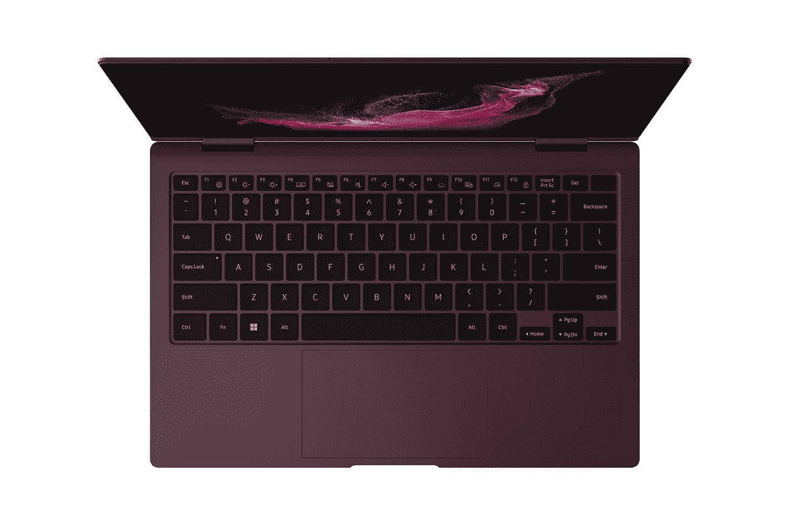

# 三星 Galaxy Book 2 Pro 支持 Windows Hello 吗？

> 原文：<https://www.xda-developers.com/does-samsung-galaxy-book-2-pro-windows-hello/>

三星 Galaxy Book 2 Pro 系列有望成为 2022 年[最佳笔记本电脑](https://www.xda-developers.com/best-laptops/)之一，考虑到去年的型号已经很棒了，这并不奇怪。今年，三星通过新的处理器和更先进的配置提升了性能，但仍保持了轻薄的设计。不过，Galaxy Book 2 Pro 系列没有改变的是 Windows Hello 支持。

就像去年的型号一样，三星 Galaxy Book 2 Pro 配备了 Windows Hello 支持，这要归功于电源按钮内置的指纹识别器。然而，没有用于面部识别的红外摄像头，这可能会更方便一些。不过，你需要做的只是用手指轻触指纹识别器来解锁你的电脑。

## 什么是 Windows Hello，它在 Galaxy Book 2 Pro 上如何工作？

Windows Hello 是微软添加到 Windows 10 中的一个功能，并且一直存在至今。这是一种将生物认证直接内置到 Windows 中的方法，即使用指纹或面部识别解锁您的 PC 或授权购买，而不是键入密码或 PIN。以前存在一些解决方案，但是它们是定制的，每个实现都是不同的。Windows Hello 既安全又方便。这比输入密码更容易，而且你也不会冒险让别人从你身后偷看你的密码。

Windows Hello 支持可以使用指纹读取器和/或用于面部识别的红外摄像头来补充。指纹识别器是 Windows Hello 最常用的方法，这也是三星 Galaxy Book 2 Pro 使用的方法。将它内置到电源按钮中意味着你可以打开笔记本电脑，它可以立即读取你的指纹。你的电脑需要几秒钟才能进入 Windows 登录屏幕，但只要你按下按钮，笔记本电脑就可以读取你的指纹，并在 Windows 锁定屏幕出现时保存该信息以供你登录。

红外摄像头可以为这个过程增加一点便利，因为你只需要看着摄像头，它就会帮你签到。这不是一个巨大的差异，但如果你试图授权购买，这可能会更好一些，所以你不必移动你的手来触摸指纹识别器。三星可能不包括这一选项，因为红外相机会占用更多的空间，而且公司通常更喜欢较小的挡板，这样笔记本电脑看起来更现代。

如果您确实想要 Windows Hello 面部识别，您可以购买内置 Windows Hello 的外部网络摄像头。市面上有多种选择，例如 [Dell UltraSharp 4K 网络摄像头](https://www.amazon.com/Dell-UltraSharp-Privacy-Computer-Proximity/dp/B098GXD82C?tag=xda-21h706a-20&ascsubtag=UUxdaUeUpU7406&asc_refurl=https%3A%2F%2Fwww.xda-developers.com%2Fdoes-samsung-galaxy-book-2-pro-windows-hello%2F&asc_campaign=Short-Term)，或者[联想 500 全高清网络摄像头](https://www.amazon.com/dp/B0821RB61V?tag=xda-21h706a-20&ascsubtag=UUxdaUeUpU7406&asc_refurl=https%3A%2F%2Fwww.xda-developers.com%2Fdoes-samsung-galaxy-book-2-pro-windows-hello%2F&asc_campaign=Short-Term)，如果您想要更实惠的产品。

* * *

您可以在下面预购三星 Galaxy Book 2 Pro 系列，它将于 4 月 1 日开始发货。如果你不是指纹识别器的超级粉丝，我们有一份内置 Windows Hello 人脸识别功能的[最佳笔记本电脑排行榜](https://www.xda-developers.com/best-laptops-with-windows-hello/)，你可能会更感兴趣。如果您想探索便携性更好的其他选择，还可以查看最好的轻量级笔记本电脑。

 <picture></picture> 

Samsung Galaxy Book 2 Pro

##### 三星 Galaxy Book 2 Pro

三星 Galaxy Book 2 Pro 是一款非常薄而轻的笔记本电脑，但它仍然附带第 12 代英特尔处理器。

 <picture></picture> 

Samsung Galaxy Book 2 Pro 360

##### 三星 Galaxy Book 2 Pro 360

三星 Galaxy Book 2 Pro 360 是一款超薄轻便的敞篷车，但它仍然配备了强大的第 12 代英特尔处理器和令人惊艳的 AMOLED 显示屏。