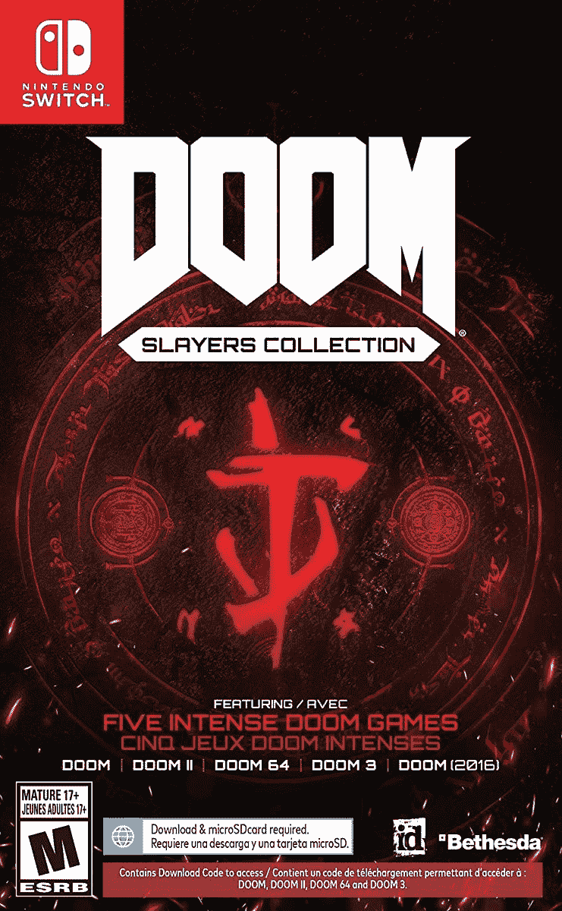

# 任天堂 Switch 的末日秀逗魔导士收藏降至 42 美元(优惠 8 美元)

> 原文：<https://www.xda-developers.com/doom-slayers-collection-for-nintendo-switch-gets-its-first-discount-at-42-8-off/>

# 任天堂 Switch 的厄运秀逗魔导士系列首次打折，价格为 42 美元(8 折)

这个超级套装包括《毁灭战士 1》、《毁灭战士 II》、《毁灭战士 64》、《毁灭战士 3》和《毁灭战士 2016》。要杀的恶魔可真多。

末日系列是有史以来最好(也是最有影响力)的视频游戏系列之一，从 1993 年的第一款 MS-DOS 游戏到 2020 年的*末日永恒*。缓慢但肯定的是，Bethesda 一直在更新整个系列，以适用于当前一代的游戏主机，如果你不想单独购买它们，上个月发布了*厄运秀逗魔导士系列*。该套装的任天堂 Switch 版本现在首次发售，价格降至 42 美元(优惠 8 美元)。

*Doom 秀逗魔导士合集*包含五款游戏: *Doom I* 、*毁灭战士 II* 、 *Doom 64* 、 *Doom 3* 、 *Doom (2016)* 。在任天堂 Switch 版本的情况下，实际的游戏卡带只包含《毁灭战士 2016》。所有其他的都必须下载，总共大约 10GB，减去未来可能推出的更新/修复程序。

 <picture></picture> 

Doom Slayers Collection

##### 厄运秀逗魔导士系列

任天堂 Switch 版的《毁灭战士秀逗魔导士》系列包括五款毁灭战士游戏，现在售价 42 美元。这比原价低了 8 美元，而且该系列才上市一个月。

你错过的唯一一款游戏是去年年底上市的*末日永恒*，并且[只有数字版本](https://www.amazon.com/DOOM-Eternal-Standard-Switch-Digital/dp/B08PP9H2HF?tag=xda-1ta8kfr-20&ascsubtag=UUxdaUeUpU4441&asc_refurl=https%3A%2F%2Fwww.xda-developers.com%2Fdoom-slayers-collection-for-nintendo-switch-gets-its-first-discount-at-42-8-off%2F&asc_campaign=Short-Term)。显然，贝塞斯达无法将所有这些恶魔装进一个物理弹药筒。

*Doom I* 和 *II* 是开启这一切的游戏，Switch 上可用的更新版本有一些现代增强功能和额外的关卡包可供免费下载(类似于最初 PC 版本上的 WADs)。 *Doom 64* 有点不同，因为它最初是由 Midway Games 开发的，而不是 Id 软件。*毁灭战士 3* 是第一部更加强调恐怖的重启，2016 年的*毁灭战士*是又一部回归更老的快节奏游戏方式的重启。