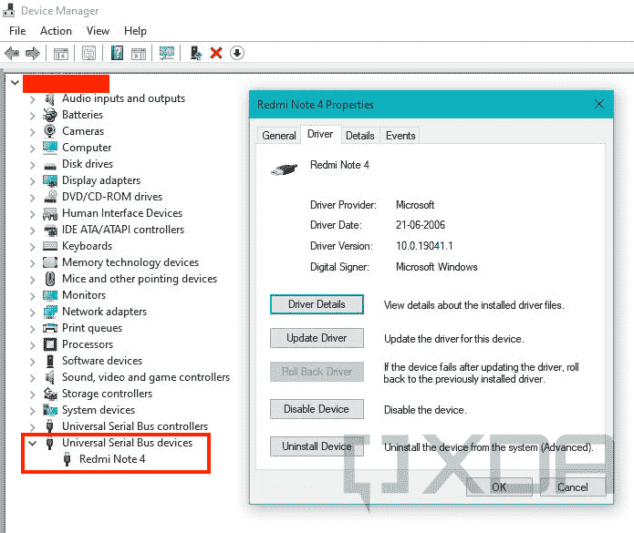
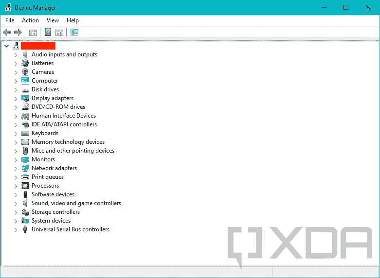

# 为流行的原始设备制造商下载和安装 Android USB 驱动程序

> 原文：<https://www.xda-developers.com/download-android-usb-drivers/>

所以你已经有了一个 Android 设备，并且想要深入到建模的世界中去？无论是[root](https://www.xda-developers.com/root/)还是安装像[linegeos](https://www.xda-developers.com/five-reasons-xda-loves-lineageos/)这样的定制 ROM，大多数售后改装都需要你使用 USB 电缆将你的 Android 智能手机连接到电脑，这样你就可以使用像 [Android Debug Bridge (ADB)](https://www.xda-developers.com/install-adb-windows-macos-linux/) 和 Fastboot 这样的工具与设备进行交互。对于 Android power 用户来说，你可能还想在手机上重新安装出厂固件，这意味着你必须处理 OEM 专用的闪存实用程序。

然而，如果你的个人电脑不能首先*看到*目标设备，这些修补工作都是不可能的。与 Windows 的情况一样，操作系统可能需要一个称为“驱动程序”的附加软件，以便正确识别 Android 设备显示的所有不同连接模式。下面您可以找到官方 OEM 提供的 Android USB 驱动程序包列表和通用驱动程序安装指南。如果你没有看到你的设备的制造商被列出，或者你看到一个错误的链接，给[塞犍陀·哈扎里卡](https://www.xda-developers.com/author/titokhan/)(论坛上的[斯坎达](https://forum.xda-developers.com/m/skandah.5301049/))发一条消息，告诉他设备的详细信息。

## Android USB 驱动程序的用途

Android 设备的 USB 接口是一个非常复杂的对象。根据配置的不同，它可能会向计算机公开标准的 Android USB 调试接口、fastboot 接口和各种其他 SoC 特定的诊断接口。还支持同时维护多个接口，例如，在[配置内部调制解调器参数](https://www.xda-developers.com/enable-volte-vowifi-asus-zenfone-8-oneplus-9-pro/)时，您可以通过 ADB 与您的设备进行交互。

请记住，上述场景与通过普通老式媒体传输协议(MTP)或图片传输协议(PTP)模式连接设备略有不同。MTP 使最终用户能够从 PC 上浏览设备的内部存储器，就像它是一个外部存储驱动器一样。从 Windows XP 开始，微软为每个版本的 Windows 都提供了通用的 MTP/PTP 驱动程序，所以你不需要外部驱动程序。

## 为流行的原始设备制造商下载 Android USB 驱动程序

大多数 Android OEMs 为他们的设备提供官方驱动程序包。除了 ADB 和 Fastboot 接口，这些驱动程序还支持由相应设备制造商设计的专有闪存协议。例如，如果您想[闪存一个三星 Galaxy 设备](https://www.xda-developers.com/update-firmware-any-samsung-phone/)，您必须事先安装三星 USB 驱动程序包。

请注意，微软已经在 Windows 上发布了一个通用的 ADB 驱动程序，所以仅仅为了 USB 调试而安装 OEM 驱动程序听起来可能不再值得了。Windows 还可以通过 Windows Update 实时检查并安装缺失的驱动程序。然而，微软推荐的驱动程序并不总是复杂 USB 接口的最佳选择，所以尽可能检查官方驱动程序包。

 <picture></picture> 

The inbox Android USB debugging driver of Windows in action

从以下索引中获取适合您设备的驱动程序:

## 如何安装 Android USB 驱动程序

既然您已经为您的设备下载了合适的驱动程序包，是时候安装它了。一些 OEM 提供标准的安装程序可执行文件，这意味着您可以通过双击安装文件并遵循向导来轻松安装整个驱动程序套件。

然而，Google 和其他一些供应商更喜欢使用裸 INF 和相关的二进制文件，它们被打包在 ZIP 或 RAR 档案中。这类软件包需要使用设备管理器来安装，但是您必须事先提取归档文件的内容。

*   右击开始按钮并选择**设备管理器**条目。您也可以直接从运行中调用名为`devmgmt.msc`的 Microsoft 管理控制台管理单元来打开设备管理器。

 <picture></picture> 

Device Manager under Windows 10

*   将 Android 设备连接到您的 PC。根据选定的配置，您可能会看到一个或多个未知设备弹出。

*   (可选)右键单击未知设备条目，选择*属性*，移动到*详细信息*选项卡，最后从下拉菜单中选择*硬件 id*。现在打开您最喜欢的搜索引擎，将硬件标识符粘贴到搜索框中，并浏览搜索结果。这是确定您的设备当前可能公开的接口的粗略方法。

*   右键单击未知设备条目并选择**更新驱动程序**。现在选择**浏览我的电脑中的驱动程序/驱动程序软件**并将向导指向您提取驱动程序包的文件夹。

*   如果一切正常，您应该会看到如下所示的确认页面。

### 为不受支持的设备手动安装驱动程序

在某些情况下，OEM 驱动程序是不够的。也许你偶然发现了一个没有名字的普通平板电脑，或者你闪亮的新手机的闪光模式界面还没有得到制造商的官方驱动程序。在这种情况下，您可以通过设备管理器强制安装类似 USB 接口的现有驱动程序包。

*   打开**设备管理器**并找到未知设备条目。
*   右键点击并选择**更新驱动**。选择**浏览我的电脑上的驱动软件**，然后选择名为**的选项，让我从电脑上的可用驱动列表中选择**。

*   现在选择**显示所有设备**并点击**下一步**。在下一个屏幕上，点击**拥有磁盘...**按钮。

*   此时，您需要浏览到为类似设备提取的驱动程序所在的位置。从文件列表中选择 INF 文件，并选择*打开*。

*   现在仔细选择驱动模型。例如，如果你试图为一个设备安装快速启动模式驱动程序，从谷歌的驱动程序集中选择 *Android 启动加载程序接口*。Windows 可能会显示与兼容性相关的警告，但您可以忽略它，继续安装过程。

此方法允许您强制安装已签名的驱动程序，而不会破坏其数字签名，因此您不需要在 64 位 Windows 实例上关闭驱动程序签名强制。

* * *

现在，您已经在计算机上安装了正确的 USB 驱动程序，您的 Android 设备可以接收指令了。现在是时候把它们放在一起，运行您的第一个 ADB 命令了！