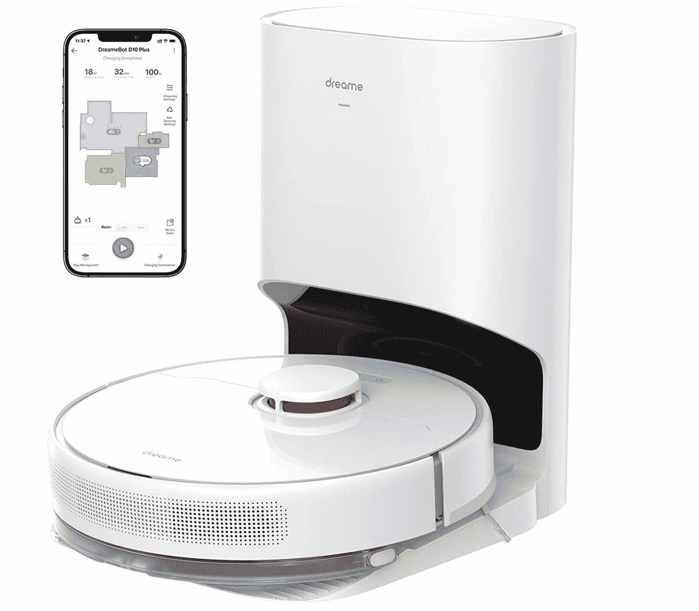

# 梦想机器人 D10 加审查:中等价位的机器人真空和自动清空站拖把

> 原文：<https://www.xda-developers.com/dreame-bot-d10-plus-review/>

dream etech dream Bot D10 Plus 二合一机器人吸尘器是一种高效的机器人吸尘器，它还具有用于硬地板的拖地模块。还有一个高效的自动清空站，可以将车上的垃圾箱倒入一个更大的袋子中，大约每 30 天就需要清空一次。

找到一个合适的机器人真空吸尘器来满足你的需求可能会很复杂。网上有各种各样的机器人，有各种不同的功能，价格也各不相同。选择一个机器人来清洁你的硬地板和地毯，并拖你的硬地板可能会让你考虑一个多功能机器人来轻松完成这两项任务。

Dreame Bot D10 机器人真空吸尘器于 2022 年 5 月推出，是 Dreametech 系列中的中等价位机器人之一。Dreame Bot D10 Plus 机器人吸尘器目前以早期价格提供，直到 2022 年 7 月 9 日，包括为前 100 名付费客户提供的免费配件包。Dreametech 的顶级 W10 型号不仅可以清洁和拖地，还可以返回到自动清空站清洁其机载拖把刷。

对于任何想要不用手扫地和拖地的人来说，Dreame Bot D10 将为您提供日常清洁服务。它会按照你每天想要的时间表清扫你的地板——或者每天多次。只需设置计划，忘记它在那里，直到它的计划时间开始，它离开其扩展坞，开始其计划的清洗。如果你有硬地板，用干净的水装满 145 毫升的水箱，它会拖你的硬地板。

 <picture></picture> 

Dreame Bot D10 Plus

##### 梦幻机器人 D10 增强版

D10 梦幻机器人提供定制的清洁和拖地服务，还有一个自动清空站，可以存放超过一个月的灰尘

**浏览此评论:**

## Dreametech Dreame 机器人 D10:价格和可用性

你可以从 Dreametech 自己的商店和亚马逊订购 499.99 美元的 Dreametech Dreame Bot D10 多功能机器人吸尘器。网站上有一张 100 美元的优惠券，这使得 Dreametech 商店提供的价格降至 399.99 美元。

* * *

## Dreametech Dreame 机器人 D10 规格

| 

投机

 | 

价值

 |
| --- | --- |
| 规模 |  |
| 吸力 |  |
| 额定功率(真空) |  |
| 额定功率(自动清空工位) |  |
| 蓄电池容量 |  |
| 车载垃圾箱容积 |  |
| 水箱模块体积 |  |
| 自动清空站集尘袋容量 |  |

***关于这篇评论**:这篇评论是在对 Dreamtech 提供的 Dreame Bot D10 二合一机器人真空吸尘器进行了一个多月的测试后撰写的。Dreametech 在这篇文章中没有任何投入。XDA 在过去一直由 Dreame 赞助，但是这篇评论不属于过去的活动，而是独立策划和撰写的。*

* * *

## D10:盒子里是什么？

Dreame 机器人 D10 的盒子包括机器人真空和自动清空站。一些制造商将自动清空工作站作为一个单独的包装额外收费，但 Dreametech 以一个价格提供盒子里的所有东西。盒子里有:

*   一台机器人真空吸尘器
*   一个自动清空的底座/扩展坞
*   用于自动清空站的两个集尘袋
*   机器人真空吸尘器的一侧刷
*   一个主滚刷
*   一个车载垃圾箱
*   一个用于拖地模块的水箱
*   一个连接到拖洗模块的拖洗垫
*   一个清洁工具，用于清洁滚筒刷上的毛发和灰尘
*   一根电源线。

* * *

## 设计和功能:智能导航环绕您的家

*   用于快速扫描和动态制图的激光雷达导航和 SLAM 算法
*   用于灰尘和宠物毛发的多面刷子
*   三种用水设置，调节拖把的湿度
*   全功能应用程序，Alexa 兼容性

在过去的四年里，我测试了 50 多个机器人。我注意到，即使是价格较低的机器人真空模型现在使用的技术也在突飞猛进。尽管许多机器人制造商在应用程序功能、连接性或机器人功能方面做出了妥协，但 Dreametech 仍在继续对其产品系列进行创新。质量的提高当然是显而易见的。Dreametech 生产了一种外观漂亮的机器人吸尘器，不仅可以清扫任何类型的地板，还可以拖硬地板，并返回清空其机载垃圾箱。

白色、流线型的 Dreame Bot 10 Plus 是一个外观漂亮的机器人，线条简洁，外观时尚。它有一个侧扫刷和一个滚筒刷在装置下面。Dreame Bot D10 Plus 在机器人真空顶部有一个激光雷达导航单元，可以绘制你的空间地图。这种自动清空工作站结构紧凑，使用起来相当安静，并使用了 Dreametech 所谓的“双增压”系统。当车载垃圾箱被清空时，这最小化了吸管的堵塞。

### 使用功能全面的应用程序进行精确映射

梦想机器人 D10 Plus 使用小米之家应用程序。连接到应用程序相当简单。打开小米之家 app，点击 app 右上角的加号，扫描快速入门指南二维码，添加机器人吸尘器。您还可以滚动浏览各种智能设备，并通过这种方式连接到 D10 Plus。一旦连接上，你可以调整机器人的几个功能。您可以调节真空吸尘器的吸力，并在安装拖把时改变通过拖把输送的水量。

### 受控清扫和定制拖地

将拖地模块连接到机器人很简单。在 Dreame Bot D10 Plus 的底部，有两个夹子和一个传感器。当机器人拖地模块正确连接时，机器人会发出通知。当拖把就位时，您可以更改拖地设置，并指定希望拖把执行日常拖地还是深度拖地。深度拖地将确保机器人以密集的 Z 形模式拖地，这将提高拖地的质量。该应用程序警告机器人在这种模式下导航更紧的拖地路线时可能会打滑。

在使用中，4000Pa 的吸力将拾取大多数碎片，包括地板和地毯上的宠物毛发和砂砾。实际上，在机器人返回基地充电之前，以最大 4000Pa 的吸力使用机器人会给你大约 35 分钟的清洁时间。没有必要一直以最大功率操作机器人。当 Dreame Bot D10 Plus 检测到地毯时，它会自动将抽风机提升到最大吸力。要实现这一点，必须在应用程序中设置此开关。有用的是，如果机器人因为电池电量低而最终返回到码头，它将返回到上次清洁的位置，并在充满电后继续清洁。

在机器人返回基地充电之前，以最大 4000 帕的吸力使用机器人会给你大约 35 分钟的清洁时间

### 定制清洗的全面设置

*   时区设置会将机器人的时区与您的移动设备的时区同步
*   声音和音量设置以及 11 种不同的语言
*   通知
*   遇到地毯时，地毯助力装置可提供最大吸力
*   儿童锁，因此只能使用应用程序操作
*   电池充电后继续清洁
*   当你想要安静的时候，不要打扰模式
*   清洁某个区域、特定房间或定制空间的预定设置
*   当您想要完全控制时，可以使用遥控器

### 日常扫地和拖地

在使用中，梦想机器人 D10 加是安静和不引人注目的。

在使用中，梦想机器人 D10 加是安静和不引人注目的。自动清空站中的电机比机器人吸尘器本身的声音大得多。然而，它只运行两到三秒钟，同时车载垃圾箱被清空，所以它对你的一天的干扰是最小的。如果你以最小功率运行梦想机器人 D10 Plus，你几乎不会注意到它的运行——除非它在穿越地毯时提升到最大功率。

你可以将梦想机器人 D10 Plus 连接到你的 Alexa 或谷歌主页，并要求它开始、暂停或停止清洁，实现自动清洁。我不倾向于在我测试的机器人上使用这个特性。我发现，在应用程序中设置一个自动时间表，增加额外的时间来覆盖特别脏的区域，对我来说比记住用我的声音启动机器人要好得多。然而，我特别喜欢这些命令:“Alexa，请 Dreame bot 告诉我它在做什么？”还有我无聊时的“Alexa，让 Dreame bot 向你问好”。

145ml，拖地罐不大。因此，如果你有一个大的硬表面，你将需要重新填充你的拖地模块罐。此外，你还需要在梦想机器人 D10 Plus 上添加无拖把区域，这样机器人就不会拖着湿拖把穿过任何铺有地毯的区域。这意味着如果你家里既有地毯又有硬地板，你需要指定何时清洁每个区域。在地毯清洁的预定时间之前，您还需要小心更换和移除拖地模块。

机器人吸尘器快速有效地执行清扫和拖地任务。它返回其基地充电，几乎不需要更换其基站集尘袋，并将很好地执行日常或深层拖地任务。

## 谁应该买一个梦想机器人 D10 加？

*   如果你家里主要都是硬地板，你应该买 Dreame Bot D10 Plus
*   如果你有多孔地板，仔细考虑是否购买梦想机器人 D10 加。如果您没有系上拖把垫，可能会损坏自动清空站周围的地板。
*   Dreame Bot D10 Plus 是任何讨厌清空机载垃圾箱并希望自动清空站在机器人每次返回基地时运行的人的理想选择。

Dreametech Dreame Bot D10 Plus 是一款可靠的机器人吸尘器，具有自动清空站和硬地板拖地模块。请记住，拖地模块只会擦你的地板。它不会擦洗它们，也不会自动清洁它的拖把。如果你想每天清洁你的硬地板，你需要取下并清洗拖把。

DreameTech Dreame Bot 10 Plus 机器人真空吸尘器的价格为 499.99 美元，当然值得它的中档价格。

市场上还有类似价位的其他产品。售价 499.98 美元的 Yeedi Vac station 具有类似的功能和类似的运行时间，尽管它不如 Dreame Bot 10 Plus 强大，但肯定也一样高效。

售价 499.99 美元的 Neabot Q11 机器人吸尘器是一款具有未来感的设备，带有自动清空台。真空可能看起来很神奇，但我发现糟糕的映射意味着它几次无法返回到基站-如果像我一样，你家里有砖墙，这是一个问题。

如果你的地板特别脏，你仍然需要偶尔给它们一次深度清洁，但是对于日常擦拭，Dreame Bot D10 Plus 拖把会给你一个日常擦拭。同时还有扫地的额外好处。制定时间表，忘记日常清洁的苦差事。如果你的地板需要每天刷新，你讨厌清空它的板载箱，请购买 Dreame Bot 10 Plus。

 <picture></picture> 

Dreame Bot D10 Plus

##### 梦幻机器人 D10 增强版

一个不显眼的二合一扫地拖地机器人，带有自动清空台和全功能应用程序