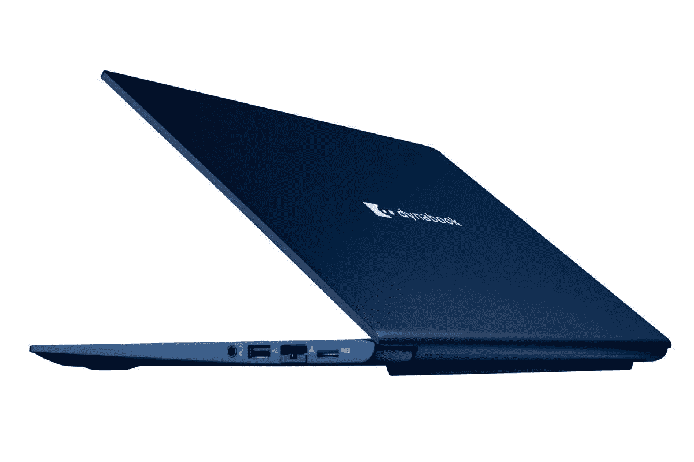

# Dynabook Portégé X40L-K 评测:一款出色的轻型商用笔记本电脑

> 原文：<https://www.xda-developers.com/dynabook-portege-x40l-k-review/>

Dynabook Portége X40L-K 是一款高端商务笔记本电脑[它不试图做任何太花哨的事情，相反，它专注于钉基础。在这种程度上，它做了它的工作。这是一款超级](https://www.xda-developers.com/best-business-laptops/)[轻型笔记本电脑](https://www.xda-developers.com/best-lightweight-laptops/)，它提供了几乎所有你真正需要的良好体验。我真的很喜欢这台笔记本电脑。它有一个漂亮的显示屏，键盘是非凡的，它设法看起来很好，同时仍然是柔和和专业的。甚至扬声器的声音都很大，非常适合媒体消费或通话。

有一些缺点，我想说最大的缺点是它仍然有一个 720p 的网络摄像头-这个决定我在 2022 年真的不能落后。我也希望触摸板能更好一点，但总的来说，这是一个真正坚实的体验。与其他商用笔记本电脑相比，基本价格也不算太低，所以我认为它绝对值得一试。

 <picture></picture> 

Dynabook Portégé X40L-K

##### Dynabook Portege X40L-K

Dynabook Portégé X40L-K 是一款轻型商用笔记本电脑，采用第 12 代英特尔处理器和 16:10 显示屏。

*Dynabook 提供了 Portégé X40L-K，用于本次审查。然而，该公司没有对其内容进行任何投入，也没有为其制作*提供任何形式的补偿。

**浏览此评论:**

## Dynabook Portégé X40L-K:定价和供货情况

*   Dynabook Portégé X40L-K 可以在亚马逊上购买，或者直接从 Dynabook 及其合作经销商处购买
*   定价官方起价 1799.99 美元，但这一配置售价 2219.99 美元

Dynabook 在 3 月份首次发布了 Portégé X40L-K，几个月后推出，起价为 1799.99 美元，配备英特尔酷睿 i5-1250P 处理器，8GB 内存和 256GB 固态硬盘。这个价格还包括三年保修和现场支持，这是大多数 Dynabook 笔记本电脑的标准配置。

你可以在亚马逊或者 Dynabook 的网站上找到笔记本电脑的预建配置，你也应该能够获得定制的特定配置。

## Dynabook Portégé X40L-K:规格

| 

中央处理器

 | 英特尔酷睿 i7-1270 处理器博锐(28W，12 个内核，16 个线程，最高 4.8GHz，18MB 高速缓存) |
| 

制图法

 | 集成英特尔 Iris Xe 显卡(96 EUs) |
| 

显示

 | 14 英寸 IPS，WUXGA (1920 x 1200)，161 DPI，最高 400 尼特，眼睛安全 |
| 

规模

 | 312.4 x 224 x 15.9 毫米(12.3 x 8.8 x 0.63 英寸)1.05 千克(2.31 磅) |
| 

记忆

 | 16GB LPDDR5 |
| 

储存；储备

 | 512GB NVMe PCIe 4 固态硬盘 |
| 

电池

 | 65 瓦时电池 |
| 

港口

 | 

*   2 个 Thunderbolt 4/USB 4 C 类端口(40Gbps)
*   2 个 USB 3.2 Gen 1 Type-A(一个支持睡眠和充电)
*   1 个 HDMI 接口
*   1 个 RJ45 以太网
*   1 个 microSD 读卡器
*   3.5 毫米耳机插孔

 |
| 

声音的

 | 带杜比全景双 360 度麦克风的四扬声器 |
| 

连通性

 | 英特尔无线 6E ax 211 蓝牙 5.2 |
| 

照相机

 | 带隐私快门的 720 像素网络摄像头 |
| 

颜色

 | 科技蓝金属漆 |
| 

材料

 | 镁合金 |
| 

操作系统（Operating System）

 | Windows 11 专业版 |
| 

价格

 | $2,219.99 |

## 设计:它超级轻，看起来很棒

*   Dynabook Portégé X40L-K 有一种柔和的深蓝色，但足够独特，足以脱颖而出
*   它使用非常轻的镁底盘，便于携带

商用笔记本电脑总是有一种看起来有点无聊的趋势，根据我过去的经验，Dynabook 并没有做太多的事情来改变这种看法。谢天谢地，有了这个模型，事情就有点不同了。Dynabook Portégé X40L-K 采用“科技蓝金属漆”，也就是说是深蓝色。它足够亮，你不会真的感到困惑，认为它是黑色的，但它足够暗，仍然非常适合办公室环境，不会有任何奇怪的外观。

老实说，我觉得它看起来很棒。这并不令人兴奋，但我欣赏那些让笔记本电脑更独特的小变化。当明亮的灯光照射在表面上时，表面会有一点闪光，这增加了一点额外的天赋，但你不会注意到它，除非你仔细看，并且你有一个非常明亮的光源。当你在室内时，它一点也不浮华。

镁很轻，但能感觉到廉价。

这种设计的另一个优点是它非常轻，只有 2.3 磅。我已经有一段时间没有评测过这种重量的笔记本电脑了，拥有这样一个可以轻松携带并带到任何地方的东西真是太棒了。这都要归功于镁底盘，这是一种非常有趣的材料，因为它可以提供与铝相同的耐用性，而厚度却要薄得多。

不过，这也有不好的一面，这就是我的感受。虽然 Dynabook Portégé X40L-K 的制造质量很好，感觉很坚固，但铝只是给你一种放心的重量和坚固感，这是镁很难比拟的。这是一件非常肤浅的事情——这款笔记本电脑仍然符合 MIL-STD-810H 的耐用性标准——但对一些人来说，笔记本电脑的感觉也很重要。就我个人而言，我更希望增加便携性，但这并不适合所有人。苹果拒绝停止为 MacBook Air 使用铝是有原因的。

至于端口，对于这样一个轻薄的机箱来说，你可以得到很多。左侧有两个 Thunderbolt 4 端口，一个 USB Type-A 端口，以及 HDMI。在左边，你有另一个 USB 型端口，RJ45 以太网，一个耳机插孔，外加一个 microSD 读卡器。很难想象比这更完整的设置，尽管我有点希望两边都有一个 Thunderbolt 端口。

## 显示和声音:屏幕足够清晰，扬声器声音很大

*   Dynabook Portégé X40L-K 有一个 WUXGA 显示屏，这个显示屏足够 sarp，并且不太耗电
*   四扬声器系统可以为媒体消费提供强大动力

Dynabook 在笔记本电脑显示屏方面一直出奇地保守。即使在今天，它的一些笔记本电脑的分辨率为 1366 x 768，你不会找到比全高清更清晰的东西，或者在这种情况下，WUXGA，本质上与全高清相同，但纵横比为 16:10。不过，这完全没问题，看起来 Dynabook 真的专注于提供可靠的体验，而没有过于花哨的配置，这完全值得尊敬。

坚持这种分辨率的一个好处是，这种面板不会很快耗尽电池，这在您使用英特尔 P 系列处理器时尤其有利。不过，我们稍后会谈到电池寿命。

这是一个 IPS 面板，它的亮度高达 400 尼特(官方)，这是非常好的。室外的能见度根本不是问题，在室内，即使是在白天，我也很习惯亮度低于 20%。正如你在下面看到的，显示器在不同的亮度水平下相当一致，实际上它可以比广告中的 400 尼特高一点。

至于颜色，我发现这个屏幕非常好用。颜色看起来很棒，虽然我注意到显示器看起来比我身上的其他一些笔记本电脑冷一点。根据更多的技术测量，它覆盖了 97%的 sRGB 色彩空间，因此它肯定适合这种笔记本电脑的工作。其他色谱并不令人印象深刻，但这款笔记本电脑真的不适合创造性工作，所以没什么大不了的。

我真正喜欢这款笔记本电脑的是四扬声器设置，这是我对商用笔记本电脑没有想到的。这只是一台 14 英寸的笔记本电脑，但仍然有顶部发射扬声器(两个向上发射，两个向下发射)，它们变得非常吵。它们在最大音量下听起来仍然很棒，据我所知没有明显的失真。声音听起来仍然很清晰清脆。

## 键盘和触摸板:打字极其舒适

*   Dynabook Portégé X40L-K 上的键盘打字感觉很棒
*   它有一个大触摸板，但表面有点粗糙

关于 Dynabook Portégé X40L-K，我最喜欢的一点就是键盘。我用过一些不错的笔记本电脑键盘，最近的[联想 ThinkBook 13s](https://www.xda-developers.com/lenovo-thinkbook-13s-gen-4-review/) 是我最喜欢的键盘之一，但我想我可能更喜欢这个。按键的行程量很好很舒服，触底也不觉得刺耳。感觉它比其他笔记本电脑需要更多的驱动力，但实际上我更喜欢这样。在这个键盘上打字的感觉很棒，绝对是我用过的最好的键盘之一。另一方面，电源按钮是一个奇怪的例外——它感觉像浆糊一样，有点难按，我不记得上次看到它是什么时候了。

尽管 14 英寸的尺寸有些局促，键盘两侧已经有了扬声器格栅，但 Dynabook 还设法在这里添加了几个额外的按键，这是我最近在许多笔记本电脑中没有看到的。箭头键有一个倒置的 T 形布局，而不是典型的设置，即两个垂直键夹在左右箭头之间，您可以获得专用的 Page Up、Page Down、Home 和 End 键。我经常使用这些，大多数笔记本电脑要求我按下 **Fn** 键和一个箭头键，但这里没有。这些都是小事，但 Dynabook 仍然决定将它们包括在内的事实让它们变得更加特别。

在键盘下方，有一个非常大的触控板，我不得不再次称赞 Dynabook 对这款笔记本电脑空间的巨大利用。它大概是合理的高度，而且有一个大的区域让我的手指四处活动，这很棒。

不过，如果使用起来感觉更好一点，那就更好了。这个触摸板的表面奇怪地抓地力，所以我的手指不能很顺畅地滑动，这真的妨碍了体验。在使用了几个星期后，我认为皮肤水分帮助它变得光滑了一点，所以也许它实际上是越用越好的东西。随着时间的推移，我的印象肯定变得更加积极了。

## 性能:我们对英特尔 P 系列的期望

*   该型号由英特尔酷睿 i7-1270P 处理器和 16GB 内存驱动，因此性能非常好
*   英特尔的 P 系列处理器继续对电池寿命造成影响

正如你可能期望的顶级商务笔记本电脑，这台机器的性能非常好。它由英特尔酷睿 i7-1270P 处理器提供动力，这意味着它有 28W 的 TDP，它有 12 个内核和 16 个线程，P 内核可以提升到 4.8GHz。这为你的各种工作相关任务提供了充足的性能，并且有 16GB 的 RAM 作为支持也有所帮助，尽管值得注意的是 RAM 是焊接在主板上的，所以你不能升级它。我从来没有真正希望这台机器有更快的性能。你可以在下面看到它与类似机器的比较。

|  | 

dyna bok portégéX40L-KCore i7-1270 p

 | 

[戴尔 XPS 13 Plus 9320](https://www.xda-developers.com/dell-xps-13-plus-review/) 酷睿 i7-1280P

 | 

[联想 Yoga 9i](https://www.xda-developers.com/lenovo-yoga-9i-2022-review/) 酷睿 i7-1260P

 |
| --- | --- | --- | --- |
| 

PCMark 10

 | 4,878 | 5,481 | 5,616 |
| 

3DMark:时间间谍

 | 1,939 | 1,992 | 1,678 |
| 

Geekbench 5(单/多)

 | 1,742 / 9,195 | 1,700 / 10,293 | 1,736 / 9,525 |
| 

Cinebench R23(单/多)

 | 1,707 / 8,319 | 1,629 / 10,121 | 1,638 / 7,757 |
| 

交叉标记(总体/生产力/创造力/响应能力)

 | 1,504 / 1,407 / 1,774 / 1,119 | 1,729 / 1,525 / 2,022 / 1,433 |  |

您还可以获得集成的英特尔 Iris Xe 显卡，因此它可以处理一些较轻的 GPU 工作负载，包括一些您感兴趣的轻度游戏。不过，与上一代相比，这并不是一个很大的升级。

电池寿命不是很长，但也可能更糟。

像往常一样，这些处理器的问题是它们产生多少热量，这会影响电池寿命和持续性能。许多配备 28W 处理器的笔记本电脑都是从具有 15W TDP 的 CPU 升级而来，但它们并没有真正做足够的事情来适应增加的功耗和热量输出。英特尔 P 系列处理器的性能差异很大，而且这款笔记本电脑会发热，因此很难获得一致的测量结果。

至于电池寿命，嗯，不是很好，但可能会更糟。总的来说，我可以在 4 小时 21 分钟内完成，大约 6 小时 6 分钟。有一次，我只有大约 3 小时 38 分钟，但这是一个分镜头，我再也没有接近那个低点。在大多数情况下，电池寿命徘徊在 5 小时左右，有时甚至更长。这并不令人惊讶，但它比联想 ThinkBook 13s 或宏碁 Swift 3 等笔记本电脑好得多，因为这些电脑都有四高清显示屏。使用全高清面板对 Dynabook 有利，您可以考虑随身携带这款笔记本电脑，以便在旅途中完成一些工作。如果是一整天的工作，你仍然需要插上电源，但对我来说，这个门槛设置得很低，相比之下还是不错的。

## 该不该买 Dynabook Portégé X40L-K？

我对 Dynabook 在 Portégé X40L-K 上所做的许多事情感到非常惊讶。这是一款非常漂亮的笔记本电脑，也非常轻便，易于携带，它有一个非常适合生产力工作的高显示屏，也是我用过的最好的键盘之一。它甚至有一个非常响亮的扬声器系统，我做到了；不要期望成为商务笔记本电脑的焦点。性能也很稳定，电池寿命虽然不是很长，但比我评测过的其他机器要稍微长一点。

**您应该购买 Dynabook Portégé X40L-K，如果您:**

*   想要一台轻便的笔记本电脑，让您可以随时随地轻松携带
*   花很多时间在你的电脑上打字
*   观看或收听大量媒体
*   想要一台性能卓越的笔记本电脑

**你不应该购买 Dynabook Portégé X40L-K，如果你:**

*   需要全天电池续航时间
*   经常使用网络摄像头

这款笔记本电脑最大的缺点之一肯定是网络摄像头，尽管如果你同意单独购买一个，你可以解决这个问题。电池寿命也不惊人，但我要说五个小时对很多人来说还是可以接受的，所以这不一定是马上拒绝它的理由。不过，如果你想看看其他选择，你可以随时查看今天能买到的[最佳笔记本电脑](https://www.xda-developers.com/best-laptops/)。

 <picture></picture> 

Dynabook Portégé X40L-K

##### Dynabook Portege X40L-K

Dynabook Portégé X40L-K 是一款轻型商用笔记本电脑，采用第 12 代英特尔处理器和 16:10 显示屏。