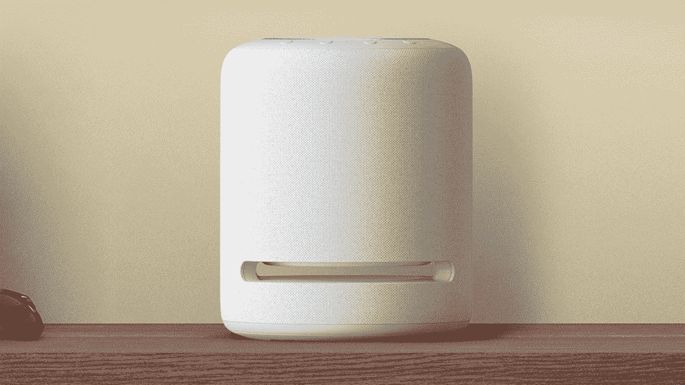

# 用免费的智能灯泡搭配更便宜的 Echo 设备，让你的家变得更漂亮

> 原文：<https://www.xda-developers.com/echo-dot-echo-studio-smart-bulb-deal/>

将你的房子改造成智能家居并不困难，而且你不必一开始就全力以赴，因为你完全可以从小处着手。虽然我们很确定你家里已经有一台智能电视，口袋里已经有一部智能手机，但 Alexa 驱动的扬声器可能会对你的家庭有所帮助，对吗？

那么，在假期之前，如果你正在购买新的 Echo Dot、带时钟的 Echo Dot、Echo Studio 或 Echo 第四代，你可以获得一个免费的智能灯泡！太棒了，对吧？智能灯泡可能相当昂贵，所以得到一个免费的灯泡来尝试一些东西可能是一个很好的方式，看看你是否想投资更多这些东西。

##### 亚马逊回声点(第五代)

这可能不是我们见过的 Echo Dot 的最低价格，尤其是黑色星期五刚刚过去，但无论如何都是非常值得的。此外，您还将获得一个完全免费的蓝牙彩色灯泡

您还可以从 Sengled 获得带有时钟的 Echo Dot 第五代和带有相同免费蓝牙彩色灯泡的第四代 Echo。

*   ##### 【亚马逊回声圆点带时钟(第五代)

*   <picture></picture>

    亚马逊回声圆点(第四代)音箱

    ##### 亚马逊回声圆点(第四代)

我们也非常喜欢新的 [Echo Studio](https://www.xda-developers.com/amazon-echo-sub-vs-amazon-echo-studio/) ，这是一款绝对令人惊叹的高保真智能扬声器。这是我们非常喜欢的新款亚马逊 Echo 设备之一。虽然如果你能在录音室的混音中加入一些回声点绝对很棒，但这不是强制性的，因为你绝对可以单独使用它来听任何你喜欢的歌曲。当然，你可以使用这些设备中的任何一个来控制你的新智能灯泡，要求 Alexa 从房子的任何一个角落打开和关闭灯。如果你不想完全关掉灯，你甚至可以把灯调暗。

 <picture></picture> 

Amazon Echo Studio

##### 亚马逊 Echo 工作室

Echo Studio 是亚马逊的一款非常棒的智能扬声器，你可以在假期前获得 25%的折扣。您还将获得免费的 Sengled 智能灯泡，以增加交易的甜头！

所以，一定要抓住这些交易之一，根据你选择的型号，节省高达 55 美元。另外，你免费得到的蓝牙灯泡价值也不到 10 美元。