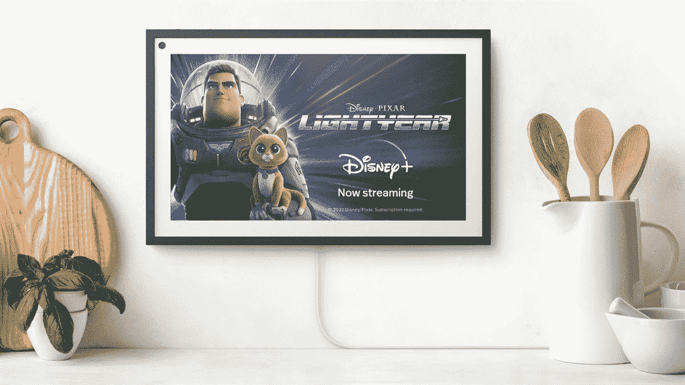

# 利用这一限时优惠，以 165 美元的有效价格购买 Echo Show 15

> 原文：<https://www.xda-developers.com/echo-show-15-best-buy-deal/>

# 利用这一限时优惠，以 165 美元的有效价格购买 Echo Show 15

使用以下链接购买 Echo Show 15 可获得 65 美元的统一折扣和 20 美元的礼品卡

 <picture></picture> 

Amazon Echo Show 15

##### 亚马逊回声秀 15

由于百思买上的这一限时交易，亚马逊的大规模 Echo Show 15 可以以 165 美元的有效价格成为你的。点击下面的链接获得 65 美元的折扣和 20 美元的礼品卡，您可以在下次购物时使用。

在亚马逊的大规模智能显示屏上获得这笔史诗般的交易，并在百思买以仅 165 美元的有效价格获得它。Echo Show 15 通常零售价为 250 美元，但亚马逊和百思买在黑色星期五以 170 美元的最低价提供了它。如果你错过了这笔交易，百思买会给你另一个机会，让你以低廉的价格买到基于 Alexa 的智能显示器。

这家零售商在 Echo Show 15 上有一个限时优惠，价格降至 185 美元。虽然这还没有它的黑色星期五销售价格低，但百思买已经用 20 美元的礼品卡和亚马逊音乐无限的四个月免费试用增加了交易的甜头。这使得实际价格降至 165 美元。

Echo Show 15 在这个价格上非常划算，因为它配备了一个巨大的 15 英寸高清显示屏，可以让你同时访问几个 Alexa 驱动的小工具。与所有 Echo 智能显示器一样，您可以使用语音命令与它进行交互，并通过一步一步的说明查找各种信息，如食谱。

鉴于其大屏幕尺寸，你还可以享受亚马逊 Prime、网飞和 Hulu 等服务的内容。最重要的是，亚马逊[最近发布了 Echo Show 15 的更新](https://www.xda-developers.com/echo-show-15-fire-tv-experience-update/)，介绍了 Fire TV 设备的所有功能。

如果你已经投资了 Alexa 生态系统，并希望为你的家庭添加一个优质的智能显示器，Echo Show 15 在这个价格上是一个显而易见的选择。请务必立即订购，因为这是限时优惠。