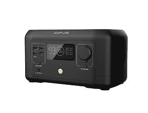
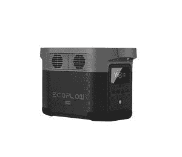
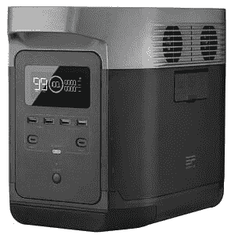
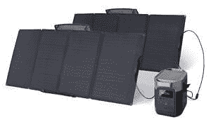

# 使用 EcoFlow 备用电源，让假期充满欢乐和阳光

> 原文：<https://www.xda-developers.com/ecoflow-backup-power/>

回家。无论身在何处，我们都梦想的地方。今年对全世界的每个人来说都是艰难的一年。圣诞节是一个和你的朋友和家人在一起的节日，即使你远在千里之外，EcoFlow 也想在这个节日带给你家的感觉。

随着寒假的临近，这是一个和家人共度时光、进行冬季探险或欣赏雪的好机会。为了确保一切按计划进行，EcoFlow 在这里提供一些他们最好的备用电源解决方案的假日销售。不要让冬天的天气导致电力中断，这可能会破坏你的计划。查看这些发电站解决方案，找到符合您需求的解决方案。

* * *

## 迷你生态流河

*手头的权力*

EcoFlow 河迷你给你手边的权力。将 210 瓦时的便携式电源放在您的背包中，随时随地都有电源。EcoFlow RIVER mini 可以在 1.5 小时内充满电，输出功率为 300 w(600 w 浪涌)，非常适合 99%的消费电子产品。

 <picture></picture> 

EcoFlow RIVER mini

* * *

## 生态流量三角洲迷你

*Prosumer 备用电源*

带上 DELTA mini，让您的设备始终保持供电。DELTA mini 的 882Wh 容量非常适合断电、户外探险和专业工作。DELTA mini 可在 3 至 6 小时内从太阳能电池板获得高达 300W 的电量。从墙上充电时，它也可以在 96 分钟内从 0 到 100%。

 <picture></picture> 

EcoFlow DELTA mini

* * *

## 生态流量三角洲

*必要的备用电源*

随时掌控达美航空的任何情况，并让您的设备始终保持供电。DELTA 拥有巨大的 1260Wh 容量，非常适合停电、户外探险和专业工作。同时为多达 13 个设备供电，1.6 小时内从 0%充电到 100%，是市场上大多数便携式电站速度的 10 倍。

 <picture></picture> 

EcoFlow DELTA

*   建议零售价:~~:1399 美元~~
*   销售:**1099 美元**

* * *

## 生态流量增量最大值

*家用备用电源主控*

一个 DELTA Max 装置的容量为 2 千瓦时，使用 DELTA Max 智能额外电池可扩展至 6 千瓦时。这意味着停电时，您可以连续几个小时为重要的家用设备供电，如冰箱和电灯。借助 EcoFlow 的 X-Boost 技术，DELTA Max 可以

功率高达 3400 瓦的重型设备。此外，DELTA Max 可在 65 分钟内从 0-80%安全快速地充电。

 <picture></picture> 

EcoFlow DELTA Max

*   管理系统建议项目:~~2，099 美元~~
*   销售:【1,899 美元

* * *

* * *

## 三角形束

*EcoFlow DELTA + 2*110W 太阳能电池板*

EcoFlow 110W 太阳能电池板的转换效率高达 21-22%。将两块 110 瓦太阳能电池板与 EcoFlow DELTA 便携式电站相结合，在寒冷和多云的环境中享受改进的太阳能充电(在 7 至 14 小时内充满电)。

 <picture></picture> 

EcoFlow DELTA Bundle

*   管理系统更新项目:~~3，399 美元~~
*   销售:2299 美元

* * *

## DELTA Max (1600)捆绑包

*EcoFlow DELTA Max (1600) + 4 块 110 瓦太阳能电池板*

EcoFlow DELTA Max (1600)是 EcoFlow DELTA Max 的缩放版本。EcoFlow DELTA Max (1600)拥有 1612Wh 的巨大容量，可以同时为 15 台设备供电，输出功率为 2000W。在 X-Boost 模式开启的情况下，它可以为一些 2800W 的电器供电。将 EcoFlow DELTA Max (1600)与四块 110W 太阳能电池板配对，它可以在 4.5 到 9 小时内充满太阳能。

 **   建议零售价:~~:3399 美元~~
*   销售:**$ 2449**($ 950 优惠)

* * *

享受购买这些必不可少的 EcoFlow 备用电源产品的有限假期优惠。不要让灾难悄悄靠近你，为下一个你可能失去权力的事件做好准备。为了确保您始终有足够的电力来度过风暴，为您的家用电器供电，或度过您的离网冒险，请始终选择 EcoFlow。

###### *我们感谢 EcoFlow 赞助这篇文章。我们的赞助商帮助我们支付与运行 XDA 相关的许多费用，包括服务器成本、全职开发人员、新闻撰稿人等等。虽然您可能会在门户内容旁边看到赞助内容(这些内容将始终被标记为赞助内容),但门户团队对这些帖子不承担任何责任。赞助内容、广告和 XDA 仓库完全由一个独立的团队管理。XDA 绝不会通过接受金钱来赞扬一家公司，或以任何方式改变我们的观点或看法，从而损害其新闻诚信。我们的意见不能被收买。**