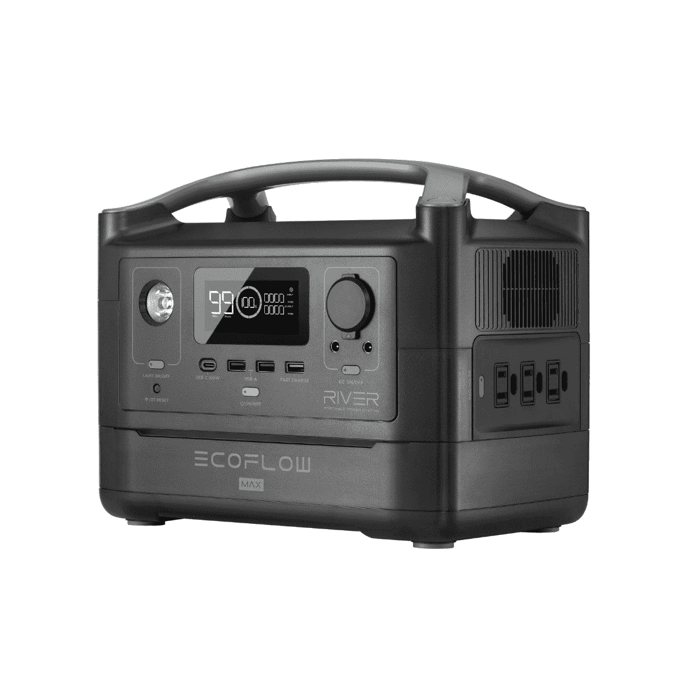
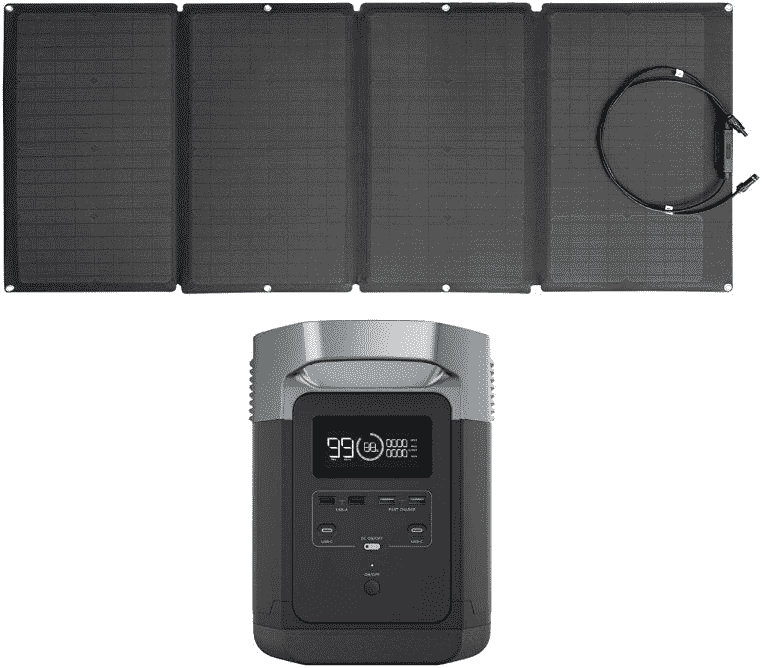

# EcoFlow 九月份的销售在便携式电站上有很大的折扣

> 原文：<https://www.xda-developers.com/ecoflow-september-sale/>

EcoFlow 将在 9 月份举办一场大型销售活动，展示他们最好的便携式发电站。EcoFlow 专注于在停电或离网情况下保持电力流动的产品。他们的一些最好的三角洲和河流发电站在整个九月打折，给你一个投资这些重要的防灾解决方案的机会。不要等待停电，现在就买一个便携式电站，利用这些优惠。

* * *

## **EcoFlow RIVER Pro**

建议零售价:649 美元

销售: **$549**

需要一点额外的果汁来延长假期吗？EcoFlow RIVER Pro 专为远离电网的长期度假而设计。快速充电时间让您可以花最少的时间担心您的电力，并有更多的时间享受大自然。

借助 720 瓦时的超大电池容量，步入大自然。RIVER Pro 是您进行网外冒险的发电站。同时保持多达 10 个设备通电，并通过汽车(8 小时)、太阳能(4-8 小时)或标准交流电源插座(96 分钟)在创纪录的时间内充电。

**购买选项:**

## EcoFlow RIVER Max

建议零售价:549 美元

销售: **$449**

马克斯河是远离电网的周末度假的最佳选择。它又小又轻，可以和你的其他露营装备一起放在任何车辆的后部。使用插座主机来确保您的所有设备都通电，即使是大型电器。

 <picture></picture> 

EcoFlow River Max

使用 RIVER Max 将河流容量增加一倍，让您的所有设备在周末度假时同时开机。使用可拆卸的额外电池，您可以在 1.6 小时内充满 576 瓦时的容量，这是市场上最快的。您还可以同时为多达 10 台设备供电。

**购买选项:**

* * *

## **EcoFlow 160W 太阳能电池板**

建议零售价:449 美元

销售: **$329**

EcoFlow 160W 太阳能电池板与 EcoFlow 发电站配合使用时，可在一天中的任何时间产生最大功率。太阳能电池板的转换效率高达 21-22%，可以在 6-12 小时内为一台 RIVER Pro 充满电。它便于携带，可折叠，体积小巧，重量仅为 15.4 磅/7 千克。

 <picture></picture> 

EcoFlow 160W Solar Panel

**购买选项:**

* * *

## eco flow DELTA+160 瓦太阳能电池板

管理系统更新项目:1，848 美元

销售:【1,599 美元

考虑获得发电站和太阳能电池板的完整解决方案，帮助您在不可预见的时间内保持照明。EcoFlow 的 160 瓦太阳能电池板和 DELTA 相结合，可以帮助您实现完全的电力独立。虽然这是紧急情况下的一个很好的解决方案，但它也可以是一个很好的方式来为谷仓、棚子或任何类型的未连接到电网的结构供电。

 <picture></picture> 

EcoFlow DELTA + 160W Solar Panel

EcoFlow 160W 太阳能电池板的转换效率高达 21-22%。将 160 瓦太阳能电池板与 EcoFlow 发电站相结合，在寒冷和多云的环境中享受更好的太阳能充电(10.5 至 21 小时内充满电)。

**购买选项:**

* * *

这是开始你的灾难计划或离网冒险的绝佳机会。由于 EcoFlow 所有产品的模块化设计，您可以随时在入门级设置上进行扩展。这些交易将持续到九月，所以尽可能地利用它们。

*我们感谢 EcoFlow 赞助了这篇文章。我们的赞助商帮助我们支付与运行 XDA 相关的许多费用，包括服务器成本、全职开发人员、新闻撰稿人等等。虽然您可能会在门户内容旁边看到赞助内容(这些内容将始终被标记为赞助内容),但门户团队对这些帖子不承担任何责任。赞助内容、广告和 XDA 仓库完全由一个独立的团队管理。XDA 绝不会通过接受金钱来赞扬一家公司，或以任何方式改变我们的观点或看法，从而损害其新闻诚信。我们的意见不能被收买。*