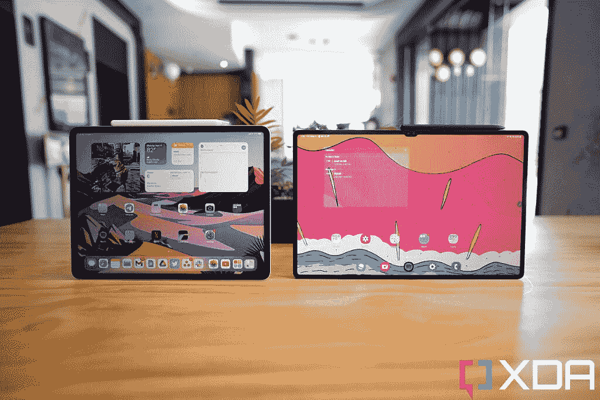
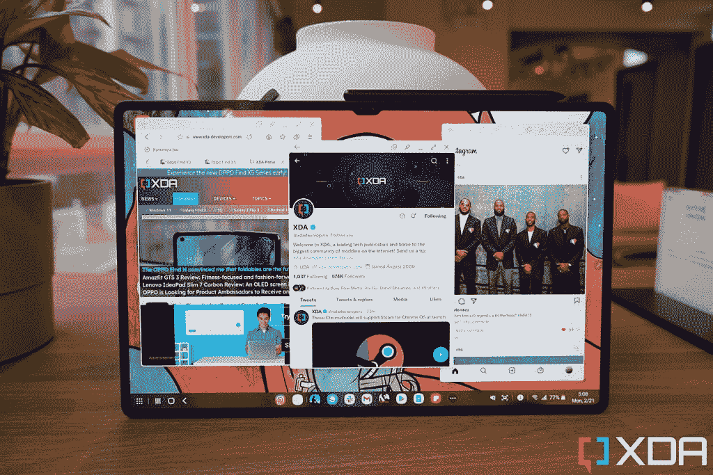
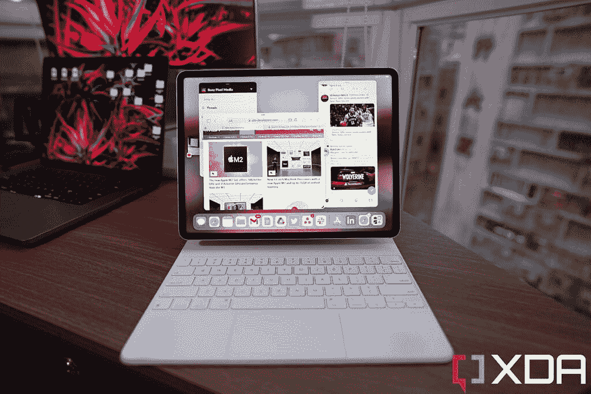

# 就在三星缩小了与安卓平板电脑的差距时，苹果用 iPadOS 16 再次扩大了差距

> 原文：<https://www.xda-developers.com/editorial-apple-widens-ipad-lead-ipados-16/>

iPhones 是否真的是最好的智能手机，或者 MAC 电脑是否比 Windows 电脑更好，这是很有争议的。但是当谈到平板电脑时，即使是最讨厌苹果的人(或者 Windows/Android 粉丝)也承认 [iPad 确实是最好的平板电脑](https://www.xda-developers.com/best-ipad/)。

这与竞争失败和苹果擅长他们所做的事情有很大关系。Windows 作为一个平板电脑是如此的糟糕，以至于它甚至不值得谈论，真的——让我们只关注 Android 平板电脑。为什么安卓平板电脑一直不如 iPad？这当然不是硬件，因为三星、小米和华为等公司已经证明，他们可以制造出和苹果一样好的高端硬件。

## 安卓平板最大的问题是运行安卓系统

相反，问题出在软件上:Android 本身并没有很好地针对横向大屏幕进行优化，但 Android 应用程序的问题更严重。它们中的大多数根本不是为在宽屏上运行而设计的。Twitter 是最好的例子——如果你在 iPad 上打开 Twitter，你会看到一个双窗格布局，充分利用了更大更宽的屏幕。在 Android 上打开同样的应用程序，它看起来很可笑——你经常会看到一条推文被拉伸到整个数字画布上。

*iPad 上的 Twitter(左)和 Android 平板电脑上的 Twitter(右)*

这是一个“先有鸡还是先有蛋”问题的完美例子:应用程序开发者不在乎只为 Android 平板电脑设计，因为 Android 平板电脑并不被高度重视。但在 Android 平板电脑获得更好的应用优化之前，平板电脑将一直受到阻碍。

 <picture></picture> 

The 2021 iPad Pro (left) and Galaxy Tab S8 Ultra (right)

## 三星为其平板电脑修复安卓系统

三星是这个规则的例外，它是通过意识到 Android 平板电脑应用程序的问题并努力自己解决这个问题而走到这一步的。对于该公司最近的两个平板电脑系列(Galaxy S7 和 Galaxy S8)，三星提供了“DeX Mode”，这是一个沙盒用户界面，可以将 Android 变成一个类似 Windows 主屏幕的空间。当你打开应用程序时，它们会在可以调整大小的较小的垂直矩形窗口中打开。这样，在宽屏上看起来很傻的 Android 应用程序，如 Twitter，可以通过 DeX“强制”以非常类似于平板手机屏幕的形式显示。

DeX 模式不仅缓解了 Android 应用程序的缩放问题，还使三星平板电脑成为一台出色的多任务处理机器。DeX Mode 不像 iPads 或其他 Android 平板电脑那样只在锁定的分屏网格中打开应用程序，而是允许三星平板电脑同时运行三个、四个或更多窗口。这一点，加上 Galaxy Tab S8 系列令人敬畏的硬件，意味着三星平板电脑实际上是好的。事实上，我非常喜欢使用 Galaxy Tab S8 Ultra，以至于我在我的评测中得出结论它比 [2021 M1 驱动的 iPad Pro](https://www.xda-developers.com/ipad-pro-2021-review/) 更通用*，因为我可以同时运行两个以上的应用程序。*

 <picture></picture> 

The Galaxy Tab S8 Ultra being able to run three apps simultaneously like this when the iPad could not made it my choice for on-the-go work machine.

现在，如果我不得不选择一个赢家，我仍然会说 iPad Pro 是一个更好的整体平板电脑，因为 M1 芯片的能力更强，因为 DeX 模式最终只是一个创可贴，而不是治愈伤口。除非应用程序开发人员像对待 iPad 应用程序一样努力开发 Android 应用程序，否则 iPad 将永远运行得更流畅，拥有更强大的应用程序。但是，三星至少缩小了其平板电脑和 iPad 之间的差距，iPad 已经统治了十多年。谁知道呢，也许随着 DeX 的进一步完善，下一代 Galaxy Tab Ultra 最终会赶上或超过 iPad。

## WWDC 的余波

但现在看来不太可能了。因为在本周的 WWDC 上，苹果宣布了对 iPadOS 16 的重大升级(该软件将于今年秋天开始在几乎所有的 iPads 上运行)，最大的改进是苹果基本上建立了自己的 DeX 模式——但更好。

这项名为“舞台管理器”的功能允许 M1 驱动的 iPad(目前是 2021 年的 iPad Pro 和 2022 年的 iPad Air)在可调整大小的窗口中打开应用程序。这是以前的 iOS 设备无法做到的，这是一个立竿见影的改变。记住:DeX 模式存在的部分原因是为了修复软件缺陷。Stage Manager 没有这个负担，它不能处理优化很差的应用程序。这将使 Stage Manager 比 DeX 模式运行得更平稳、更高效。见鬼，即使现在是 iPadOS 16 的第一个开发者测试版，Stage Manager 已经比 DeX Mode 工作得更好了。例如，谷歌文档在 DeX 上的表现总是很奇怪，在全新的窗口中打开文档。无论是否在 Stage Manager 中，这个问题在 iPadOS 的 Google Docs 上都不存在。

 <picture></picture> 

iPad Pro with iPadOS 16 beta software running three apps at the same time.

苹果基本上已经建立了自己的 DeX 模式——但更好

Stage Manager 还有一个聪明的窗口分组设置，我觉得非常有用。例如，我可以将我的所有工作窗口(Slack、Twitter、Safari)放在一个组中，将休闲窗口(Instagram、YouTube、WhatsApp)放在另一个组中，这些批次的应用程序可以最小化为 iPad 显示屏左侧的一个浮动图标堆栈，这意味着我可以在两个批次的应用程序之间来回跳转。这些转换发生的动画或速度在 iPadOS 16 的第一个测试版上已经非常流畅了。

## 苹果公司通过 iPadOS 16 再次扩大了领先优势，甚至比以前更大

iPadOS 16 的另一个巨大改进是它允许 M1 驱动的 iPads 将主屏幕扩展到外部显示器，这给了我更多的空间来打开更多的窗口(你最多可以打开八个窗口，但实际上，四五个对我来说已经足够了)。三星的 Galaxy Tab S8 Ultra 就像我所知道的几乎所有其他平板电脑一样，只能将其屏幕镜像到另一个显示器上，而不能扩展。

我远程工作，至少在 Covid 之前，我经常出差。因此，我总是在寻找最便携的设置，它仍然给我足够的能力和屏幕空间来有效地工作。我真的希望 Galaxy Tab S8 Ultra 成为那台机器——在将 review unit 退还给三星后，我自己也购买了一台——但现在 iPad Pro 提供了一个带外部显示器支持的高级多任务系统，我别无选择，只能跳回 iPad Pro。

最近有消息称，苹果正在开发一款更大的 14.1 英寸 iPad Pro，加上承诺为 iPadOS 带来更多“桌面级应用”，iPad Pro(甚至 iPad Air)作为真正的电脑替代品只会越来越好。就在三星用一款几乎和 iPad 一样强大的平板电脑缩小了差距的时候，苹果再次扩大了领先优势。