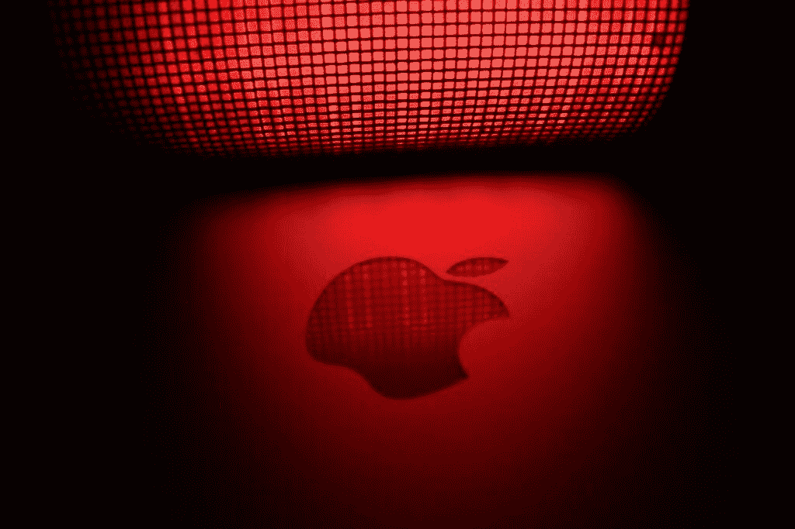
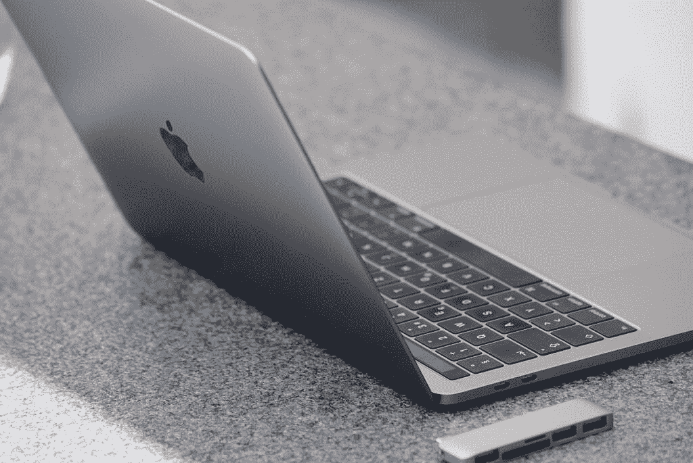

# 我讨厌我的苹果电脑——这就是我转向 Windows 的原因

> 原文：<https://www.xda-developers.com/editorial-why-moving-from-mac-to-windows/>

就介绍而言，这绝对是一种更容易引起分歧的自我介绍方式。但是谨慎的乐趣在哪里？在对我的 Mac 上闪亮的苹果标志崇拜了十年之后，我终于明白了，我将切换到我自 Windows XP 以来的第一个 Windows 操作系统。

考虑到我刚刚在同一个句子中使用了“崇拜”和“苹果”这两个词，你认为我也是 iPhone 的恳求者是情有可原的。然而，幸运的是，那艘船在很久以前就启航了，这让我更加惊讶，尽管在过去的八年里我一直拥有 Android 手机，但我还没有放弃我的 Mac 电脑而选择 Windows。

## 麦克对我做过什么？

就是这样；麦克从未为我做过任何事。尽管我想全心全意地爱 Mac，但每次我咬紧牙关买了新型号，价格就上涨了，而质量却下降了。一旦拥有一台[漂亮、闪亮的新 Mac](https://www.xda-developers.com/best-macs/) 的蜜月期结束，我总是会想我实际上为它付出了什么——是闪亮的苹果标志，还是里面的规格？

 <picture></picture> 

Image Credit: [Pexels](https://www.pexels.com/photo/apple-logo-413279/)

在苹果网站上配置你的 Mac 就像是在获得一个可以真正做你需要它做的事情的设备和无意中让你自己破产之间跳舞。作为一名即将成为百万富翁的人，我经常不得不站在可承受的一边，这意味着我要为一台不合规格的 Mac 支付高于预期的价格。

### 别穷了，买个好点的型号

我现在可以听到，远处传来键盘战士为 Mac 辩护的声音，他们辩称，如果我只是买一个更好的型号，就不会有问题。

我真的需要解释为什么要求某人购买你的产品的顶级版本以使其物有所值不是一个好的品牌策略吗？当然，任何四位数价格的设备都应该能够处理几个打开的标签并连接到互联网，但我这里有一台 Mac，听起来像是要给瑞安航空的钱。

## 我的 Mac 让我恼火的地方

如果你还在这里，那么很明显你是为了 Mac 诽谤而来的，我会尽量不让你失望。尽管在我数字生活的大部分时间里，我都在使用 MacBook Air 和 MacBook Pro，但它们总能给我带来一些新的惊喜。

你喜欢你的充电器不断断开你的笔记本电脑吗？那么配有 L 型连接器的 MacBook Air 2008 就是你的苹果电脑。

或者你更喜欢不用空格键打字？在这种情况下，在 2016 年从剪刀开关转向新的蝶形连接器之后，几乎所有的 MacBook 都应该符合你的要求。

玩笑归玩笑，这些问题大部分已经在最近的 MacBook Air 和 MacBook Pro 迭代中得到解决，那么我对我的 Mac 机型有什么不满呢？不幸的是，我没有每年攒钱买新 Mac 的奢侈，所以我只能用 2018 年的 MacBook Air，偶尔也用 2018 年的 MacBook Pro。

除了在后台播放 Spotify 时难以处理几个打开的标签之外，我的 MacBook Air 的音质就像水下土豆一样，除非连接到耳机，否则无法使用流媒体服务。它还喜欢在最不方便的时候禁用我的触控板，而且从第一天开始，每当我试图全屏观看视频时，显示屏都会随机闪烁。

如果这还不够，它的两个非常慷慨的 USB-C 端口中的一个在几个月后停止了工作，给我留下了一个 USB-C 插座，在我有足够的空间下载 Mac OS Monterey T1 之前，我不得不继续疯狂删除。

虽然我很想说 2018 年的 MacBook Pro 没有任何问题，但它的价格也低于更疯狂的价格。它的按键仍然喜欢莫名其妙地卡住，我还体验过触控板在点击模式下卡住的情况。考虑到我主要使用 MacBook Pro 进行创作，被四个 USB-C 连接卡住，没有传统的 USB 端口或 SD 读卡器，这是一种痛苦，这迫使我使用一个转换器，苹果公司很乐意以很高的价格提供。

 <picture></picture> 

Image Credit: [Pixabay](https://pixabay.com/photos/macbook-pro-adapter-usb-c-macbook-2381729/)

## 我会想念麦克的什么

不要误会我的意思，虽然这篇社论并不完全是对 Mac 有利；我会怀念一些关于 Mac 的事情。

虽然我的 MacBook Air 的内部构建质量在价格上还有很多不足之处，但外部构建质量是首屈一指的。我喜欢苹果产品的外观和感觉；它们可能很贵，但它们也让人感觉很贵，我不确定我能不能回到没有金属机身的设备上。

我的 MacBook Air 也轻如鸿毛，方便地滑入最小的空间，这总是让我在旅行时成为朋友们羡慕的对象。

在 Mac 世界呆了这么久之后，我也害怕重新学习新的 Windows 操作系统，尽管考虑到 Windows 11 中的[设计变化，这可能不会太难。像他们的产品一样，Mac 一直有一个干净、漂亮、时尚的操作系统，虽然它可能不符合 Windows 用户的口味，但我一直很喜欢它。](https://www.xda-developers.com/windows-11/)

## 那我换什么 Windows 笔记本呢？

事情是这样的，Mac 限制你只有几个选择，MacBook Air，Pro 或 iMac。至于 Windows，可供选择的几乎太多了！

我还没涉足窗户的水域，就已经淹没在推荐的海洋中了。三星 Galaxy Book 2 业务可能是我的 Macbook Air 的竞争者，但 T2 的微软 Surface Laptop Studio 也在竞争之列。虽然有太多的选择是一个好问题，但这确实意味着我还没有决定哪台 Windows 笔记本电脑将取代我家的 Mac 电脑。

## 叫我叛徒，但我已经看到了光明

从 Mac 转向 Windows 已经有很长一段时间了。当我说我想继续爱着 Mac 时，我是认真的，但越来越明显的是，如果不付出高于正常水平的代价，我就无法获得我想要的表现。所以，现在，再见了 Mac，向 Windows 世界问好——不要来找我！