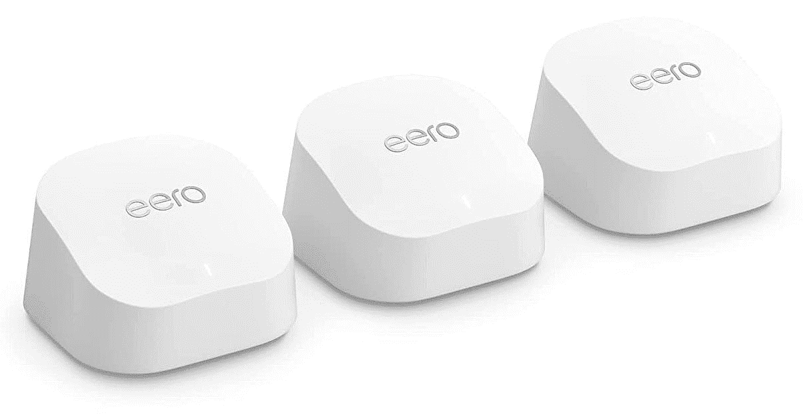

# 使用 Eero 6+网状路由器套件享受 Wi-Fi 6 带来的优惠

> 原文：<https://www.xda-developers.com/eero-6-early-prime-day-deal/>

亚马逊硬件目录的深度确实在像 [Prime Day](https://www.xda-developers.com/amazon-prime-day/) 这样的大事件上大放异彩。亚马逊树上的 Wi-Fi 路由器分支 Eero 也不例外，Prime Day 交易仍将持续几个小时。在整个 Eero 范围内都有节省，但绝对最好的是 Eero 6+套件。

正常情况下，三包售价为 299 美元，但 Prime Day 折扣已经生效，并带来了新的历史最低价格。从现在起到 7 月 13 日 23:59 Prime Day 结束，你可以在口袋里装上超过 100 美元的**，而不是普通的要价，这使得这成为最热门的 Wi-Fi 路由器交易之一。**

 **那为什么 Eero 6+ Mesh Wi-Fi 套件值得拿起呢？与你的普通 ISP 提供的路由器相比，你将会在任何网状网上玩得更开心。这些系统使用专用的后端协同工作，用强大的无线信号完全覆盖你的家。Eero 6+支持 Wi-Fi 6 和高达千兆的无线速度。它在 160 MHz 频段上也有额外的带宽，这显然是“更快连接”的代码。

 <picture></picture> 

Eero 6+ (3-pack)

##### Eero 6+ (3 件装)

使用这款 Wi-Fi 6 Mesh 套件告别 Wi-Fi 死区，让您的家沐浴在美味的连接中。

Eero 6+的目标是在你的家中提供快速、稳定的 Wi-Fi，但实际上你得到的远不止这些。首先，每个节点背面都有一对千兆以太网端口。尽管 Eero 6+ wireless 的性能应该非常好，但对于一些任务，如游戏，用电缆连接仍然是更好的选择。

也许更有趣的是 Eero 6+的智能家居功能。作为亚马逊的产品，它当然与 Alexa 兼容。但不仅仅是控制 Wi-Fi 接入这样的日常任务。Eero 6+支持 Zigbee 和 Thread，何时推出，事关重大。这使得通过将设备与 Eero 6+配对，然后链接到 Alexa，将 Eero 6+用作智能家居的心脏成为可能。**