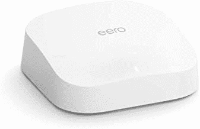
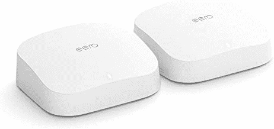
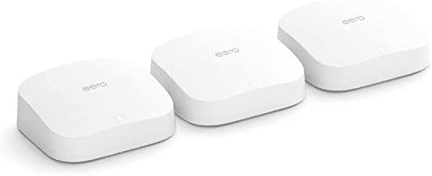

# Eero Pro 6 mesh Wi-Fi 系统现已上市，起价仅为 171 美元(优惠 50-150 美元)

> 原文：<https://www.xda-developers.com/eero-pro-6-mesh-wi-fi-system-now-on-sale-starting-at-just-171-50-150-off/>

亚马逊旗下的 Eero 出售一些最好的 Wi-Fi 路由器，尤其是如果你有一个更大的家，需要一个网状网络来实现更大的信号覆盖。Eero Pro 6 是该公司的最新系统，支持 Wi-Fi 6 和其他伟大的功能，现在它在多家零售商出售。单个电台现在只要 171 美元(低于 229 美元)，两个一组的要 229 美元(低于 399 美元)，三个一组的要 449 美元(低于 599 美元)。

Eero Pro 6 是一个网状网络系统，这意味着路由器相互连接，你的设备连接到最近的站(类似于手机连接到最近的手机信号塔)。与常规的 Eero 6 不同，Eero Pro 6 是一个三频系统，所以你不会在辅助站上损失任何速度——你家里的设备应该与连接到主路由器的任何设备具有大致相同的互联网速度。

 <picture></picture> 

Eero Pro 6 (1-Pack)

##### 亚马逊 Eero 6

这个独立的工作站非常适合 2000 平方英尺的家庭。制成

 <picture></picture> 

Eero Pro 6 (2-Pack)

##### 亚马逊 Eero 6

两个 Eero Pro 6 工作站最多可覆盖 3000 平方英尺。制成有了高速互联网。

 <picture></picture> 

Eero Pro 6 (3-Pack)

##### 亚马逊 Eero 6

这款 Eero Pro 3 件装可为您提供高达 6000 平方英尺的覆盖范围。制成

即使你没有一个 Wi-Fi 接收不稳定的大房子，单个 Eero Pro 6 站可能仍然是对你当前路由器的改进。它使用智能手机应用程序进行设置和管理，你可以看到哪些设备正在使用你的带宽，所有 Eero Pro 6 站都是 Zigbee 设备的智能家庭集线器(至少对基于 Alexa 的产品来说)。亚马逊还销售可选的“安全”订阅服务,为你提供先进的内容过滤功能，并增强对联网设备的保护。

我已经在我的家庭网络上使用 Eero 6 Pro 近一年了，它比我尝试过的其他路由器可靠得多。我真的没有理由为可选的订阅服务付费，尤其是因为我已经使用 [NextDNS](https://nextdns.io/) 进行网络过滤。较小的家庭和公寓可能最好使用单个基站，但如果你注意到家中部分地方的 Wi-Fi 信号很弱，2 包或 3 包可能效果最好。