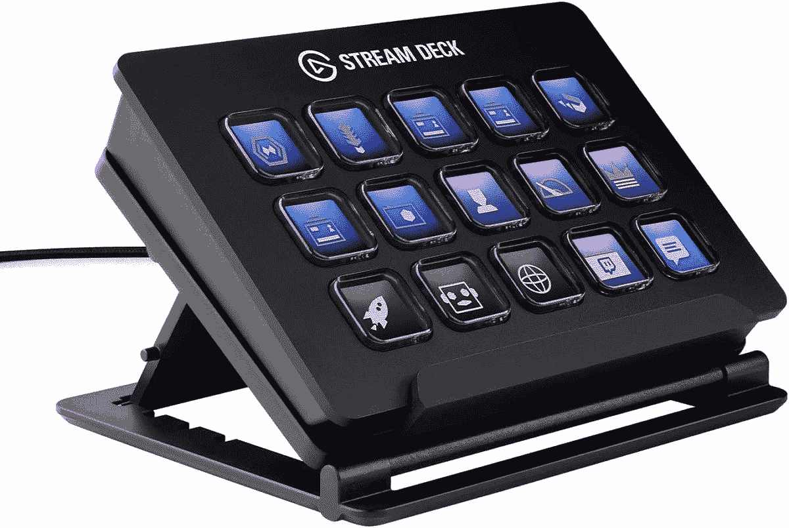

# Elgato Stream Deck 降至 99 美元时的流光之梦

> 原文：<https://www.xda-developers.com/elgato-stream-deck-drops-down-to-99/>

# Elgato Stream Deck 降至 99 美元时的流光之梦

众所周知，埃尔加托溪流甲板让彩带生活变得更加轻松。现在，它在百思买和亚马逊有售，售价 99 美元。

无论你是一个经验丰富的在线流或只是一个初学者，机会是，你可以使用你的武器库中的工具，使你的生活更容易。虽然 Elgato Stream Deck 曾经只提供给专业人士，但它带来了一个可编程键盘，只需按一下按钮就可以执行操作。更好的是，它以合理的价格做到了这一点。令人欣慰的是，在亚马逊的 Prime Day 销售期间，价格进一步降低，这是一件绝对的便宜货。

如果你从未听说过 Elgato，那是一家专门生产游戏产品的公司。Elgato Stream Deck 是一个方便的工具，有 15 个按键，可以通过编程来执行不同的操作。让这款产品成为多功能产品的是，Stream Deck 上的每个按键都是一个 LCD。这意味着您可以根据自己的喜好定制键盘，并拥有许多不同的操作和选项。您甚至可以使用提供的工具创建自己的设计，并拥有多种不同的布局。Stream Deck 集成了流行的流媒体软件，如 OBS、Twitch、Twitter、YouTube 等。

## Stream Deck 可以简化您的流媒体流程

就价格而言，埃尔加托溪流甲板的价格通常在 120 美元到 150 美元之间。百思买和亚马逊目前的折扣使价格达到 99 美元。这意味着在这次销售中你可以得到 30 到 50 美元的折扣。从历史上看，价格很长一段时间没有降到 99 美元，即使有，也是罕见的情况。在这种情况下，如果你一直在盯着这个产品，趁折扣还在的时候拿起它可能是个好主意。如果这件商品没有引起你的注意，请务必查看我们出色的[亚马逊 Prime Day](https://www.xda-developers.com/amazon-prime-day/) 销售页面，展示为期两天的活动的最佳交易。

 <picture></picture> 

Elgato Stream Deck