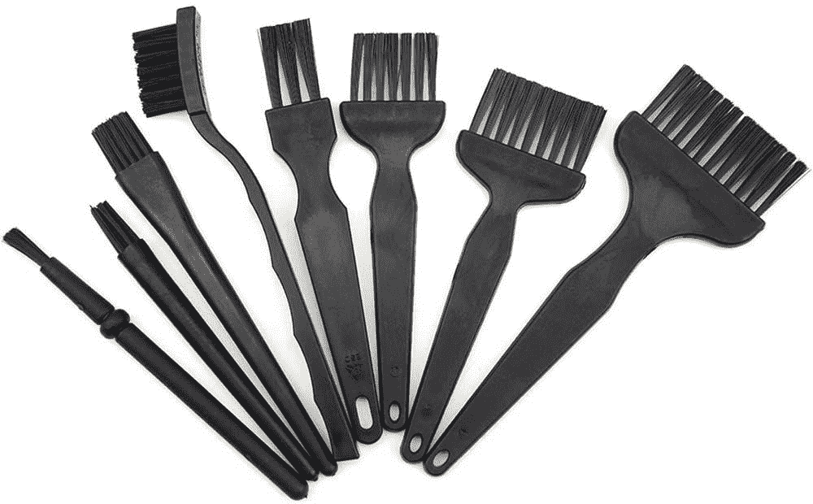

# 如何清洁和保养 HP Elite Folio 的纯素皮革

> 原文：<https://www.xda-developers.com/elite-folio-cleaning/>

新推出的[惠普 Elite Folio](https://www.xda-developers.com/hp-elite-folio-review/) 是一个稀有品种。除了是为数不多的由 ARM 处理器驱动的 Windows 笔记本电脑之一，它还采用了纯素食皮革表面，名副其实。这不是惠普的第一款皮革包装笔记本电脑，因为该公司几年前推出了 Spectre Folio。但 Elite Folio 上的皮革由于其深色涂层而感觉更加微妙。

就外观和手感而言，它无疑很有吸引力，但保养皮革可能是一项任务，尤其是粘在笔记本电脑上的皮革。今天，我们就如何清洁和保养 HP Elite Folio 上的纯素皮革提供了一些建议。

## **在惠普 Elite Folio 上清洁纯素皮革**

纯素皮革是真正皮革的良好替代品，人们正在努力使用可持续材料来减少对环境的影响。但如果你想让纯素皮革经久耐用，最好时不时地清洗和保养一下。保持 Elite Folio 皮革清洁的最简单方法是使用软毛牙刷或从亚马逊购买一套防静电清洁刷。

 <picture></picture> 

WMYCONGCONG 8 in 1 Anti Static Brush Kit

##### Wmycongcong 8 合 1 防静电刷套装

这款刷子套件非常适合清洁各种电脑部件和外围设备。

轻轻刷掉积聚在褶皱和角落周围的灰尘颗粒或任何棉绒。一个好习惯是，一旦你注意到灰尘或任何污渍，立即擦掉它们。使用婴儿湿巾或用温水浸湿的柔软干净的布。**确保不要将任何液体倒在皮革上，因为这会损坏皮革和下面的笔记本电脑。**

要去除顽固污渍，请遵循污渍清洁法。将一些温和的清洁剂与水混合，用它来浸湿一块干净的无绒布。轻轻擦拭污渍，去除多余的水或清洁剂。用干布擦去，重复上述步骤，直到污渍被去除。正如我之前提到的，不要让任何液体停留在皮革上，因为这可能会损坏皮革。

## **在惠普 Elite Folio** 上维护纯素皮革

 **纯素皮革或人造革通常使用特殊的保护剂或密封剂进行维护。但是，建议在这种情况下避免使用它们。Elite Folio 的材料不是同样闪亮的面料，使用任何上光剂都会损坏皮革。有一些指导方针可以帮助你保持皮革的质量。

*   避免将机箱长时间暴露在极端温度或潮湿环境中。
*   避免阳光长时间直射。
*   将可能含有染料的物质，如墨水、口红或油漆远离箱子。
*   避免接触可能划伤皮革的尖锐物体或表面。

 <picture></picture> 

HP Elite Folio

##### 惠普精英版

HP Elite Folio 是一款基于 ARM 的 Windows 可转换笔记本电脑，采用独特的纯素食皮革外壳保护整个机器。**