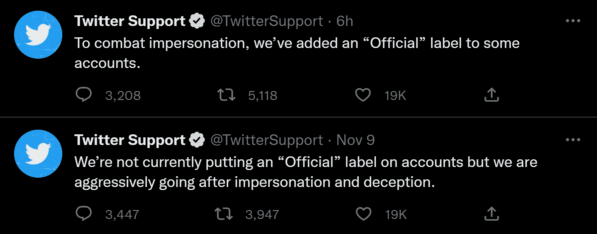

# 埃隆，怎么才过了两周？

> 原文：<https://www.xda-developers.com/elon-musk-twitter-two-weeks/>

Twitter 一直是一家成功公司的混乱展示，尽管所有的努力都是相反的。然而，当该公司濒临死亡之门时，2016 年美国总统大选使其变得有意义。那年早些时候，前董事会成员迈克·麦库埃告诉*[Vox](https://www.vox.com/2016/9/14/12876560/twitter-acquisition-options-google-facebook-apple)*“Twitter 是一个巨大的现象，而不仅仅是一家公司。”而这种现象正是世界首富埃隆·马斯克两周前继承的。

但从那以后，马斯克的任期变成了一种不同的现象。随着公司 50%的员工被裁，这似乎是一场赌博(几项法律挑战正在进行中)，该网站已经开始崩溃。更重要的是，被解雇的员工已经被要求重返工作岗位，这似乎是对过度热衷于减少公司月度记录的含蓄承认。

过山车也没有就此结束。一个“官方”标记被添加到人们的个人资料中，使人们的个人资料看起来像是计算机科学 UX 一年级作业的一部分。当人们抱怨时，马斯克取消了这项功能，随后表示 Twitter 将在未来几个月做“很多蠢事”。但截至本文写作之时，似乎又回来了。据我们所知，它会再次被移除。而这只是冰山一角。

怎么才过了两周？

## 快速移动并打破东西...很多事情

马斯克来到 Twitter 后的第一件事就是安排裁员，尽管尚不清楚裁员的规模。早期投资者被告知，该公司目前多达 75%的员工将被解雇，尽管真正的裁员人数约为公司的 50%。目标团队包括通信、全球人权、机器学习伦理、透明度和问责制。有趣的是，The Verge 昨天试图联系该公司发表声明，但不得不直接联系马斯克，因为 Twitter 不再雇佣任何沟通团队。

马克·扎克伯格(Mark Zuckerberg)曾用“快速行动，打破常规”这句古老的格言来描述脸书的增长战略，它被视为许多硅谷大型科技公司遵循的行动计划。脸书后来偏离了这句格言，而竞争对手也放慢了速度，而是坚持前半句。Twitter 最近再次无能，导致后者成为其商业战略，前者指的是扣动扳机前缺乏思考。

Twitter 最近再次表现出无能，导致“打破常规”成为其商业策略，“快速行动”指的是其在扣动扳机前缺乏思考。

“很抱歉@-周末的每个人，但我想告诉大家，我们有机会问那些离开的人他们是否会回来。我需要在太平洋标准时间周日下午 4 点前把名字和理由放在一起。我会做一些调查，但如果你们中的任何人与可能回来的人以及我们认为会帮助我们的人有联系，请在 4 点之前提名，”一位经理在公司的 Slack 中写道。

将关键人物调离公司，然后要求他们回来，这意味着许多裁员都是精心策划的。经理们试图保护最脆弱的人免受裁员的影响，但有些人觉得最脆弱的人似乎才是被裁员的目标。

事情变得越来越糟糕，因为在马斯克的广告空间之后不久，仍留在公司的两名最受公众关注的高管同时离开了。其中一个是该公司前信任和安全负责人 Yoel Roth。马斯克经常被看到与罗斯互动，分享他的(总是积极的)推文，似乎试图证明 Twitter 比以往任何时候都做得更好。另一位是该公司的首席信息安全官 Lea Kissner，目前还不清楚他们离开后谁接管了公司的安全运营。

马斯克目前表示，Twitter 的使用人数正在上升，这可能是真的，但对我们来说，这似乎是人们站在那里看烟花。参与度是一个短期指标，用户数量是一个滞后指标。当用户数量开始下降时，已经太晚了。

## “8 美元”并不是对批评的认可

任何敢于批评 Twitter 掌门人并设法吸引他眼球的人都会得到简单的回复:“8 美元。”批评新的核查制度？ [$8](https://twitter.com/Youssofal_/status/1590758262311649280) 。指出负责人随意摆弄平台的方式，就像孩子玩新玩具一样？ [$8](https://twitter.com/FridaGhitis/status/1587891785791307778) 。如果账户所有者没有支付 8 美元，一个平台就会压制推文，这难道不是言论自由的例子吗？"[感谢您的反馈，现在支付 8 美元](https://twitter.com/AOC/status/1587647032457449473)"

所有这些都是合理的批评，然而，马斯克似乎不想听这些批评。该网站的新验证系统已经出现了几个记录在案的问题，而且这些问题不会消失。当 Twitter 蓝色验证勾号看起来完全像“合法”验证勾号(代表官方品牌或个人)时，诈骗就变得容易多了。尽管有“验证”的绰号，[没有这样的验证可言](https://twitter.com/JackMLawrence/status/1590480221257359361)。

就好像他在马儿跑了之后关上了马厩的门，经过验证的用户不允许在 Twitter 上更改他们的用户名。问题是，你可以只改变你的网名，然后为 Twitter Blue 付费，保留你的任何网名。这已经导致了一些非常有趣的情况，特别是在 Doja Cat 的情况下，她在她的名字被贴上“圣诞节”后，直接在 Elon Musk 上发了推特。

广告客户显然会对任何人都可以模仿他们的品牌这一事实感到不快，许多人已经离开了。当一个 Twitter 蓝色验证用户的模仿已经迫使一家公司不得不发表道歉时，这并没有什么帮助。制药公司礼来公司不得不在推特上发表声明，向那些看到虚假推文，谎称胰岛素将免费提供的人道歉。

在许多人希望能对批评做出大量回答的情况下，马斯克随后开设了一个专门针对广告商的 Twitter 开放空间。他详细讲述了该平台未来可能面临的问题，他对这些问题的计划，以及它们如何实际上不会成为问题。马斯克表示，对信用卡和电话号码的要求最终会导致巨魔在耗尽资源后放弃，尽管生成电话号码和信用卡非常容易，同时也有可能在犯罪黑社会中大量购买这两者。

这家公司并不是没有预见到一些问题。Twitter 已经推出了新的 Twitter Blue，限制 11 月 9 日或之后创建的账户不能访问它，作为一种权宜之计，防止人们注册新账户进行诈骗。问题是这种限制是不可持续的；如果它的目标是赚钱，它无法阻止新用户永远为其订阅服务付费。尽管有这种限制，我们已经看到几个帐户从事主要品牌和高知名度的人的模仿。限制昨天之前创建的每个账户访问 Twitter Blue 就像试图用海绵堵住漏洞。从那以后，该公司已经禁止订阅 Twitter Blue。

考虑到骗子可能赚到的钱，“8 美元”不是一个答案，而是一种激励。

## “已验证”与“已验证”以及官方分笔成交点的回归

更荒谬的是，Twitter 自己的验证失败了，目前实际上有两种不同的验证方式*，当查看某人的账户时，这两种方式都被发送到用户的客户端。以下是从查看我自己的帐户。*

 *如你所见，上面写着我没有被*蓝*验证。然而...

即使在 Twitter 上，“验证”也有两种不同的意思。目前还不清楚这样做的目的是什么，但它将允许该公司在理论上根据验证的类型显示不同的图标，并允许它最终在未来完全停止在已验证的个人资料上显示标签。

更荒谬的是，在今天早些时候的某个时候，该公司随后*重新启用了*“官方”tick，就在几天前，马斯克在推特上明确表示“我杀了它”以回应关于它的下落的问题。现在有报道称不再可能订阅 Twitter Blue，这表明对该服务的全面重新评估即将到来。现在，我们有了官方的 Twitter 支持账户(奇怪的是，没有“官方”打勾),它最近的两条推文总结了 Twitter 目前的小丑车。

## 

带有蓝色验证复选标记，并被替换为...蓝色验证复选标记可以购买，需要有一种方法来区分“验证”的人和“已验证”的人。这就是最初引入“官方”标记的原因。

## 别忘了还有联邦贸易委员会

如果你认为这家公司从外部看起来已经够糟糕了，那么你还什么都没看到。Twitter 对美国联邦贸易委员会(FTC)并不陌生，马斯克本人对联邦政府机构也不陌生。早在 2011 年，Twitter 就与 FTC 签署了一项同意令，明确禁止该公司歪曲其隐私和安全做法。5 月，该公司因违反该法令被罚款 1 . 5 亿美元，并被迫签署了第二项修正法令。

第二份协议非常重要，因为该公司[同意将以下内容作为和解的一部分](https://www.ftc.gov/news-events/news/press-releases/2022/05/ftc-charges-twitter-deceptively-using-account-security-data-sell-targeted-ads):

> 实施和维护全面的隐私和信息安全计划，该计划要求公司检查和解决新产品的潜在隐私和安全风险。

该公司隐私团队的法律负责人发送了一份内部备忘录，称他们已经[听说](https://twitter.com/alexeheath/status/1590732764487512064/photo/1)工程师将需要“自我证明”符合 FTC 要求和其他法律。2014 年借调到 Twitter 的 riana Pfefferkorn[认为](https://twitter.com/Riana_Crypto/status/1590739501160468481)该公司已经违反了联邦贸易委员会的第二次修改令。这是因为必须有一个团队来确保 FTC 的合规性，而目前 Twitter 还没有这样的团队。

谁来“检查和解决新产品潜在的隐私和安全风险？”工程师「自证」算「综合」吗？我大胆猜测一下，说它不是。

在马斯克提前一小时通知组织的紧急全体会议上(顺便说一下，他迟到了)，他告诉 Twitter 员工“破产不是不可能的。”更令人担忧的是，马斯克似乎暗示该公司仍然人浮于事。考虑到 Twitter 因收购而背负的巨额债务(130 亿美元，12 个月后将有 12 亿美元的利息到期)，以及由于广告商退出而每天损失的 400 万美元，前景无疑是暗淡的。

然而，所有这些都是可以避免的。Twitter 以前是一家一团糟的公司，但不像现在这样烧钱。由于它以前是一家上市公司，该公司的收益报告很容易获得。2021 年，该公司的收入为 50.8 亿美元，运营亏损为 4.93 亿美元。这包括 7.66 亿美元的一次性诉讼相关费用和其他投资。Twitter 是一家苦苦挣扎的企业，但不知何故，埃隆让它走得更远。

## 两周就够了

两周。就像埃隆会说的那样，“[让它在](https://twitter.com/elonmusk/status/1585341984679469056)中下沉。”不到两周，公司的广告收入大幅下降，几名高层管理人员离开了公司，50%的员工几乎在一夜之间消失了。虽然 Twitter 近年来大部分时间都有运营亏损，但它至少有广告收入可以依靠，以减轻这些亏损。现在它甚至没有这个功能，8 美元的订阅费——对于一个目前甚至不存在的订阅——应该是解决 Twitter 所有问题的灵丹妙药。

很难相信这一切发生得如此突然，埃隆·马斯克对 Twitter 的整个方法正在以一只鸽子试图解决魔方一样的成功水平执行。如果这个平台的未来依赖于一个对任何批评都只能回应“8 美元”的任性顽童，那么 Twitter 注定要失败。*