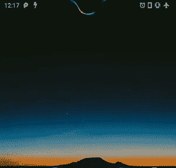

# Energy Notch 电池指示灯增加了对 OnePlus 6/7/7T、POCO F1、小米 Mi 10 Lite 5G、Redmi Note 7/7S 和摩托罗拉 One Power 的支持

> 原文：<https://www.xda-developers.com/energy-notch-battery-indicator-adds-support-oneplus-6-7-7t-poco-f1-xiaomi-mi-10-lite-5g-redmi-note-7-7s-motorola-one-power/>

# Energy Notch 电池指示灯增加了对 OnePlus 6/7/7T、POCO F1、小米 Mi 10 Lite 5G、Redmi Note 7/7S 和摩托罗拉 One Power 的支持

Energy Notch 电池指示灯已更新，支持 OnePlus 6/7/7T、POCO F1、小米 Mi 10 Lite 5G 和其他几款手机的摄像头凹槽。

Android 是关于定制的，售后开发社区是这种自由背后的驱动力。开发人员经常提出创造性的想法，以完全不同于预期的方式重用现有的设计组件。以 XDA 知名开发商 [jagan2](https://forum.xda-developers.com/member.php?u=1884109) 的 [Energy Notch](https://www.xda-developers.com/energy-notch-shows-a-battery-indicator-around-the-notch-of-the-oneplus-6t/) 为例——这是一个很酷的应用程序，它通过将凹槽周围的空间变成动画电池指示器来使用一加 6T 的显示凹槽。

 <picture></picture> 

Energy Notch in action

在发布该应用的初始版本后不久，该开发者就开始收集其他几款带有凹口显示面板的智能手机用户的反馈，以扩大支持设备的列表。最新版本的能源环，标记为 *EN_1.2* ，现在支持一加 6，一加 7 和一加 7T。除了一加，该应用程序现在完全兼容来自不同原始设备制造商的一系列手机，即[小米 Mi 10 Lite 5G](https://www.xda-developers.com/xiaomi-mi-10-lite-5g-announced/) (及其中国版本，Mi 10 Lite Zoom/ [Mi 10 青春版 5G](https://www.xda-developers.com/xiaomi-mi-10-youth-edition-5g-snapdragon-765g-periscope-camera-china-launch/) )、Redmi Note 7/Note 7S、Poco F1 和摩托罗拉 One Power。如果您在列表中找不到您的手机，只需向开发者发送一条私人消息，请求添加对特定设备的支持。

下面列出了特定于设备的讨论线索。

付费用户有一些额外的功能，但基本版确实提供了足够的定制选项，如配置宽度，根据电池电量改变颜色，定义耗尽的方向，等等。该应用程序消耗的 CPU 功率非常小，因此用户不必担心电池耗尽。

【app box Google play“you . in . spark . energy . notch”】