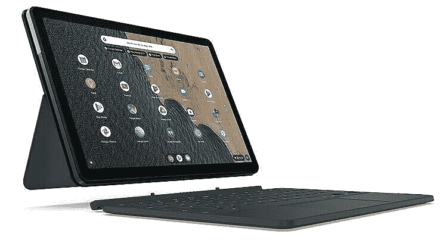
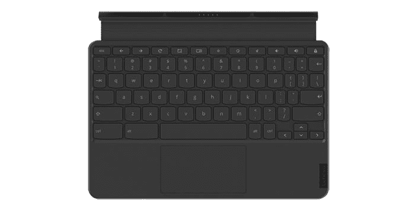
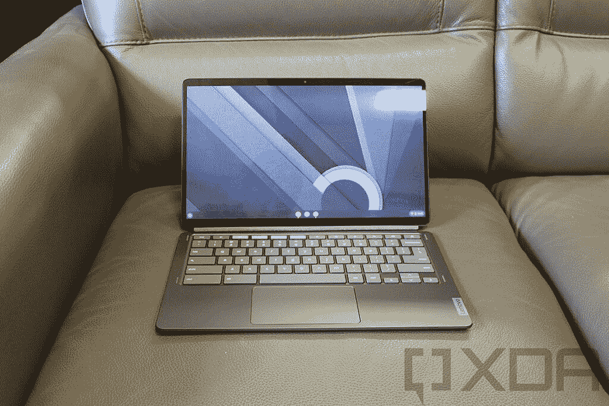
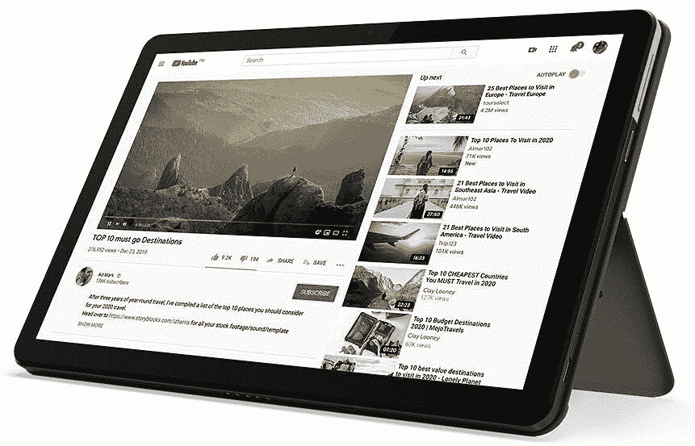
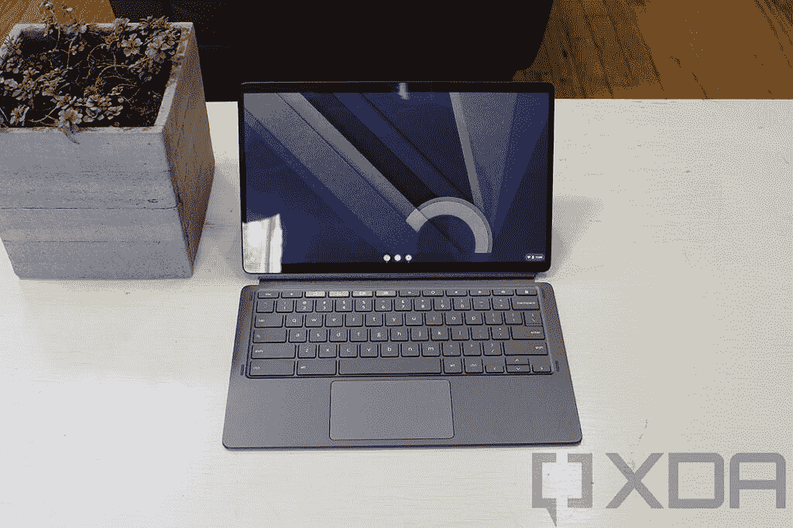

# 联想 chrome book Duet 5 vs chrome book Duet:该买哪个？

> 原文：<https://www.xda-developers.com/enovo-chromebook-duet-5-vs-chromebook-duet/>

在这一比较中，我们将了解这些 Chrome OS 平板电脑的不同之处，以及根据您的首选使用情况，您现在应该购买哪一款。这是联想 Chromebook Duet vs 联想 Chromebook Duet 5。

| 规格 | 联想 Chromebook Duet | 联想 Chromebook Duet 5 |
| --- | --- | --- |
| **尺寸&重量** | 

*   9.44 英寸 x 6.29 英寸 x 0.29 英寸(仅限平板电脑)
*   0.99 磅(仅限平板电脑)

 | 

*   7.35 英寸 x 12.4 英寸 x .29 英寸
*   1.5 磅(700 克)

 |
| **显示** | 

*   10.1 英寸 FHD (1920 x 1200) IPS
*   400 尼特
*   触摸屏

 | 

*   13.3 英寸 1920x1080 像素
*   触摸屏
*   有机发光二极管（Organic Light Emitting Diode 的缩写）

 |
| **处理器** | 

*   联发科 Helio P60T 处理器(2.00 GHz，8 核，8 线程)
*   集成 ARM G72 MP3 800GHz

 | 

*   高通骁龙 7c 计算平台第二代
*   8 核
*   高通 Adreno 618 GPU

 |
| **风筒&储存** | 

*   板载 4GB LPDDR4X
*   高达 128GB eMMc

 | 

*   板载高达 8GB LPDDR4X
*   高达 256GB 的 eMMC 存储

 |
| **电池&充电** | 

*   长达 10 小时
*   基于较低的亮度设置进行估计

 | 

*   快速充电时长达 15 小时
*   基于较低的亮度设置进行估计

 |
| **安全** |  |  |
| **前置摄像头** | 

*   200 万像素固定焦距，带 LED 指示灯

 |  |
| **面向世界的摄像机** |  |  |
| **端口** | 

*   1 个 USB-C(第二代)
*   5 点弹簧针

 | 

*   2 个 USB-C(第二代)
*   5 点弹簧针

 |
| **音频** | 

*   2 个杜比 Audi0 扬声器
*   智能放大器

 | 

*   4x 杜比音频扬声器
*   智能放大器

 |
| **连通性** | 

*   802.11 a/b/g/n/ac、MIMO、2x2、2.4GHz/5GHz 双频带
*   蓝牙 4.2

 | 

*   802.11 a/b/g/n/ac、MIMO、2x2、2.4GHz/5GHz 双频带
*   蓝牙 5.1

 |
| **软件** | Chrome OS | Chrome OS |
| **其他特性** | 

*   可拆卸键盘
*   部分型号中包含笔
*   起价 219 美元

 | 

*   可拆卸键盘
*   深渊蓝，风暴灰
*   起价 429 美元

 |

## 联想 Chromebook Duet vs 联想 Chromebook Duet 5:设计和显示

这两款平板电脑都是真正的可拆卸设备，最近我们在 Chrome 领域看到了越来越多的这种设备。能够随身携带一个更轻的设备，并在需要时移除键盘和支架，这绝对是一件好事。由于两者都是由联想设计的，所以这些平板电脑的整体外观相当相似，尽管 Chromebook Duet 5 是一款更高端的设备。最初的 Chromebook Duet 有一个铝制外壳，但它被键盘下侧的织物盖和塑料隐藏得很好。另一方面，Chromebook Duet 5 自豪地展示了它的双色铝结构，同时在键盘盖/支架附件上仍然有很好的纹理。这两款平板电脑的价格相差约 200 美元，所以你可能会认为更贵的那款更结实。不过，最初的 Chromebook Duet 相当耐用，织物/塑料二重奏覆盖了大部分机箱。正如上面的规格表中所提到的，联想 Chromebook Duet 5 是一款超薄平板电脑，拥有 13.3 英寸的有机发光二极管显示屏，亮度为 400 尼特。这是一款全高清面板，分辨率为 1920 x 1080，支持 100%的 DCI-P3 色域。Duet 5 的显示肯定会更亮更生动，这使它成为像网飞这样的消费媒体的更好候选。

Duet 5 拥有与苹果 iPad Pro 相似的设计语言，这在平板电脑领域应该算是一种恭维。你得到的是带有较硬边缘的圆形显示角，手感很好。鉴于大屏幕尺寸，这不会是周围最轻的平板电脑。即使没有键盘和支架，它的重量也有 1.5 磅。如果你需要两个选项中较轻的一个，原版二重唱是单手使用的梦想，不到一磅。在键盘外壳上滑动，你可以在随身携带 Duet 5 时获得抓握的织物纹理，以及与原始 Duet 类似的感觉。这些平板电脑在没有键盘外壳的情况下使用时可能会有点滑，所以在外出时戴上键盘外壳是个好主意。这两款平板电脑也都支持笔输入。最初的 Chromebook Duet 的某些型号包括联想的 USI 钢笔。不幸的是，二重奏 5 的 USI 笔是一个可选配件。你可以从联想购买一支 USI 钢笔，或者作为第三方选项从亚马逊购买。

值得注意的一个关键规格是这两款设备都缺乏生物识别安全性，这在最初 Duet 的 229 美元价位上有些预期，但在 Duet 5 的更高价位上则相当令人失望。如果 OEM 厂商能够考虑为所有 Chrome OS 设备添加生物识别安全性，那就太好了，这在 2021 年的手机上是相当标准的。至于显示，二重唱 5 出来的顶部得心应手。OLED 面板有更深的黑色，仍然比原来的二重唱亮一点。可以肯定的是，最初的 Duet 在其价格点上有一个出色的屏幕，400 尼特的亮度对于户外工作来说足够了。考虑到这些设备的价格，你应该会对它们的显示屏感到满意——只要确保你检查了它们，看看你更喜欢哪个尺寸。

## 联想 Chromebook Duet vs 联想 Chromebook Duet 5:键盘和笔支持

与原装的联想 Chromebook Duet 和 Duet 5 一样，可拆卸键盘包含在所有型号的价格中。如果你选择购买原版 Duet 的高端型号，你还可以获得联想 USI 笔作为套装的一部分。二重唱 5 你需要自己买支笔。这意味着，如果你无论如何都需要笔支架，这两款平板电脑之间的价格差异实际上可以小一点。

最初对联想 Chromebook Duet 键盘的评论也不太令人印象深刻，所以这让人们对 Duet 5 的担忧有所停顿。许多评论者发现键盘有点小而且拥挤——如果你的手很大，那可能就不理想了。我们期待在内部获得联想 Chromebook Duet 5，这样我们就可以测试这些键盘的性能。

## 联想 Chromebook Duet vs 联想 Chromebook Duet 5:性能和电池

新的骁龙 7c 处理器应该优于原始 Duet 内部的低端联发科芯片，所以 Duet 5 在多任务处理、Android 游戏和运行 Linux 应用程序方面应该会更好一些。虽然我们没有对这两款设备进行基准测试，但 Duet 5 中的骁龙 7c gen 2 应该比最初的骁龙 7c gen 1 略有优势，后者在我们对 Chromebooks 的基准测试中表现不太好。事实上，联想 Chromebook Duet 5 是第一款采用第二代骁龙 7c 芯片的 Chromebook。

第一代 7c 并不强大，但对于日常任务来说还是不错的。你可以应付基本的网络浏览和低效率，但任何严肃的多任务处理都将非常困难。如果您想玩任何类型的游戏或运行强大的 Linux 应用程序，7c 处理器可能不适合您。联想 Chromebook Duet 5 似乎有可能在理论和实践的整体性能方面取得这两者之间的冠军，我们可以并将在我们的评论中测试这一点。作为更大的平板电脑，Chromebook Duet 5 的电池续航时间明显更长。联想认为 Duet 5 可以在现实世界中使用大约 15 个小时，这对我来说有点不现实。不过，Duet 5 内部的骁龙 7c gen 2 处理器可能会延长电池寿命。如果联想对平板电脑进行优化，以利用 7c 的高效功能，我们可以看到电池寿命显著提高。最初的 Duet 相当接近联想声称的 10 小时电池寿命，所以也许 Duet 5 也可以同样高效。

## 联想 Chromebook Duet vs 联想 Chromebook Duet 5:摄像头和音频

在过去的 18 个月中，视频通话因持续的疫情而变得突出。大多数 Chromebooks 仍然有普通的 720p 网络摄像头，根本没有后置摄像头。

相机质量是最初的 Chromebook Duet 和联想 Chromebook Duet 5 的一个突出特点。联想在正面和背面都配备了 FHD 或 FHD+分辨率的摄像头。最初的 Chromebook Duet 配备了一个 200 万像素的前置摄像头和 800 万像素的后置摄像头。至于 Duet 5，它配有一个 8 MP 后置摄像头和一个 5MP 前置摄像头，用于视频通话。在变焦、微软团队和谷歌相遇的时代，这些相机是一件大事。幸运的是，这两款 Chrome OS 平板电脑在视频通话方面都能胜任。

最初的 Chromebook Duet 有坚固的双扬声器，许多评论者在发布时都很喜欢。联想 Chromebook Duet 5 的扬声器如果采用四扬声器设置，可能会更加令人印象深刻。如果你喜欢在平板电脑上消费媒体，你不会对这两个选项失望，尽管 Duet 5 有更大的屏幕来准备一流的音频。

## 结论

显然，这些平板电脑有许多相似的功能和设计线索。考虑到它们是联想同一产品家族的成员，这并不令人惊讶。如果你想获得更高级的选择，更大的屏幕用于媒体消费，联想 Chromebook Duet 5 是一个很好的选择。它还拥有更新的骁龙 7c 第二代处理器，应该可以很好地处理你在 Chrome OS 中的日常平板电脑任务。如果你想花更少的钱，想要一个更小、更便携的屏幕，最初的 Chromebook Duet 是更好的选择，一些型号还包括 USI 笔。不管怎样，这两款平板电脑都应该是

[best Chromebooks of 2021](https://www.xda-developers.com/best-chromebooks/)

.

### 联想 Chromebook Duet

联想 Chromebook Duet 是目前你能买到的最好的可拆卸 Chromebook 之一，而且，你不需要倾家荡产去买一台。

**Affiliate Links**

Amazon

[View at Amazon](https://www.amazon.com/dp/B0856QVM2F/?tag=xda-17d44jl-20&ascsubtag=UUxdaUeUpU4354&asc_refurl=https%3A%2F%2Fwww.xda-developers.com%2Fenovo-chromebook-duet-5-vs-chromebook-duet%2F&asc_campaign=Short-Term)

### 联想 Chromebook Duet 5

联想 Chromebook Duet 5 是 2020 年 Chromebook Duet 的更大、更高端版本。你得到一个明亮的有机发光二极管显示器，可拆卸键盘，和 USI 笔支持。售价 429 美元的所有这些功能使其在 Chrome 平板电脑领域具有坚实的价值。

**Affiliate Links**

Lenovo

[View at Lenovo](https://shop-links.co/link/?exclusive=1&publisher_slug=xda&article_name=Lenovo+Chromebook+Duet+5+vs+Chromebook+Duet%3A+Which+should+you+buy%3F&article_url=https%3A%2F%2Fwww.xda-developers.com%2Fenovo-chromebook-duet-5-vs-chromebook-duet%2F&u1=UUxdaUeUpU4354&url=https%3A%2F%2Fwww.lenovo.com%2Fus%2Fen%2Fd%2Fchromebook-laptop%2F)