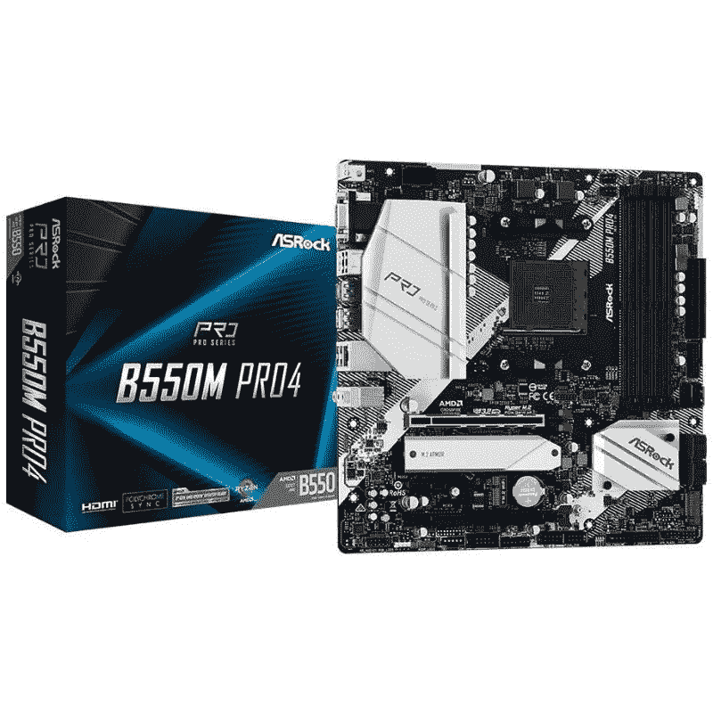
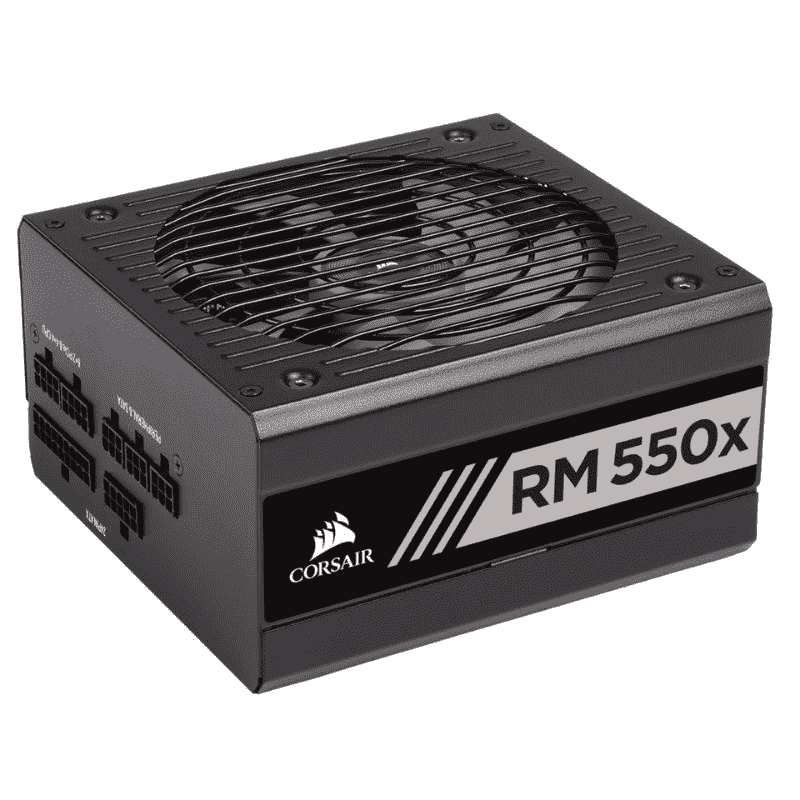
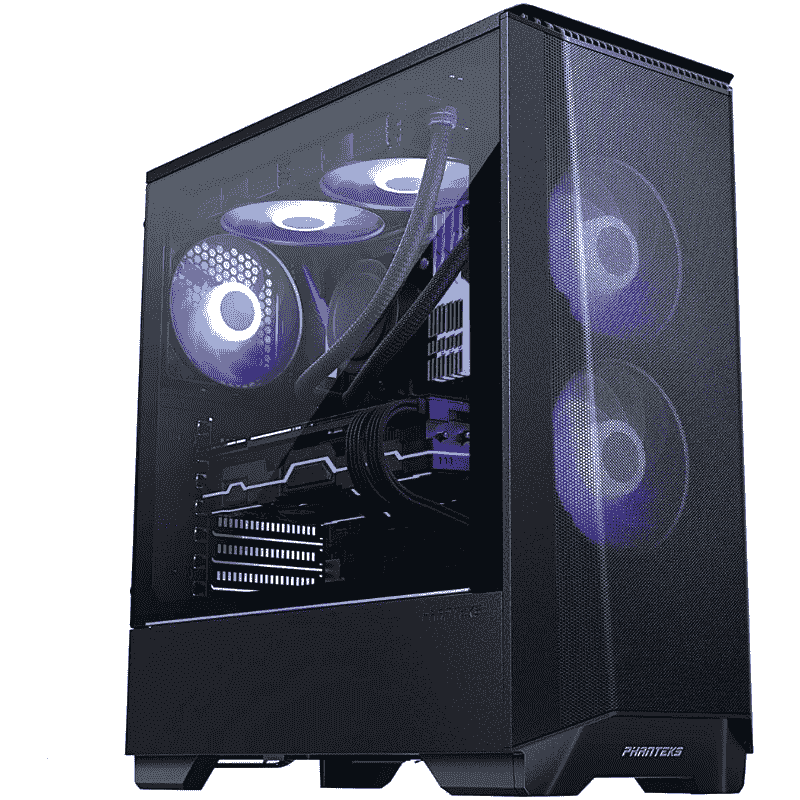

# 入门级游戏电脑指南:预算游戏的最佳选择

> 原文：<https://www.xda-developers.com/entry-level-gaming-pc-guide/>

构建一台入门级、低预算的 PC 并不意味着无聊或不能在上面玩游戏。近年来，个人电脑技术发展如此之快，以至于你现在可以用不到 600 美元的价格，用所有全新的部件组装出一个高质量的产品。

这怎么可能呢？这主要归功于 AMD 及其在 APU 上安装高质量图形硬件的能力。这将是这个版本的中心，因为是的，2022 年你可以在集成显卡上玩游戏。你不会在最大设置或任何东西上撕掉赛博朋克 2077，但对于老游戏和轻游戏如 Valorant 和火箭联盟，这已经足够了。

这是我们挑选出来的。

## 入门级游戏的最佳 CPU:AMD 锐龙 5 5600G

AMD 锐龙 5 5600G 是锐龙 5000 系列中最好的处理器之一。这个经过测试的 APU 是一个绝对不用动脑筋的东西，因为它是我们收集的目前市场上[最佳游戏 CPU](https://www.xda-developers.com/best-cpu-gaming/)和[最佳 AMD CPU](https://www.xda-developers.com/best-amd-cpu/) 的一部分。锐龙 5 5600G APU 为那些希望在入门级产品上省钱的人提供了令人印象深刻的性价比。

至于性能，锐龙 5 5600G 对于入门级游戏应该足够好了。你不会在所有游戏中获得梦幻般的画面，但我们认为在 720p 或 1080p 的低图形设置下运行一些新游戏已经足够了。锐龙 5 5600G 是一款六核 APU，配有 AMD 镭龙 Vega 7 显卡。这种特殊的 APU 还附带了一个捆绑的 CPU 冷却器，这意味着您将在构建上节省更多的钱。锐龙 5 5600G 有很多令人喜欢的地方，只要你保持对这款以预算为中心的入门级电脑的期望。

 <picture></picture> 

AMD Ryzen 5 5600G Processor

##### AMD 锐龙 5 5600G

AMD 锐龙 5 5600G 是一款出色的 APU，结合了强大的 CPU 性能和一流的集成显卡。

## 入门级游戏构建的最佳主板:华硕 B550M Pro 4

对于主板，我们认为任何价格合理的基于 B550 芯片组的主板都应该能够处理锐龙 5 5600G APU。我们选择了 ASRock B550M Pro 4 主板，主要是因为这是目前市场上最实惠的选择之一。它具有许多值得注意的功能，包括八相电源设计，支持 DDR4-4733+ RAM 等。

华硕 B550M Pro 4 在超频方面不是最好的，但它仍然允许你调整 5600G，以获得一点额外的性能。华硕 B550M Pro 4 是一款 mATX 外形规格的主板，这意味着它可能最好坚持使用小型 PC 机箱或中塔式机箱。

 <picture></picture> 

ASRock B550M Pro 4 motherboard

##### 华硕 B550M Pro 4

华硕 B550M Pro 4 可能不是市场上最强大的主板，但我们认为它足以处理锐龙 5 5600G APU。它也有很多值得注意的功能，通常是更昂贵的主板保留的。

## 最佳入门级游戏 RAM:海盗船复仇 LPX DDR4

对于一个预算建设，你仍然会依赖于 DDR4，为此，你想得到一个海盗船复仇 LPX 16GB 套件。价格已经降了下来，但这款 3200MHz RAM 绝对适合这种型号。它有四种颜色，虽然没有 RGB，但由于其低调的设计，它声称与市场上的所有冷却器 100%兼容。这种内存是可靠的，因为它来了，所有你需要做的是插槽，使 XMP 配置文件，你就可以走了。

##### 海盗船复仇 LPX DDR4 内存

这款 DDR4 内存价格实惠、性能可靠，是最低调的设计之一，XMP 的一键式设置。

## 最佳存储驱动器:西部数据 SN550 M.2 NVMe 固态硬盘

西部数据的 Blue SN550 是目前市场上最实惠、最可靠的 M.2 固态硬盘之一。这种特殊的固态硬盘是许多入门级产品的首选，我们在本指南中选择了 500GB 的硬盘。SN550 提供了大量功能，包括高达 2，400MB/s 和 1，750MB/s 的高顺序读写速度。

对于一台游戏电脑，你有两种选择。如果你有预算，要么购买更高容量的 SN550，要么购买 256GB 版本作为启动驱动器，并将其与 SATA SSD 或 HDD 配对来存储游戏。

 <picture></picture> 

Western Digital Blue SN550

##### WD Blue SN550 NVMe M.2 固态硬盘

WD Blue SN550 是一款预算充足的固态硬盘，适合入门级构建。尽管价格相对实惠，但 WD Blue SN550 以其可靠的性能和速度而闻名，适用于包括游戏在内的各种工作负载。

## 入门级游戏的最佳电源:Corsair RM550x

当谈到 PSU，我们建议拿起海盗船 RM550x。顾名思义，这款设备提供 550 瓦的功率，对于像我们在本指南中使用的这种相对低功率的设备来说已经足够了。话虽如此，仍然建议您选择一个可靠的电源设备，具有良好的评级。

我们在这里选择的 ATX PSU 具有 80+的金牌评级，并且是完全模块化的，这使得它比同类产品中的大多数其他 PSU 都要好。550W 的功率足以满足我们在这里列出的构建，如果您决定升级，应该会为入门级显卡提供足够的空间。

 <picture></picture> 

Corsair RM550x psu

##### Corsair RM550x

海盗船 RM550x 是目前市场上最好的 PSU 之一。它为相对低功率的构建提供了充足的功率，并且还具有 80+金评级。

## 最佳电脑案例:Phanteks Eclipse P360A

Phanteks Eclipse P360A 是这种特殊构建的完美 [PC 机箱](https://www.xda-developers.com/best-pc-cases/#bestbudget)。尽管价格合理，但它是一个高质量的中塔式 PC 机箱，预装了两个 120 毫米 D-RGB PWM 风扇。此外，机箱有足够的空间来添加更多的机箱风扇和 CPU 冷却器散热器。它为所有组件提供了很大的空间，包括高大的 CPU 冷却塔、现代 GPU 等等。这个箱子还有很多通风孔，它们都覆盖着网状过滤器，以防止灰尘进入内部。

PSU 隐藏在内置护罩后面，侧板是钢化玻璃，背面有足够的空间用于线缆管理。对于相当小的情况，幻肢设法让他们感觉有点像 Tardis。

 <picture></picture> 

Phanteks Eclipse P360A mid-tower case

##### 幻像日食 P360A

Phanteks Eclipse P360A 是一款适合预算构建的坚固 PC 机箱。它配有两个 RGB 风扇和一个沿侧面板的 RGB 灯条。

## 入门级游戏版本:价格汇总

根据我们为本指南挑选的零件，下面是入门级游戏电脑的价格汇总。价格会随着库存和其他因素的变化而变化，所以记住这一点，但我们远低于 600 美元。

| 

成分

 | 

挂牌价格

 |
| --- | --- |
| **AMD 锐龙 5 5600G 处理器** | $129 |
| **华硕 B550M Pro 4 主板** | $100 |
| **AMD 幽灵隐形 CPU 冷却器(包含在 APU 中)** | $0 |
| **海盗船复仇 LPX DDR4 16GB** | $55 |
| **西数蓝 SN550 M.2 NVMe SSD** | 从 40 美元起 |
| **海盗船 RM550x PSU** | $100 |
| **幻像日食 P360A** | $100 |
| **总计** | **$524** |

显然，这不包括任何额外的机箱风扇，任何你可能想要添加的 RGB 照明，甚至是你将在 CPU 上使用的导热膏。但是，它确实表明，以低于 600 美元的价格构建一台相当强大的入门级游戏 PC 是可能的。你可能希望在预算范围内获得尽可能多的储物空间，所以这是额外支出的首选。你当然也需要某种形式的外部展示。

如果您现在或将来想要添加显卡，我们建议您考虑 Nvidia GeForce GTX 1660。它不像一些 AMD 镭龙卡那样便宜，但总体性能值得额外的成本。

## 入门级游戏构建:最终想法

在预算紧张的情况下制造一台游戏电脑，或者仅仅作为第一台入门级电脑，并不意味着要做出太多牺牲。虽然集成显卡只能让你到此为止，但 AMD 是业界最好的，你绝对可以用它来玩游戏。像 Valorant 和火箭联盟这样的冠军将被锐龙 5600G 摧毁，你甚至可以在更高要求的冠军中获得一些里程。重点是，你现在可以从这个 APU 开始，一些好的 RAM 和存储，并在未来添加更强大的图形。

通过用更便宜的替代品替换我们推荐的零件，也有可能制造出负担得起的电脑。例如，你可以用 SATA 固态硬盘或更慢的硬盘取代 M.2 固态硬盘，以节省更多资金，或者搭配低容量 NVMe 固态硬盘进行大容量存储。同样，你可以买一个非模块化的 PSU，或者一个更实惠的电脑机箱，这样可以多省几美元。

一如既往，您也可以加入我们的 [XDA 计算论坛](https://forum.xda-developers.com/c/xda-computing.12289/)来讨论您的构建，并从我们社区的专家那里获得更多产品建议。你也可以看看我们的[电脑组装指南](https://www.xda-developers.com/how-to-build-a-computer-beginners/)，以防你在家里组装电脑时需要帮助。