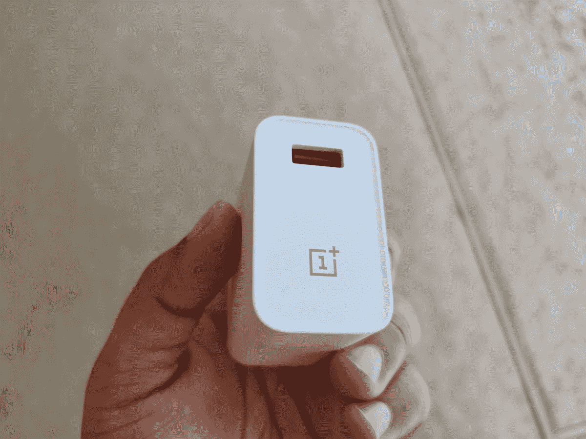

# 快速充电已经足够快了。给我们更好的电池寿命吧！

> 原文：<https://www.xda-developers.com/fast-charging-is-fast-enough-already/>

小米在 2022 年推出了几个移动硬件边界，包括推出第一款带有[1 英寸无折叠传感器](https://www.xda-developers.com/xiaomi-12s-ultra-review/)的手机，[目前最薄的可折叠手机](https://www.xda-developers.com/xiaomi-mix-fold-2-review/)，以及最近推出的智能手机 [210W 快速充电](https://www.xda-developers.com/redmi-note-12-series-launch/)，它显然可以在短短九分钟内充满 4300 毫安时的电池。

虽然我认为前两次发布对移动行业来说是伟大的创新，并带来了现实世界的好处，但我对这种极其——也许是可怕的——快速充电的反应是问:我们真的需要它吗？

## 快速充电很棒，但只是在一定程度上

需要说明的是，我并没有完全否定快速充电的用处。这项技术本身非常有益，尤其是在早期，它是中国品牌提供的小众发烧友功能。在北美，一加是推动技术进步的品牌，推出了专有的 20W“Dash Charge”充电器，在短短半小时内将手机从 0 充满到 65%，从电池没电到充满约 70 分钟。这些数字现在看起来很平常，但在 2016 年，它明显快于竞争对手，iPhone 6s 从 0 到 100 充电需要两个半小时，而使用高通自己的“快速充电”技术的 Galaxy S7 需要 88 分钟。

 <picture></picture> 

Mass Image Compressor Compressed this image. https://sourceforge.net/projects/icompress/ with Quality:95

那些密切关注移动领域的人知道，一加的快速充电技术实际上是 Oppo 的 VOOC(电压开环多步恒流)充电的重塑，这两个品牌将不断推动可能的极限。在北美手机市场，这意味着一加手机的充电速度一直比最新的苹果或三星手机快。

2020 年，一加推出了 8T 的 65W 充电器，可以在 39 分钟内将手机从 0 充满到 100。根据地区的不同，今年的一加 10T 可能会以 150 瓦或 120 瓦的功率充电，这有助于该手机相当大的 4800 毫安时电池分别在 19 分钟或 21 分钟内从 0 充电到 100。

这是快速充电对我来说变得“足够快”的时候。当你可以在 20 分钟左右充满一部手机时，这意味着即使是 7 分钟的充电也足以为手机注入足够的电量来解决中午的电池焦虑。对我来说，这就是快充最大的好处；它帮助我们在傍晚或傍晚快速充值，以确保我们的手机可以持续一整夜。

小米的 210W 快充似乎正在步入毫无意义的弯曲领地。我想在一些极端的情况下，这样快的充电速度是有用的。也许你即将登上一架你知道没有插座的飞机，你刚刚意识到你的手机要没电了。在这种情况下，即使是三分钟的充电(理论上，这将增加约 30-35%的电池)也可以帮助你的手机在大多数飞行中持续使用。

但是我们有多经常处于这种极端的情况呢？通常，如果你有时间给手机插上四分钟的插头，你可能会多抽出几分钟，让它插上电源八到十分钟。对于 120 瓦、80 瓦甚至 65 瓦的充电器来说，这些时间足够让你摆脱电池焦虑。

## 更长的电池寿命反而更重要

手机的电池寿命过去很差，所以曾经有一段时间，中国手机更快的充电速度大大提高了可用性。三星的 Galaxy 手机，特别是从 S6 到 S8，电池寿命低于标准，只能坚持 9 个小时，更不用说每天 13-14 个小时了。iPhone X 的电池寿命也很一般，这让我在晚饭前就开始寻找充电器，这让它 20 瓦的最大充电速度更加令人沮丧。事实上，如果你额外支付一根 USB-C 到 Lightning 的电缆并有合适的充电器(前者当时没有广泛使用)，你只能实现最大 20W 的充电。使用 iPhone X 附带的 5W 充电砖，几乎需要三个小时才能将手机充满电。

不出任何人所料，苹果并没有过多地追逐快速充电技术。即使今天的顶级 iPhone 也只能以 30W 的速度充电，这仍然需要大约 70 分钟才能充满一部 iPhone 14 Pro，更大的 [iPhone 14 Pro Max](https://www.xda-developers.com/apple-iphone-14-pro-max-review/) 需要 90 分钟。这种仍然缓慢的充电速度意味着中午 8 分钟的充电不会增加足够的电量来产生有意义的变化。按照 2022 年的标准，iPhone 的充电速度仍然很慢，但这已经不是几年前的烦恼了，因为 [iPhone 14 手机提供了超长的电池寿命](https://www.xda-developers.com/apple-iphone-14-review/#battery-life-amp-charging)。在过去的两个月里，我一直在使用 iPhone 14 Pro Max，在我的一天结束之前，我从未用完过电池。只要我用 100%的电池开始我的一天，我就不需要担心在睡觉前再次充电。

最近的顶级 Android 手机也是如此，尽管程度较低。谷歌 Pixel 7 Pro、一加 10T 和小米 12S Ultra 等手机通常也可以让我使用一整天，只是没有 iPhone 14 Pro Max 那么自信。

只要手机能够持续正常使用一天，它充电的速度就成了一个争论点。比如我最近从一个小米 12S Ultra(充电速度 67W)跳到一个 23W 充电的 Pixel 7 Pro，完全没有对我的日常生活造成冲击。如果手机只需要充电一次，而且是在晚上我睡觉的时候充电，那么充电速度并不重要。

尽管如此，我想重申，我并不是完全否定中国品牌对更快充电技术的追求。这项技术很好地服务于智能手机行业，快速充电技术可以应用于其他仍然需要不断充电的设备，如笔记本电脑和电动自行车。这项技术应该继续探索，但我认为对于手机中相对较小的电池来说，目前的速度已经足够好了。