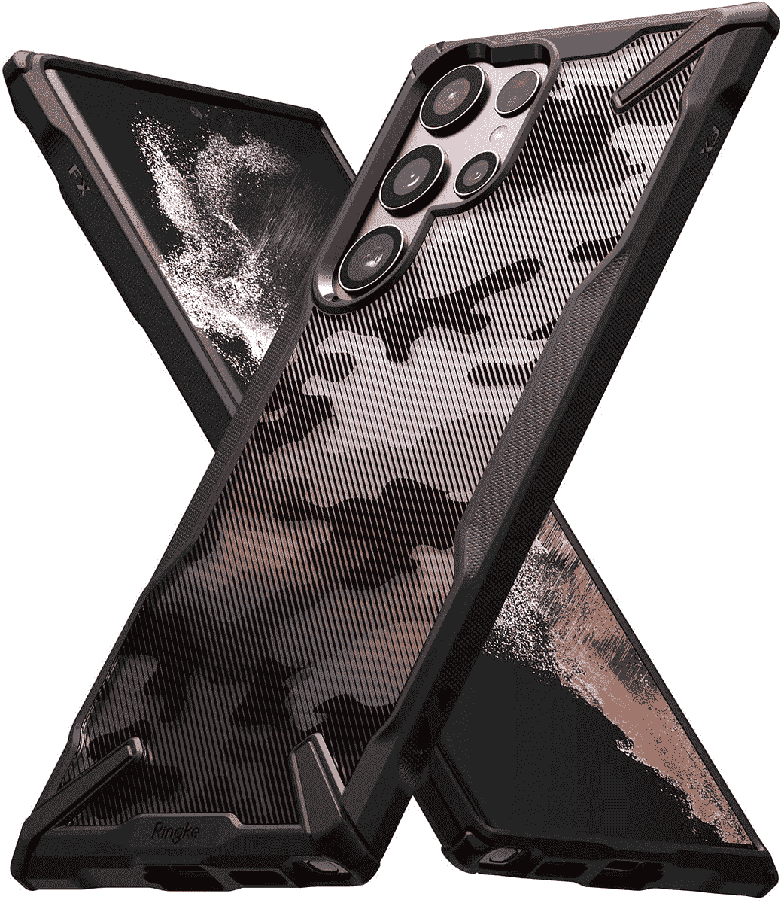

# 查看我们最喜欢的三星 Galaxy S22 系列保护套

> 原文：<https://www.xda-developers.com/favorite-cases-for-samsung-galaxy-s22-series/>

Galaxy S22 系列智能手机在这里，它是三星 2022 年的旗舰阵容。标准的 [Galaxy S22 和 Galaxy S22 Plus](https://www.xda-developers.com/samsung-galaxy-s22-hands-on/) 迎合了想要一部 1000 美元以下手机的观众，而大男孩 [Galaxy S22 Ultra](https://www.xda-developers.com/samsung-galaxy-s22-ultra-hands-on/) 则是为了那些想要一部无限旗舰的人。不管你买的是哪一款手机，保护你的投资免受刮伤或凹陷是很重要的。最好的方法是使用案例。下面是一些我们最喜欢的三星 Galaxy S22 系列智能手机的案例！

## Supcase 独角兽甲虫专业版

Supcase Unicorn Beetle Pro 由于其坚固的设计和坚固的框架，长期以来一直是我们的推荐产品之一。如果你是一个经常摔手机的人，并且想确保它一直受到保护，独角兽甲虫 Pro 是一个完美的选择。它有一层硅胶包裹着手机，还有一层硬塑料层，在受到冲击时会与任何表面接触。

如果这听起来不像是足够的保护，你甚至可以得到一个内置的屏幕保护，所以没有必要单独购买。Supcase Unicorn Beetle Pro 不仅具有保护性，还具有一些不错的实用功能。首先，后部有一个支架，可以帮助你将手机放在任何你喜欢的表面上。这在长时间观看手机内容时很方便。除此之外，你还会得到一个带皮套的手机套，所以如果你喜欢把手机挂在腰带上，你知道该买哪个手机套！

 <picture></picture> 

Supcase UB Pro

##### SUPCASE UB Pro Galaxy S22 外壳

Supcase Unicorn Beetle Pro 是为那些希望通过支架等额外功能获得最佳保护的人设计的。

## Spigen 薄款

虽然有些人可能希望为他们的智能手机提供全面的保护，但并不是每个人都希望使用防摔的外壳。这种外壳通常很厚，会改变手机的外观和手感。然而，外壳仍然是必要的，以提供某种类型的保护，至少防止刮擦和撞击。解决这个问题的方法是使用薄的外壳。一个薄的外壳增加了一个基本的保护层，而不会增加太多的体积或改变手机的尺寸。

最好的轻薄款之一是 Spigen Thin Fit。虽然 Thin Fit 曾经是一个硬塑料外壳，但 Spigen 去年修改了设计，现在它更灵活，也更具保护性。它很轻，不会给手机增加任何明显的重量，这在 Galaxy S22 Ultra 这样又大又重的设备上尤其明显。它看起来也很隐秘，是想要简约的人的完美选择。

 <picture></picture> 

Spigen Thin Fit

##### Spigen 超薄型 Galaxy S22 保护套

Spigen Thin Fit 适合那些想要一个简约外壳而不会给设备增加太多体积的人。

## 我是布拉森·阿瑞斯

Galaxy S22 系列手机有多种诱人的颜色。当你选择了一种颜色后，你肯定会想在使用手机时向所有人炫耀。这就需要一个清晰的案例了。不过，i-Blason Ares 并不是一般的清晰案例。它有一个透明的背面，可以展示智能手机的颜色，但由于外壳边缘遍布坚固的保险杠，它也提供了大量的保护。

这显然是你能买到的最具保护性的保护套之一。它的边缘也有多种颜色可供选择，因此您可以选择与您的手机颜色相匹配，也可以选择对比鲜明的表面，让您的手机焕然一新。

 <picture></picture> 

i-Blason Ares

##### i-Blason 战神银河 S22 表壳

如果你正在寻找一个明确的情况下，不妥协的保护部门，这种情况下，你。

## 林克聚变 X

这种情况下，是那些谁是一个迷的军事迷彩外观。Ringke 的 Fusion X 外壳有一个半透明的背面，带有迷彩图案，当你把它放在手机上时，它看起来很棒。背面也有一个很好的纹理，可以改善你拿着手机时的握持感。除了看起来很坚固之外，Ringke Fusion X 还具有坚固的保护装置，大型拐角突起可以在跌落时保护设备。

保险杠沿着设备的边缘延伸，由减震的 TPU 制成。背板是聚碳酸酯，这意味着它很坚固，也为背部提供了良好的保护。侧保险杠上的元素在某些部位延伸到了背部，让行李箱看起来更具侵略性。如果你想要一个坚固的外壳，它有一个漂亮的设计，并且不会增加太多的体积，你可以考虑 Ringke 的这个外壳。

 <picture></picture> 

Ringke Fusion X

##### Ringke Fusion-X 星系 A22 案例

Ringke Fusion X 保护套是为那些希望保护套不会增加太多体积，而且背面也有很好的设计或图案的人设计的。看起来挺酷的！

## 克莱科氙

很多人想保护他们的手机免受跌落，但又不想增加太多体积或在设计上妥协。这就是克莱科氙进入画面的地方。Clayco 的 Xeon 系列外壳具有保护作用，但不会增加智能手机的体积。如果你有 Galaxy S22 Ultra，它已经是一个相当笨重的设备，所以如果你穿上厚厚的外壳，长时间持有和使用可能会有点不舒服。

Clayco Xenon 表壳通过使用不一定增加太多厚度的较软材料解决了这一问题。表壳的设计也很好，没有太多攻击性的元素。背面经过哑光处理，更容易握持手机，顶部和底部配有碳纤维，使外壳看起来略显坚硬。它甚至配有内置屏幕保护器，并根据设备的不同有几种颜色可供选择。

 <picture></picture> 

Clayco Xenon Case

##### Clayco 氙气 Galaxy S22 表壳

想要很好的保护，但又不想增加太多体积？考虑这个来自 Clayco 的案例！

* * *

我们感谢 Supcase、i-Blason 和 Clayco 赞助了这篇文章。我们的赞助商帮助我们支付与运行 XDA 相关的许多费用，包括服务器成本、全职开发人员、新闻撰稿人等等。