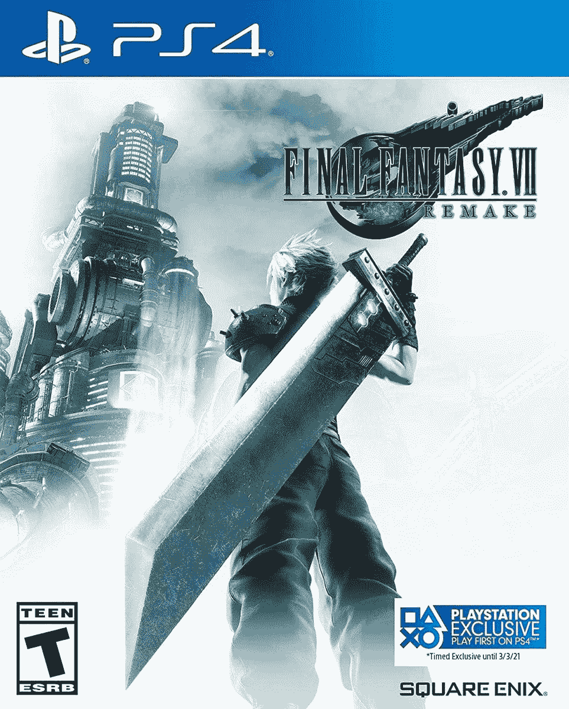

# 《最终幻想 7》的翻拍版现已在 PS4 和 PS5 上发售

> 原文：<https://www.xda-developers.com/final-fantasy-vii-remake-now-on-sale-for-both-ps4-and-ps5-30-50-off/>

# 《最终幻想 7》重拍版现已在 PS4 和 PS5 上发售(30-50%的折扣)

Square Enix 去年的最佳游戏《最终幻想 7:重拍》现已发售。PS4 和 PS5 版本都打折。

Square Enix 重拍的*最终幻想 VII* 终于在去年上映，早在 2015 年就首次公布。它最终成为了 2020 年最好的游戏之一(至少对任何对 JRPGs 感兴趣的人来说是这样)，并且该游戏在两个月前为 PS5 更新了增强的图形。现在你可以买到 PS4 或 PS5 版本，PS4 游戏降至 29.99 美元，PS5 端口降至 49.99 美元。

这是为 PlayStation 1 翻拍 1997 年的*最终幻想 VII* ，尽管游戏变化如此之大，以至于它可能是一款新游戏。你扮演克劳德·斯特莱夫(是的，来自 Smash Bros 的云)，一名前士兵，他加入了恐怖组织 Avalanche，与耗尽地球能源的 Shinra Corporation 作战。游戏比原版多了实时元素，当然也更好看了。

 <picture></picture> 

Final Fantasy VII: Remake

##### 最终幻想 7:翻拍

这是 2020 年最受好评的游戏之一，现在它以 29.99 英镑(五折)的价格出售。PS5 版本也在销售，但折扣并不令人印象深刻(29%)。

*最终幻想七:重拍*原本是 PS4 独占的，但一个 PS5 版本于 6 月发布，名为*最终幻想七:重拍过渡*。PS5 版本增加了新的照片模式，更多的难度设置和图形改进。