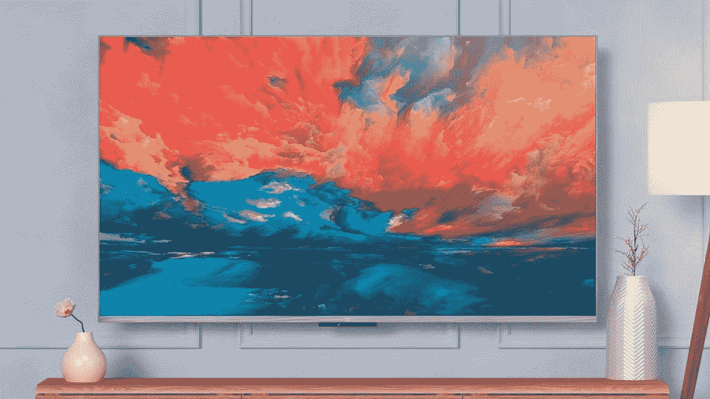

# 亚马逊最聪明的电视阵容在这里，Fire TV Omni QLED 系列

> 原文：<https://www.xda-developers.com/fire-tv-omni-qled-series-launch/>

在一个私人的虚拟活动中，亚马逊今天推出了许多不同的产品。其中包括新的 Kindle、Halo Rise 和其他 Echo 设备。最大的宣布之一——至少在尺寸方面——是 Fire TV Omni QLED 系列。这个电视系列的用户第一次可以利用亚马逊的环境体验。对于智能电视来说，这是一种更智能的模式，可以相应地显示相关信息。

## Fire TV Omni QLED 阵容来了

环境体验检测到一个人何时进入房间，并以美丽的背景显示有用的信息。该功能支持 Alexa Widgets、免提音乐/音频播放、个人照片库、Alexa 例程、要发现的内容等。这使得 Fire TV Omni QLED 电视在智能电视部门脱颖而出。亚马逊娱乐设备和服务副总裁 Daniel Rausch 表示:

> 几十年来，我们都在购买所谓的智能电视，但它们实际上并不那么智能——而且在一天的大部分时间里，它们也不漂亮或有用。Omni QLED 系列提供了令人惊叹的艺术作品、简略信息、免提控制等等——它重新想象了客户对智能电视的期望。

正如您所料，您可以在这些电视上下载您最喜欢的流媒体应用程序，并利用它们所包含的视觉技术。其中包括 4K 内容、HDR10 Plus、HLG、杜比视界 IQ 和 HDR10 Plus Adaptive。考虑到它们巨大的 65 英寸和 75 英寸尺寸，Fire TV Omni QLED 电视真正在您的客厅或卧室提供影院体验。

这些智能电视的起价分别为 799.99 美元和 1099.99 美元。目前，它们将通过亚马逊和百思买向美国和加拿大的消费者提供。有兴趣购买的人可以从今天开始预订。

 <picture></picture> 

Amazon Fire TV Omni QLED

##### 亚马逊 Fire TV Omni QLED

新的 Fire TV Omni QLED 系列引入了 Ambient Experience 智能技术，支持 4K 分辨率，并包括 Alexa。

您会订购这些电视吗？如果是，你会选哪一个？请在下面的评论区告诉我们。