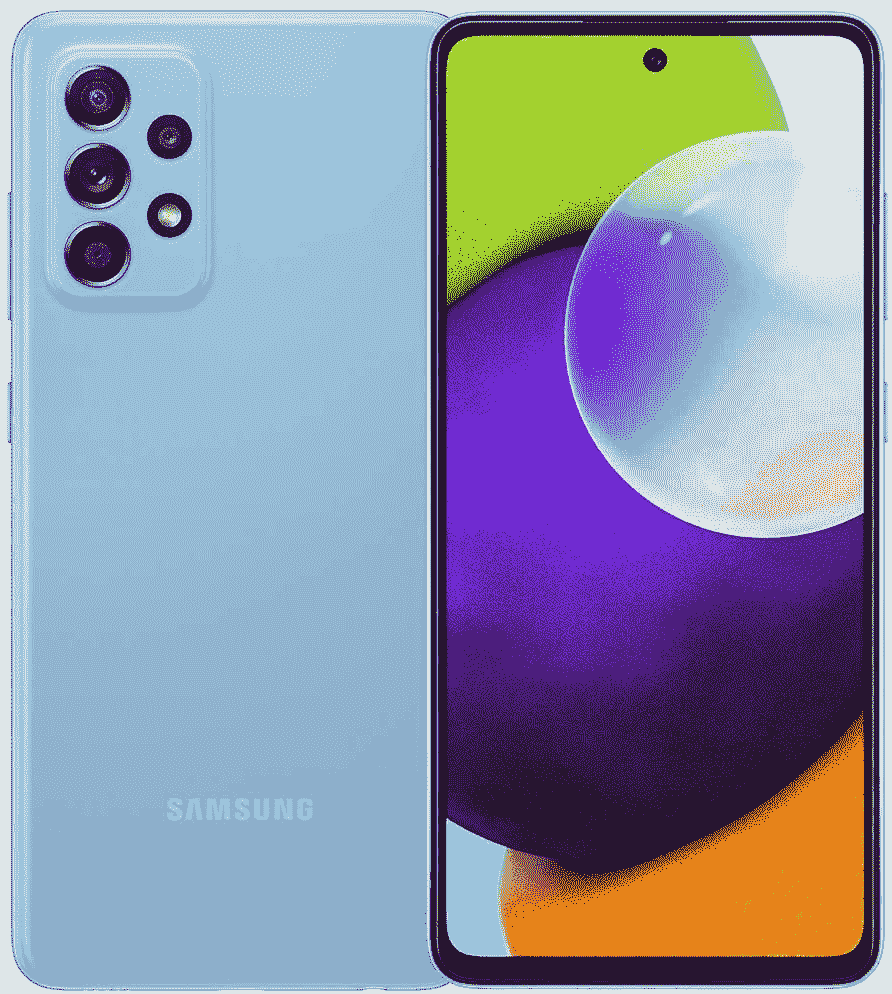
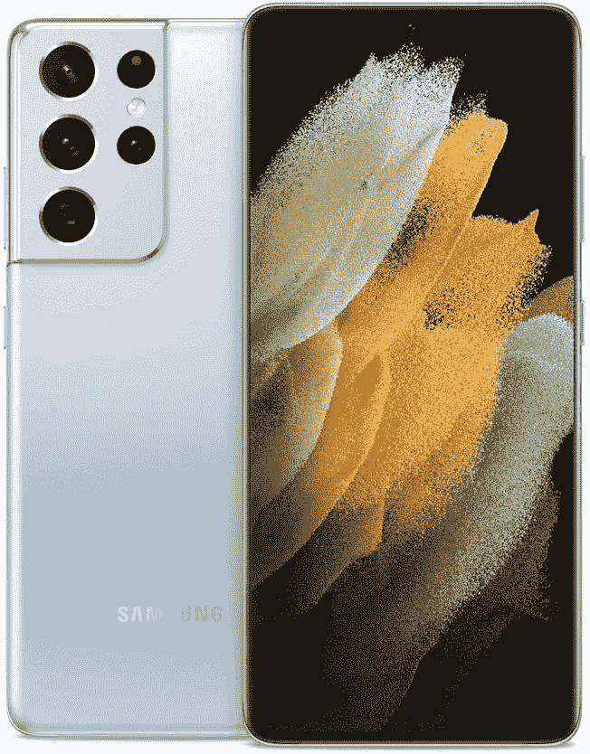

# 使用新三星 Galaxy 手机的前 10 件事

> 原文：<https://www.xda-developers.com/first-10-things-to-do-samsung-galaxy-phone/>

给自己买了一部崭新的[三星 Galaxy 手机](https://www.xda-developers.com/best-samsung-phones/)？您可能需要一些帮助来熟悉界面，或者一些提示来帮助您充分利用新购买的产品。这正是你将在这篇文章中找到的！无论你是三星手机的新手，还是刚刚从旧机型升级，我们都会告诉你使用新 Galaxy 手机应该做的前 10 件事，以确保你拥有最佳体验。因此，拿起你的手机，坐下来，按照这些简单的步骤来定制设备，以发挥其全部潜力！

**浏览本文:**

1.  [在设置过程中禁用广告/促销](#setup)
2.  [从旧手机中传输数据](#data)
3.  [定制您的主屏幕](#home)
4.  [为敏感数据设置安全文件夹](#securefolder)
5.  [重新映射 Bixby 按钮](#bixby)
6.  [设置始终显示](#aod)
7.  [为信使使用双应用](#dualapps)
8.  [改进边缘面板的多任务处理](#multitask)
9.  [通过省电模式延长电池寿命](#battery)
10.  [用好的锁定制每一个单独的方面！](#goodlock)

 <picture></picture> 

Samsung Galaxy A52 5G

##### 三星 Galaxy A52 5G

Galaxy A52 5G 是三星的一款功能强大的中档智能手机，涵盖所有基本功能。如果你正在寻找一款可靠的手机，而又不会倾家荡产，这款手机是你应该考虑的。

 <picture></picture> 

Samsung Galaxy Z Flip 3

Galaxy Z Flip 3 是最实惠的可折叠手机，不会做出很多妥协。它拥有最新的芯片，独特的设计，甚至包括今年的 ip 等级。这肯定是一个令人眼花缭乱的节目！

 <picture></picture> 

Samsung Galaxy S21 Ultra

这是你能从三星得到的覆盖所有基地的最好的智能手机。它拥有稳定的性能、最通用的相机和华丽的显示屏。这个是万能的。

当你得到一部新手机时，除了插入 SIM 卡之外，你要做的第一件事当然是通过初始设置过程。这非常简单，因为当您浏览整个过程时，说明会显示在屏幕上。但是，在设置过程中有一些选项，如果选择了这些选项，在使用手机时可能不会产生理想的体验。

例如，众所周知，三星会在一些手机上显示广告和发送促销通知。这可以通过取消选择任何要求您允许显示促销内容的选项来避免。在设置手机时，很容易忽略这样的复选框，但经验法则是不要盲目同意和选择屏幕上显示的每个选项。请确保您彻底阅读了屏幕上的选项，并只选择那些对使用手机绝对必要的选项。

### OneUI 4.0 上的设置过程

在设置您的 Samsung 帐户时，您将被要求同意各种条款和条件，其中一些是强制性的，而另一些是可选的。必须强制勾选 ***条款和条件*** 、 ***特殊条款*** 、 ***三星账户隐私声明*** 才能继续。仅选择这些选项*。**请勿*** 选择*“我已经阅读并同意以上所有内容”*选项。

输入您的详细信息后，您会看到一个屏幕，上面写着 ***查看其他应用*** 。取消选中 ***以下所有应用*** 复选框，仅选择对您重要的应用。如果您不使用列出的任何应用程序，您可以完全跳过这一步。三星还会要求你 ***获取推荐的应用*** ，这些应用本质上是三星的第一方应用，我们看不出有什么办法可以跳过这一步。

### 在一个 UI 3.0 和更低版本上的设置过程

同意 ***最终用户许可协议*** 和 ***隐私政策*** 是绝对必要的，否则您将无法使用该设备。但是， ***发送诊断数据******信息链接*** 和 ***接收营销信息*** 是可选的，我们建议您取消选中这些复选框，尤其是最后一个。通常，用户在使用手机的兴奋中倾向于选择 ***同意以上所有*** 选项。你不应该这样做。一些经济型和中档三星手机也带有 ***锁屏故事*** 选项，可以在锁屏上显示不想要的内容。如果在安装过程中看到该选项，请将其禁用。如果您看到任何其他选项，有 ***允许推荐...*** 在它里面，不勾选它是明智的。

设置手机时需要注意的另一点是，不要安装 ***推荐应用*** 列表中的任何不必要的应用。三星会尝试并敦促你安装他们合作的应用程序，但最好取消选择你不需要或不使用的应用程序。您可以通过 Play Store 安装您稍后需要的特定应用程序，或者从旧手机恢复备份/传输数据，这将恢复您使用的所有应用程序。

## 2.从你的旧手机传输数据，包括 iPhone！

三星为您提供了一个很好的选择，将您的数据从旧手机迁移到新的 Galaxy 手机。它被称为[三星智能开关](https://play.google.com/store/apps/details?id=com.sec.android.easyMover)，在设置您的新三星设备时，您会看到使用它的选项。酷的是，通过使用这个过程，你可以将你现有的所有数据从你的旧智能手机转移到你的新设备上。这包括应用程序、消息、照片、视频等。最棒的是，Smart Switch 甚至可以让你将数据从 iPhone 转移到新的 Galaxy 手机上。

如果你已经从 iOS 切换到 Android，因为它显然是更好的智能手机操作系统([对不起，马哈茂德](https://www.xda-developers.com/ios-better-operating-system-android/))，你将能够在你的新手机上安装你以前在 iPhone 上使用的相同的应用程序集。事实上，如果你有一部三星 Galaxy 手机，你现在可以[将 WhatsApp 聊天从 iOS 转移到 Android](https://www.xda-developers.com/how-to-migrate-whatsapp-data-iphone-android/) ，我们建议你尽早这样做，因为只有当你的手机处于全新状态时，这个过程才有效。如果你没有带着你的旧手机，因为你把它换成了新的，你甚至可以从你的旧手机恢复一个备份。

## 3.自定义您的主屏幕

好了，你已经设置好了电话，并且进入了用户界面。现在怎么办？嗯，Android 的美妙之处在于你可以无限制地定制手机的各个方面。虽然一些定制需要额外的应用程序，如用于高级用户的[启动器](https://www.xda-developers.com/best-android-launchers/)或[模块](https://www.xda-developers.com/best-magisk-modules/)，但你可以获得大量内置选项，尤其是在三星设备上。当你第一次解锁你的设备时，你的设备的主屏幕是你与之交互的，所以根据你的喜好定制它是一个好主意。

你可以改变[壁纸](https://www.xda-developers.com/best-wallpaper-background-apps/)，添加小工具，尝试不同的[图标包](https://www.xda-developers.com/best-icon-packs/)，甚至改变主屏幕上的网格大小。为此，点击并按住主屏幕上的空白区域，调出主屏幕菜单。现在，点击*主屏幕设置*。在这里，您可以选择主屏幕网格大小，启用/禁用应用程序上的通知标记，甚至从应用程序抽屉中隐藏您的应用程序。

默认情况下，三星还会在一些设备的主屏幕右侧显示一个 Bixby 窗格。你可以通过按住主屏幕上的空白区域来调出主屏幕定制菜单来禁用它。现在，你会看到所有的主屏幕都是可滚动的窗口。滚动到最左边的窗口，就是 *Bixby home* 。你会找到一个你需要禁用的开关。

## 4.为敏感数据设置安全文件夹

这是一个在三星 Galaxy 手机上被低估的功能。三星设备具有 Knox 安全性，其中一部分是所谓的安全文件夹。启用该选项基本上会在您的手机上创建一个文件夹，该文件夹使用不同于解锁手机所用的 PIN 或模式进行加密。创建安全文件夹后，您可以在其中存储敏感信息和数据，如照片、帐号和文档。

一些人存储他们的信用卡号码、pin 等。在他们的智能手机上。虽然这不是一个好的做法，但 Secure Folder 只是为这类信息增加了一个额外的安全层。即使其他人设法进入你的手机，他们也必须通过安全文件夹的额外安全措施来访问你的个人信息。请注意，Secure Folder 仅出现在一些 Galaxy 手机上，主要是中档和旗舰手机。如果你有一个面向预算的三星设备，你可能没有这个功能。

如果您希望在手机上设置安全文件夹功能，请前往*设置>生物识别和安全>安全文件夹*。如果您尚未使用 Samsung 帐户登录，系统会提示您立即使用该帐户登录。完成后，你可以输入密码来访问安全文件夹，然后设置一个生物识别方法来访问它，比如你的指纹。设置完成后，您可以将文件或任何您想要的内容添加到安全文件夹中。如果您希望将现有文件或照片移动到安全文件夹，请进入图库应用程序，长按您希望移动的项目，然后选择*移动到安全文件夹*选项。

要访问安全文件夹，您可以点击应用抽屉中的图标或通知中心的快速切换。

## 5.重新映射 Bixby 按钮

默认情况下，Galaxy 手机侧面的按键是用来打开/关闭屏幕的，只需按一下即可。虽然该功能无法更改，但您可以自定义该键的长按和双击功能。为此，请转至*设置>高级功能>侧键*。在这里，您可以选择当您双击或按住电源按钮时，您想要分配给它的功能。

我喜欢保持双按设置来启动相机应用程序。当你想快速打开相机应用程序，而没有时间解锁设备时，这是一个漂亮的小快捷方式，可以进入主屏幕，然后启动应用程序。默认情况下，按住选项设置为唤醒 Bixby，如果你不使用三星的助手，这可能会很不方便。你可以改变 P*press 和 hold* 选项来触发*关机菜单*，就像几年前所有手机的惯例一样。这样，按住电源按钮将启用关机和重启选项，而不是触发 Bixby。

## 6.设置始终显示

如果你的三星手机配备了 AMOLED 显示屏，它很有可能会一直显示功能。如果你不熟悉这个功能，永远显示顾名思义-它让你的显示器永远显示重要信息，如时间，日期，日历事件，未决通知等。如果你不想经常打开智能手机屏幕查看时间或通知，并最终长时间使用手机，这是非常有用的。

要在你的 Galaxy 手机上启用永远显示，请前往*设置>锁屏>永远显示*。在这里，您可以选择是让它显示 10 秒钟，还是让它一直亮着。我更喜欢后者。您还可以选择时钟类型和想要显示的信息。一旦你开始使用这个功能，你就离不开它了。

## 7.为信使使用双应用程序

三星在一个用户界面中添加了一个漂亮的功能，让你可以创建一个应用程序的克隆版本，并在你的手机上使用同一应用程序的两个版本。如果你有两张 SIM 卡，想要使用两个 WhatsApp 账户或两个不同账户的两个版本的 Facebook Messenger，只需遵循几个简单的步骤，你就可以在本地完成。

前往*设置>高级功能>双信使*。在这里，您将看到设备上安装的可复制到辅助应用程序中的应用程序列表。选择您想要第二个版本的应用程序，然后点击*安装*。等到这个过程完成，你现在有了同一个应用程序的两个版本。同一应用程序的第二个版本由主屏幕上应用程序图标右下角的橙色小横幅和应用程序抽屉表示。你可以用这个来区分这两个应用。

要禁用某个应用程序的第二个版本，请转到同一个菜单，关闭该应用程序旁边的开关。

## 8.利用边缘面板改进多任务处理

*边缘面板*最初是为了给三星旗舰机的弯曲边缘增加额外的功能。从那以后，它已经出现在几款三星手机上，如果你在手机上进行大量的多任务处理，它是一个很好的工具。它是一个小的半透明条，位于显示器的边缘。轻敲工具栏会显示几个选项，如快捷方式、各种截图方法、收藏夹联系人、媒体控件、剪贴板等。您甚至可以在 Edge 面板中为您喜欢的一组一起使用的应用程序设置应用程序对。点击一个应用程序对将在分屏视图中同时打开这两个应用程序，使您更容易进行多任务处理。

要激活和使用边缘面板，请转至*设置>显示>边缘屏幕*并启用*边缘面板*旁边的开关。你现在可以点击屏幕边缘的一小部分来激活任何应用程序顶部的边缘面板。在这里，您还可以自定义 Edge 面板，以包含对您来说很重要的所有功能和选项。请注意，Edge Panel 仅在某些三星手机上可用，并非在所有设备上都可用。

## 9.通过省电模式延长电池寿命

如今，大多数智能手机的电池寿命都很长，可以持续一整天，甚至更长时间。但是，在某些情况下，您可能希望进一步延长三星 Galaxy 手机的电池寿命。如果你知道你要离开充电器很长一段时间，你可能要储存一些电量以备不时之需。这就是一个用户界面上各种节能模式的由来。

三星手机有三种不同的电池模式——正常、中等省电和最大省电。根据具体情况，您可以在这些模式之间切换。

正常模式是当你想让你的手机发挥所有可用功能的最佳性能。它充分利用所有资源，实现最快的性能。本质上，这是省电 ***关闭*** 或禁用的模式。对于常规使用，这是你的手机应该一直开着的模式。

### 一个 UI 4.0 上的电池节电器

在 One UI 4.0 上，三星对电池保护程序做了一些改变。取代各种模式，它们包括一个单一的选项，该选项带有一个开关，可以在电池紧急情况下禁用其他可能不重要的功能。要访问带有一个 UI 4.0 的手机上的电池节电程序，请前往*设置>设备维护>电池>节电*。

在这里，您会发现一个启用省电模式的主开关。这将实现中等或中等程度的节能，您的所有应用和服务都可以使用。您还可以连接到互联网和其他无线外设。但是，您的 CPU 性能将会降低，以节省一些额外的功率，并且所有后台活动都将暂停。其他方面如显示器亮度和刷新率也会降低。

如果你想进入终极省电模式，你必须在这个菜单中切换*限制应用程序和主屏幕*选项。这实际上是 UI 3.0 和更低版本中的最大省电功能。你可以阅读下面的描述，了解 Max power saver 的作用，但简而言之，它将你的手机限制在绝对基本的功能上，即拨打/接听电话，发送短信等。它甚至用黑色壁纸取代了你的主屏幕。当你的手机处于关机边缘时，这是你最后的希望。

### 一个 UI 3.0 及以下版本上的电池节电器

***中等省电*** 模式是为了在不影响手机核心功能的情况下延长电池寿命。这种模式仍然允许您使用所有应用和网络，但会限制后台使用，降低屏幕刷新率和分辨率，限制显示器亮度，并禁用始终打开的显示器以延长电池寿命。当你知道你离充电器只有几个小时了，所以你想让你的手机多坚持一会儿的时候，使用这种模式。

***【马克斯·鲍威尔】省电*** 模式是当你急需电池续航时间、手机快没电时的终极拯救工具。这种模式基本上禁用了你手机上所有非必要的功能，并且限制在 8 个应用程序中供你选择。您可以配置拨号器、信息、浏览器等应用程序。，这些将是你在马克斯·鲍威尔节省模式下唯一可以使用的应用程序。像互联网连接和蓝牙这样的东西也将受到限制，你的壁纸将被改为黑色背景。如果你想大幅度延长电池寿命，并希望你的手机保持活跃的基本功能，如拨打和接听电话，使用这种模式。

要访问各种省电模式，请转至*设置>设备管理>电池*并选择所需模式。

## 10.定制好锁的每一个方面！

我把最好的留到了最后！Good Lock 是一款可以通过 Galaxy 应用商店下载的应用程序。你可以定制你的三星 Galaxy 手机的每一个方面。从通知中心到最近的应用程序，锁屏到导航栏，应用程序已经得到了一切。首先，前往 Galaxy 应用商店，在你的三星手机上下载 [Good Lock](https://galaxystore.samsung.com/detail/com.samsung.android.goodlock?langCd=en) 。然后，打开应用程序，找到服务于不同目的的各种定制模块。

通知有 NotiStar，锁屏有 LockStar，多窗口和多任务有 Multistar，导航键有 NavStar，还有一堆其他定制选项，你可以用它们来彻底改变你手机的外观！如果你有一个三星的可折叠手机，并且在一些应用程序中挣扎于怪异的纵横比，Good Lock 甚至有一个模块可以改变每个应用程序的纵横比以适应屏幕。

有了好的锁，可能性是无穷无尽的。我强烈建议你安装这个应用程序，并花大量的时间来完成你能做的各种修改。你一定不会失望的！

* * *

那么，你还在等什么？拿起您的全新三星 Galaxy 手机，开始工作吧！自定义设备，使其成为您自己的设备，并遵循所有简单的技巧，充分利用您的设备。你最喜欢这些建议中的哪一个？请在下面的评论中告诉我们！