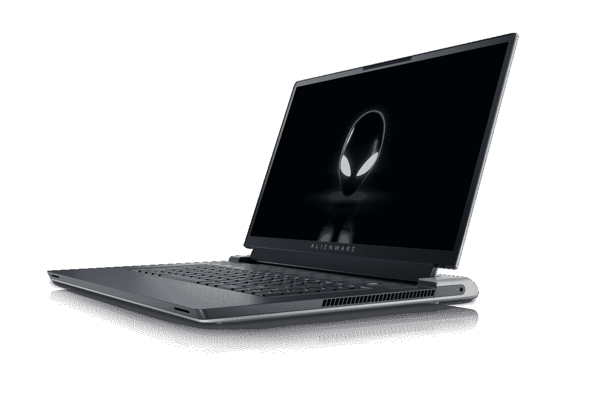

# 首款采用英特尔 Alder Lake 处理器的游戏笔记本电脑现已上市

> 原文：<https://www.xda-developers.com/first-intel-alder-lake-gaming-laptops-available/>

您现在可以订购首批采用英特尔第 12 代 Alder Lake 处理器和 NVIDIA 最新 RTX 显卡的游戏笔记本电脑。今年的 CES 上发布了其中的一些笔记本电脑，今天开始接受订单，所以如果你想成为第一个获得最新最棒的笔记本电脑的人，现在就可以开始购买了。

今天发布笔记本电脑的公司之一是戴尔的外星人品牌，它今天将发布[外星人 x15 R2 和外星人 x17 R2](https://www.xda-developers.com/concept-polaris-alienware/) 。这些是外星人轻薄游戏笔记本电脑的第二代型号，顾名思义，它们有 15.6 英寸和 17.3 英寸两种型号。两者都由最高 14 核(6P + 8E)和 20 线程的英特尔酷睿 i9-12900H 处理器提供支持，P 核能够提升到 5GHz。它们还配备了高达 NVIDIA GeForce RTX 3080 Ti GPU，拥有 16GB 的 GDDR6 内存，比标准的 RTX 3080 强大得多。

所有这些都由外星人定制开发的热界面冷却，它称之为 31 号元素。这种解决方案改善了热传递，并允许笔记本电脑尽可能薄，不管它们的规格如何。

外星人 x15 R2 提供高达 32GB 的 5200 MHz DDR 5 RAM 和高达 2TB 的 PCIe SSD 存储。它还提供 360 赫兹的全高清(1920 x 1080)面板或 240 赫兹的四高清(2560 x 1440)面板。更多型号可能会在稍后推出，但您可以在下面看到它们，起价为 2199.99 美元。

 <picture></picture> 

Alienware x15 R2

##### 戴尔外星人 x15 R2

外星人 x15 R2 拥有英特尔和英伟达的最新硬件，并由戴尔的 Element 31 冷却。

至于外星人 x17，它配备了高达 32GB 的 DDR5 内存，但速度稍慢，为 4800MHz，外加同样的 2TB 固态硬盘存储。目前，只有全高清 360Hz 显示选项可用，但未来应该会出现更多选项。您可以在下面订购，起价为 2，299.99 美元。

 <picture></picture> 

Alienware x17 ($1,000 off)

##### 戴尔外星人 x17 R2

外星人 x17 R2 与 15 英寸型号具有相似的强大规格，但具有更大的显示屏和更多端口，包括以太网。

雷蛇最新的 [Blade 15 和 Blade 17 游戏笔记本电脑](https://www.xda-developers.com/razer-blade-2022/)也采用了英特尔 Alder Lake 处理器和 NVIDIA 最新的 GPU，今天也可以预购。它们的规格几乎相同:最高可配英特尔酷睿 i9-12900H 处理器、NVIDIA GeForce RTX 3080 Ti 显卡、16GB 内存(可升级)和 1TB 存储(也可升级)。但是，GPU 是不同的，因为它们在刀片 15 上只能达到 105W 的功率，而在刀片 17 上可以达到 130W。

除了尺寸之外，大多数显示器选项也是一样的:全高清 360 赫兹、四高清 240 赫兹或超高清 144 赫兹。Razer Blade 17 确实有一个额外的选项，这是一个更实惠的 165Hz 四核高清面板，可以搭配较弱的 GeForce RTX 3060 GPU。同样值得注意的是，Razer Blade 17 上的超高清面板选项还不能预购，尽管它在 Blade 15 上可用。

如果你想要 Razer Blade 15，它的起价为 2499.99 美元，而 Razer Blade 17 的起价为 2699 美元。您可以在下面预购您喜欢的型号，它们将于 2 月 22 日开始发货。

 <picture></picture> 

Razer Blade 15 (2022)

##### 雷蛇之刃 15 (2022)

Razer Blade 15 拥有英特尔第 12 代处理器和高达 105 瓦功率的 RTX 3080 Ti 显卡。此外，它有各种显示选项。

 <picture></picture> 

Razer Blade 17 (2022)

##### 雷蛇之刃 17 (2022)

Razer Blade 17 拥有与其较小兄弟相同的英特尔处理器，甚至更强大的 GPU，功率高达 130W。除了尺寸之外，它还包括相同的显示选项。