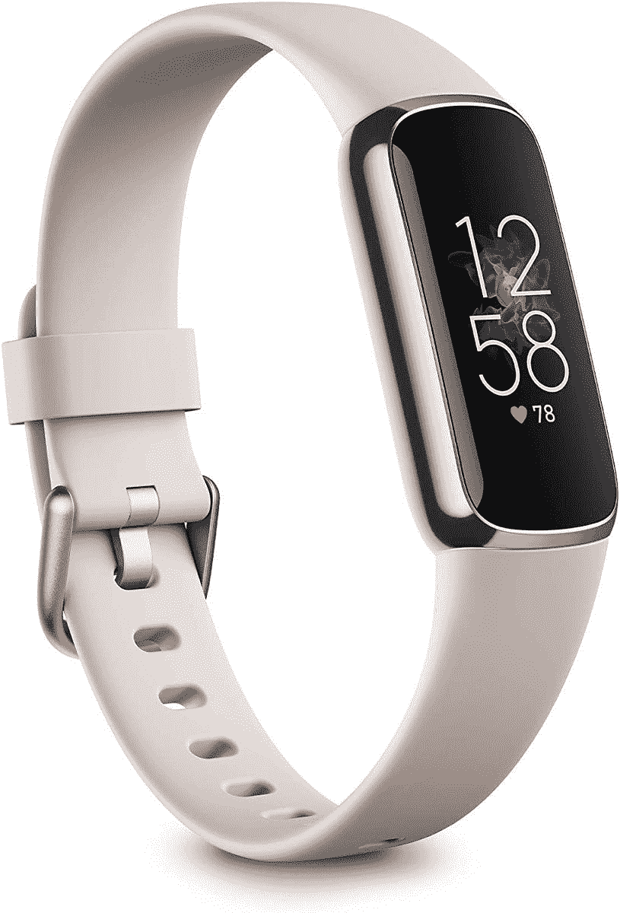

# Fitbit Luxe update 增加了持续显示、SpO2 监控等功能

> 原文：<https://www.xda-developers.com/fitbit-luxe-update-adds-spo2-tracking-aod/>

# Fitbit Luxe update 增加了持续显示、SpO2 监控等功能

最新的 Fitbit Luxe 软件更新带来了 SpO2 监控、始终显示和更大的字体。请继续阅读。

上个月，Fitbit 推出了一个新的软件更新，对 [Fitbit Sense 和 Versa 3 进行了更新，带来了打鼾&噪音检测功能](https://www.xda-developers.com/fitbit-sense-versa-3-snore-and-noise-detect-feature/)。现在，该公司正把注意力转向更高端的 Fitbit Luxe。

软件版本 1.151.16 是[向 Fitbit Luxe 推出](https://help.fitbit.com/articles/en_US/Help_article/1372.htm)(通过 [*9to5Google*](https://9to5google.com/2021/04/19/fitbit-luxe-announcement/) )，它包括几个新的补充，包括永远显示(AOD)、SpO2 监控、增加字体大小和其他改进。

新更新中最值得注意的是支持血氧或 SpO2 监测，允许用户在睡眠期间跟踪他们的血氧水平。Fitbit 承诺在发布时添加 SpO2 跟踪，现在终于来了。用户可以直接在手表的 SpO2 磁贴或 Fitbit 配套应用程序中访问 SpO2 数据。

另一个有用的功能是永远显示(AOD)，使健身追踪器与最近推出的 Charge 5 相提并论。安装更新后，Fitbit Luxe 用户可以通过前往*设置>显示设置>常亮显示*来启用 AOD。您还可以设置“非工作时间”来按计划触发 AOD 功能。

完整的更新变更日志如下:

*   若要使时钟始终可见，请打开“始终显示”设置。有关详细信息，请参阅如何查看 Fitbit 设备上的时间？
*   Luxe 会在您睡觉时估算您的血氧饱和度(SpO2)。有关更多信息，请参阅如何使用 Fitbit 设备跟踪血氧饱和度(SpO2)？
*   我们增加了你追踪器屏幕上的字体大小。
*   此版本包括错误修复和改进。

 <picture></picture> 

Fitbit Luxe

##### Fitbit 豪华版

Fitbit Luxe 提供了一个优质的，类似 jwelery 的设计，一个明亮的 AMOLED 显示屏，SpO2 监控和长达 5 天的电池寿命。

Fitbit Luxe 早在四月份就以时尚健身追踪器[的身份推出。它采用了优质的珠宝般的设计和彩色 AMOLED 显示屏，Fitbit 声称其亮度是 Charge 4 和 Inspire 2 的 2 倍。该追踪器一次充电可提供长达 5 天的电池寿命，提供 24/7 心率监测和睡眠跟踪，防水深度可达 50 米。](https://www.xda-developers.com/fitbit-luxe-unveiled-price-launch-date/)