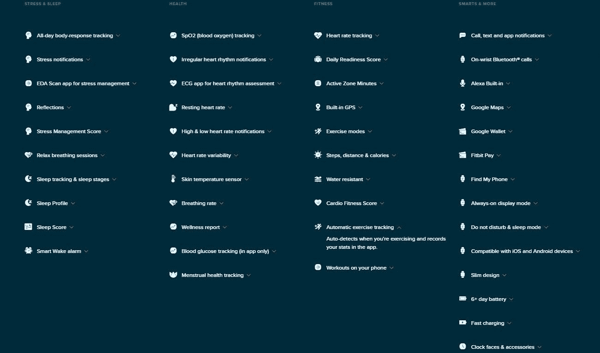

# Fitbit Sense 2 评论:一款跨越两个世界的梦幻可穿戴设备

> 原文：<https://www.xda-developers.com/fitbit-sense-2-review/>

谈到健身和健康相关的可穿戴设备，Fitbit 是最知名的品牌之一，多年来一直如此。谷歌在 2019 年收购了 Fitbit，尽管直到 2021 年才最终确定，并表示 [Fitbit 将发布一款 Wear OS 手表](https://www.xda-developers.com/fitbit-and-samsung-are-working-on-new-watches-with-wear-os/)。Fitbit Sense 2 是该品牌最新的智能手表，它不运行 Wear OS。相反，它使用的是 Fitbit OS 的更新版本。虽然我从未拥有过 Fitbit，但我更喜欢更完整的智能手表体验，包括与我的智能手机相协调的丰富的应用程序目录。但 Sense 2 是一款有趣的设备，它提供了 Wear OS 设备的影子，但具有更好的电池寿命，专用的健身功能，以及一个庞大的 Fitbit 用户社区。

那么，在使用这款设备一周后，它会让我永远远离我心爱的智能手表吗？不，但这并不意味着这是感官上的失败，至少不完全是。虽然这款设备在性能上确实有一些问题，缺乏我喜欢的 Wear OS 的一些应用集成，并且缺少谷歌助手，但它是一个可靠的健身追踪器，可以成为一些人的完美健康和健身伴侣。但它不太可能赢得智能手表粉丝的支持。

 <picture></picture> 

Fitbit Sense 2

##### Fitbit 检测 2

Fitbit 的 Sense 2 是一款令人印象深刻的可穿戴设备，可以提供对您的健康和活动的有用见解。其纤薄的外形和轻巧的重量使其能够舒适地长时间佩戴。多亏了能持续六天的电池，这才成为可能。性能只是“还行”，缺乏真正的智能手表功能，这让 Sense 2 在其他可穿戴设备中处于一个奇怪的位置。

**Notification Support**

Google Maps (iOS in Spring 2023)

**Battery Life**

6+ days

**Operating System**

Fitbit OS

**Onboard GPS**

✔️

**Offline Media Storage**

🚫

**Customizable Strap**

✔️

**Case Material**

Aluminum

**Smartphone Music Control**

🚫

**Colors**

Shadow Grey / Graphite, Lunar White / Platinum, Blue Mist / Soft Gold

**Display**

1.58-inches, AMOLED

**Connectivity**

NFC (Fitbit Pay/Google Wallet), Bluetooth, Wi-Fi (deactivated)

**Health sensors**

GPS/GLONASS/, HRM, altimeter, skin-temperature, gyroscope, accelerometer, ambient light, SpO2, cEDA

**Strap**

24mm replaceable using proprietary connection

**Dimensions**

40.5 x 40.5 x 11.2mm

**Weight**

37.64 grams

**Audio**

Built-in speaker and microphone

**Mobile payments**

Fitbit Pay and Google Wallet

**Workout detection**

✔️

**Exercise modes**

Fitbit free: 40 modes, Fitbit Premium: 200+ workouts and 200+ mindfulness sessions

| 

赞成的意见

 | 

骗局

 |
| --- | --- |
| 重量轻，穿着舒适 | 许多更高级的健康和健身功能需要订阅 |
| 良好的电池寿命 | 扬声器不太好 |
| 一套绝妙的健康和健身功能 | 谷歌地图要到 2023 年春季才能在 iOS 上使用 |
| 谷歌地图和谷歌钱包可用 | 没有谷歌助手 |
| 亚马逊 Alexa 在船上 | 没有音乐控制 |
| 易于使用的用户界面 | Wi-Fi 可用，但已禁用 |

## Fitbit Sense 2:价格和可用性

*   Fitbit Sense 2 的完整零售价为 299.95 美元

Fitbit 于 2022 年 8 月发布了 Sense 2，并于 2022 年 9 月发布。这款可穿戴设备的售价为 299.95 美元，但在许多零售商如百思买、塔吉特、Fitbit 等公司降至 199.95 美元后，销量有所下降。Sense 2 有三种颜色可供选择——阴影灰色表带配石墨铝表壳、月亮白色表带配铂铝表壳，以及蓝雾表带配软金铝表壳，所有颜色均采用单一表壳尺寸。

## Fitbit Sense 2:设计

*   Fitbit Sense 2 使用铝制表壳，而不是以前型号的不锈钢
*   由于轻薄的外形，长时间佩戴 Sense 2 非常舒适
*   有许多健康传感器，包括心率、心电图、EDA、血氧和体温

在其第二次迭代中，Fitbit Sense 2 完善了第一版可穿戴设备的设计，并旨在继续竞争现有的最佳健身追踪器。外壳更加圆润，并在设备的左侧引入了一个物理按钮，而不是原来的电容式按钮。表壳的另一个变化是它的材质。最初的 Sense 采用不锈钢材质，而 Sense 2 则选择了铝材质。虽然这一变化降低了设备的总重量和理论成本，但价格并没有反映出这一点。这也使得外壳不太耐用。

总的来说，Sense 2 的外形非常小巧，长时间佩戴非常舒适，包括在晚上跟踪睡眠时。在盒子里，你有两种不同尺寸的带子，小的和大的，以适应不同尺寸的手腕。该表带通过专有的快速释放夹固定在 Sense 2 上。但是 Fitbit 和第三方都有很多很好的替代品。

至于显示器，它是一个充满活力的 1.58 英寸 AMOLED 屏幕，在明亮的环境中保持可见效果非常好。有一个环境光传感器可以自动调整亮度水平，但如果你想快速调整，你可以使用快速切换。看显示屏时，你可以看到屏幕周围看起来像天线带的东西。这些是用于获取心电图(ECG)和皮肤电活动(EDA)读数的传感器。

如果你不熟悉，心电图是一种帮助检测不规则心律和心房颤动(AFib)的测试，根据 Fitbit 的说法，EDA 扫描“跟踪心率和皮肤电反应的变化——皮肤上的微小电变化——所以你可以看到你的身体在正念期间的反应。”这些扫描，加上心率、血氧饱和度和跟踪皮肤表面温度的变化，一起工作，以便提供更完整的健康视图。

## 电池寿命

*   电池寿命额定为 6 天以上，但在启用所有形式的健康监控的情况下，电池仅持续了大约 3 天。

如果有一个领域是健身追踪器能够一直击败最好的智能手表的话，那就是电池寿命。Fitbit 声称，Sense 2 的充电间隔时间为 6 天以上。随着所有健康跟踪功能的启用，始终显示，睡眠跟踪，以及定期心电图和 EDA 读数，我一直有大约三天半的时间需要给手表充电。虽然这仍然比市场上的许多智能手表要好，除了可能是[的 TicWatch Pro 3 Ultra](https://www.xda-developers.com/ticwatch-pro-3-ultra-gps-review/) ，但这并不是我所希望的。当需要为 Sense 2 充电时，您可以使用 USB-A to magnetic POGO pin 充电器，该充电器连接到设备的背面。同样，根据 Fitbit 的说法，只需充电 12 分钟，你就可以获得一天的电量。我设法在 16 分钟内从 20%上升到 35%，在一个多小时内达到 100%。不算太坏，但也不是很好，考虑到谷歌 Pixel Watch 将在大约 30 分钟内让你从零到 50%。

## 软件

*   Fitbit 的刷新版 Fitbit OS 干净易学
*   Android 用户可以使用谷歌钱包和谷歌地图，但 iOS 用户要到 2023 年春天才能获得谷歌地图
*   通知回复仅限于 Android 用户
*   有时 UI 对交互的响应会很慢

与往常一样，Sense 2 运行 Fitbit OS，但最新版本包括一些谷歌应用程序，如钱包和地图。然而，在本文发表时，谷歌地图仅适用于那些将该设备与安卓手机配对的用户——iOS 用户将在 2024 年春天获得访问权。

导航界面类似于佩戴操作系统手表，向下滑动可以快速切换，向上滑动可以显示任何通知，向左或向右滑动可以快速浏览你的统计数据，最后，按下物理按钮可以显示你的应用程序列表。虽然我喜欢 Fitbit Sense 2 上的谷歌助手访问选项，特别是谷歌拥有 Fitbit 和所有功能，但我们在设备上安装了亚马逊 Alexa。您可以通过打开应用程序或使用侧面的按钮将其设置为长按来访问数字助理。双击会弹出你最喜欢的四个应用程序的快捷方式。

# 

我总体上很喜欢 Sense 2 的软件体验。正如我之前提到的，我从来没有被健身追踪器吸引过，即使是那些自称是智能手表的人，因为我希望能够访问一些应用程序，并能够根据通知采取行动。从某种意义上来说，这一切都是可能的。我想要的基本应用程序都有了，在 Android 上，我可以用快速回复、表情符号或语音来回复收到的信息。

Fitbit 一直做得很好的一个领域是鼓励社区。因为 Fitbit 已经存在了很长时间，并且非常受欢迎，所以有很多人在使用这些设备。这一点，加上 Fitbit 在应用程序中融入竞争和分享进步的理念，你可以与朋友和志同道合的人联系，帮助鼓励彼此实现你的目标。只需佩戴 Sense 2 并加入 Fitbit 应用程序中的其他人，您就可以参加每周步数目标、虚拟健身活动等比赛。

所有健康和健身读数都会自动同步回智能手机上的 Fitbit 应用程序。然后，根据你是使用免费版本还是为 Fitbit Premium 订阅付费，你会对 Sense 2 为你收集的数据有不同程度的了解。

例如， [Fitbit 最近为付费用户增加了睡眠简介](https://www.xda-developers.com/fitbit-sleep-profile/)，提供关于你的睡眠模式的更深入的信息，并指定一种动物来代表你的睡眠方式。但是，您还可以获得就绪分数、健康报告、高级皮肤温度详情等。它甚至将可跟踪锻炼的数量从大约 40 种扩大到 200 多种，还有 200 多种正念训练。Fitbit Premium 为 9.99 美元/月或 79.99 美元/年。但是你可以获得 90 天的免费试用期来测试这项服务，以决定增加的功能对你来说是否值得。

Fitbit 在使界面易于使用和健康信息易于消化方面做得很好。在手表上查看数据本身很容易，但要获得全面的数据，Fitbit 应用程序是一个不错的选择。应用程序中的每个部分都可以扩展，向您显示更多信息，并附有含义解释。

虽然绕过 Sense 2 的软件并不难，但很多时候，在屏幕之间滑动或打开应用程序会很慢，或者需要多次尝试才能让手表做出反应。我不知道这是由于软件故障还是 Sense 2 的硬件不够强大，无法跟上。它并非不可用，但值得一提，因为这款设备确实很贵。

## Fitbit Sense 2:该不该买？

**购买 Fitbit Sense 2 if:**

*   你想要一款专注于健身的智能手表。
*   你想要一块不笨重的手表有多天的电池续航时间。
*   你想从手腕上访问谷歌地图、谷歌钱包和亚马逊 Alexa。
*   你想成为拥有相似健康和健身目标的志趣相投的人的一部分。

**不要购买 Fitbit Sense 2，如果:**

*   你需要你的手表在两次充电之间能使用一周以上。
*   你现在想使用谷歌地图，并且你是一个 iOS 用户。
*   你用 iOS，想回复信息。
*   你想在手腕上戴上谷歌助手。

对于一个长期以来更喜欢智能手表而不是健身追踪器的人来说，Fitbit Sense 2 是一款弥合这一差距的伟大设备。它肯定比智能手表更倾向于健身追踪器，但 Sense 2 提供了足够的功能，可以提供类似的体验，并比其他智能手表有所改进。比如更深入的健康和健身见解，这不仅要归功于更多的传感器，还要归功于 Fitbit 在可穿戴领域的悠久历史。你还可以获得比许多其他智能手表更长的电池寿命。

但是如果你是一个“超级智能手表用户”，那么你可能会觉得自己错过了一些功能。你可以下载到 Sense 2 的应用程序列表非常短，一些可用的应用程序在 iOS 和 Android 上并不平等。对于 iOS 用户来说，甚至连回复消息这种看似基本的能力都缺失了。表盘也是如此。虽然有很多可用的，但远没有 Wear OS 用户可以访问的那么多。

最后，我非常享受使用 Fitbit Sense 2 的时光。我有时会觉得它缺少了什么吗——是的。但我真的不知道是什么。这会阻止我推荐或使用它吗——不会。除非你对可穿戴设备有特殊要求，而这在 Sense 2 上是不可能的。因此，如果你想要一款类似智能手表的健身追踪器，拥有一套出色的健康功能和一个充满活力的用户社区，我认为你会对这款设备非常满意。