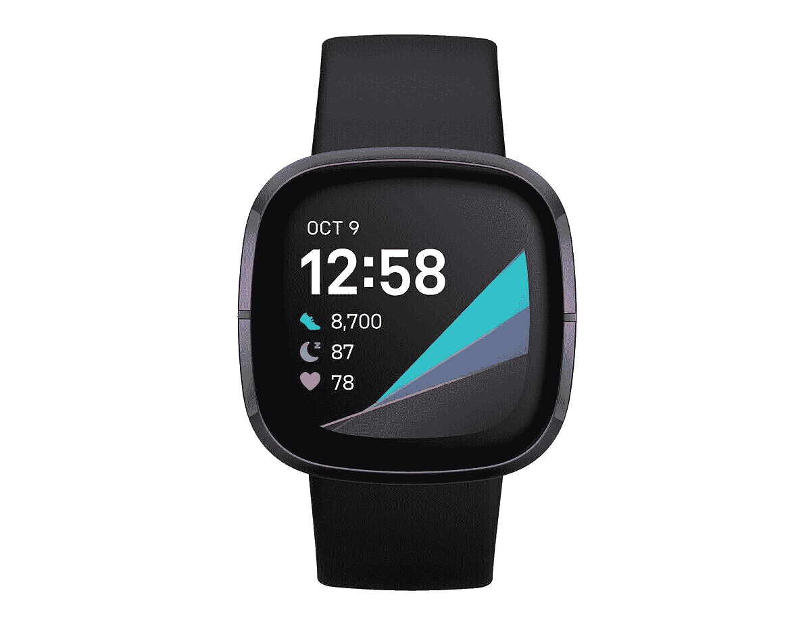

# 现在在亚马逊上只需 180 美元就能买到 Fitbit Sense

> 原文：<https://www.xda-developers.com/fitbit-sense-deal-amazon/>

虽然 Fitbit Sense 现在已经问世两年了，但它仍然是市场上最好的健身追踪器之一。它提供了你期望在高级智能手表上看到的所有健身跟踪功能，包括压力管理、情绪跟踪、温度传感、SpO2 监测、心率跟踪、带打鼾检测的睡眠监测、月经健康跟踪和二十多种基于目标的运动模式。最重要的是，Sense 还配备了 FDA 批准的心电图监视器，可以帮助您测量心律变异性。

这些功能使 Fitbit Sense 成为铁杆健身爱好者的绝佳选择，但由于其 330 美元的高昂价格，大多数买家通常都买不起。幸运的是，Fitbit Sense 目前在亚马逊上的折扣价仅为 180 美元，如果你想在市场上购买一款高级健身追踪器，你应该马上订购一款。

 <picture></picture> 

Fitbit Sense

##### Fitbit Sense

Fitbit Sense 是目前你能买到的最先进的智能手表之一。它集众多功能于一身，包括 FDA 批准的用于测量心率变异性的 ECG 监护仪。

Fitbit Sense 采用方形表盘，配有生动的 AMOLED 显示屏，可帮助您跟踪所有健身数据，它还包括足够的板载存储空间，可保存多达 7 天的日常运动数据、30 天的每日总计数据以及锻炼期间每隔 1 秒钟的心率数据。它还配有内置扬声器和麦克风，与谷歌助手和 Alexa 兼容，支持语音命令，NFC 支持，可定制的手表面部和内置 GPS。健身追踪器一次充电可持续六天，它具有快速充电支持，可在 12 分钟内为您充满一整天的电量。

Fitbit Sense 有三种配色可选——白/金、灰/银、碳/石墨。这三种型号目前在亚马逊上的折扣价为 199.95 美元，但你可以在结账时为碳/石墨型号再节省 20 美元，这使其价格降至 179.95 美元。

在 Fitbit Sense 和 Galaxy Watch 4 之间迷茫？查看我们对 Fitbit Sense 和 Galaxy Watch 4 的详细比较，了解哪一款最适合您的使用案例。