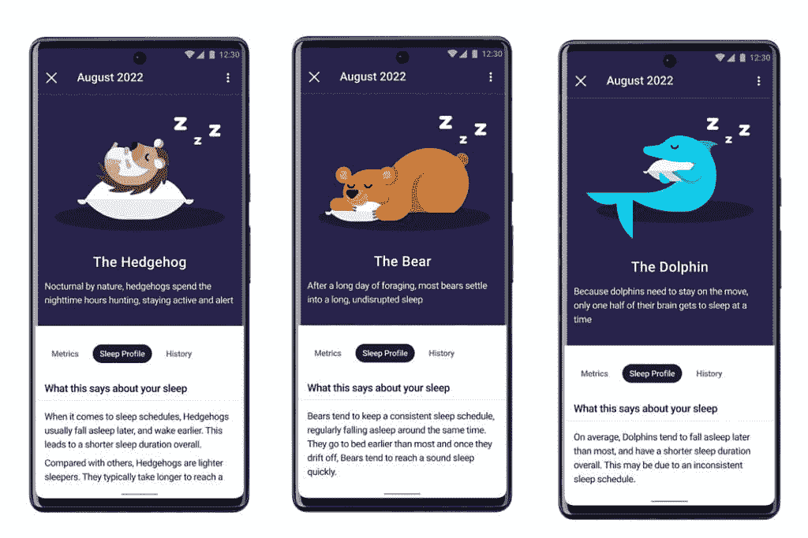

# Fitbit Sleep Profile 为高级用户提供更好的睡眠数据

> 原文：<https://www.xda-developers.com/fitbit-sleep-profile/>

你能给一夜好眠定价吗？当然，你可以，许多公司也是如此。Fitbit 的应用程序中早就有睡眠跟踪功能，但现在，在分析了 220 亿小时的睡眠数据后，该公司认为用户有兴趣了解更多关于他们的睡眠和睡眠模式的信息。正因为如此，Fitbit 推出了睡眠概况，作为其 9.99 美元的 Fitbit 高级服务的一部分，可以对你的睡眠行为进行更深入的分析。

Fitbit 声称，获得良好的夜间休息并不像每晚获得标准的 7 到 8 小时睡眠那么简单。Fitbit 的数据已经由各种专家和权威机构进行了分析，使用这些数据，Fitbit 能够确定十种不同的睡眠指标，这些指标对于促进更好的夜间睡眠至关重要。其中一些指标包括:睡眠时间表的可变性、酣睡前的时间、睡眠中断、睡眠持续时间、快速眼动睡眠等等。

 <picture></picture> 

Sleep Animal

使用这些数据，用户将获得一个理想的范围，让人们更好地掌握他们在这个指标中的位置。这将使用户能够一目了然地了解他们的数据，以及可能需要改进的地方。Fitbit 还让事情变得更可爱，为用户提供了一种指定的睡眠动物。这六种动物将被用来向用户展示它们是哪种类型的睡眠者。

## 你想成为什么睡眠动物？

Fitbit 能够通过让用户在一个月内至少 14 个晚上佩戴 FitBit 设备来给出准确的评估。你戴得越多，数据就越好。数据将在月底呈现，同时还有你是哪种睡眠动物。使用 Fitbit 应用程序的高级用户现在可以使用睡眠模式。当然，你还需要兼容的硬件，可以是以下任何一种:Sense、Versa 3、Versa 2、Charge 5、Luxe 或 Inspire 2。如果你用的是 Fitbit Ionic，你[可能要重新考虑戴着它睡觉。](https://www.xda-developers.com/fitbit-lawsuit-claims-entire-product-lineup-could-cause-burns/)

* * *

**来源:** [谷歌](https://blog.google/products/fitbit/sleep-profile/)

**Via:** [安卓权威](https://www.androidauthority.com/fitbit-sleep-profile-3178966/)