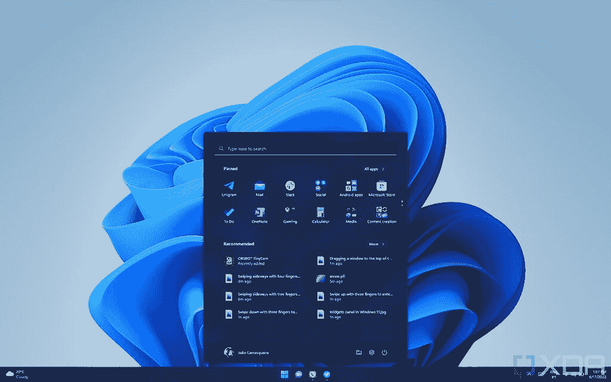
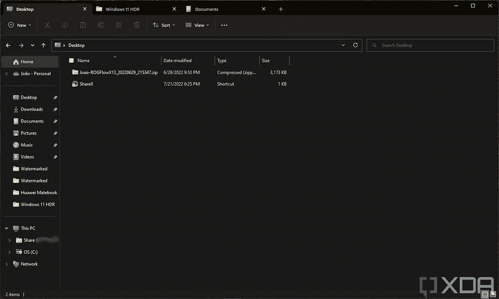
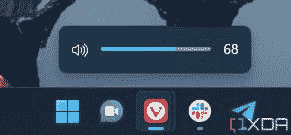

# 这是我在 Windows 11 版本 22H2 中最喜欢的五个功能

> 原文：<https://www.xda-developers.com/five-favorite-features-windows-11-version-22h2/>

在与 Windows 内部人士进行了一年多的测试后，微软终于在 9 月 20 日向公众发布了 [Windows 11 版本 22H2](https://www.xda-developers.com/windows-11-22h2/) -也被称为 2022 更新。这次更新中有很多改进体验的各个部分，无论是简单的视觉变化，添加新功能，还是恢复最初的 [Windows 11](https://www.xda-developers.com/windows-11/) 版本中删除的旧功能。在发布前几个月测试了更新后，我形成了一些看法，我想强调一下 Windows 11 version 22H2 中我最喜欢的五个功能。

这次更新几乎所有的改动都值得称赞，某种程度上，我喜欢其中的大部分。这些只是我使用 Windows 11 期间最突出的几个，它们没有按任何特定的顺序列出。

## 开始菜单文件夹和个性化

这个列表上的第一个项目是，有趣的是，从 Windows 10 中带回来的东西。在 Windows 11 的最初版本中，你不能再在开始菜单中创建文件夹，所以你的应用程序要么分布在多个页面上，要么你必须进入所有应用程序列表才能看到它们。文件夹让我更容易组织我的应用程序，我喜欢根据应用程序的类型将它们分组，例如社交应用程序或媒体相关应用程序。在我的主笔记本电脑上，我还有一个存放安卓应用的文件夹。

 <picture></picture> 

Windows 11 Start menu with folders and an expanded Recommended section

在开始菜单上有文件夹也帮助我为 Windows 11 版本 22H2 中的另一项新功能节省了空间，这是在开始中调整固定区域和推荐区域的大小的能力。我喜欢看到更多的推荐项目，因为对我来说，拥有一个最近下载的文件是很常见的，我可以很快找到它，拥有一个更长的最近文件列表在这些情况下真的很有帮助。

这两样东西结合在一起让开始菜单感觉更像我的，也更有用。对某些人来说，这可能是一个小小的改变，但它肯定是我最喜欢的改变之一。

## 触摸手势

我认为，当 Windows 8 未能在 PC 市场获得牵引力时，微软得到了错误的信息。这并不是说用户不一定想要一个针对触摸优化的体验，而是他们不想要一个对其他人来说如此不方便的体验。所以对我来说，在整个 Windows 10 一代中，该公司对待触摸用户如此之差，这总是很不幸的。不要误会我的意思，它是可用的，显然有一些元素对此有所帮助，但它没有一个真正考虑到触摸支持而设计的 UI。我喜欢[可转换笔记本电脑](https://www.xda-developers.com/best-convertible-laptops/)和它们给你的多功能性，所以很高兴看到微软最终投资于 Windows 11 的触摸体验。

最初的版本已经有几个有趣的触摸屏手势，让你更容易地切换桌面和应用程序，但 Windows 11 版本 22H2 增加了更多。我喜欢从任务栏向上滑动打开开始菜单，或者从系统托盘向上滑动进入快速设置面板。最后，我还喜欢的是，当你滑动进入通知中心时，动画会跟随你的手指，而不是固定的动画。这一切都很棒，当我将笔记本电脑用作平板电脑时，它给了我新的享受。奇怪的是，动画更新并不适用于窗口小部件面板，但我们可以希望微软最终会解决这个问题。

还有一个期待已久的全屏应用程序“抓取器”。本质上，这是一种安全机制，防止您意外触发覆盖您的游戏或正在观看的电影的滑动手势。现在，如果你想在使用全屏应用程序时使用这些手势，你必须滑动两次，有点类似于 Android 上的操作，这很有意义。

总而言之，新的触摸手势可能是我最喜欢的更新。如果你想了解更多，我已经更广泛地介绍了 Windows 11 中的[触摸手势。](https://www.xda-developers.com/how-to-use-touch-gestures-windows-11/)

## 文件资源管理器选项卡(和其他改进)

这个还没有正式发布，但是我们不能不提它。在文件浏览器中支持类似浏览器的[标签是多年来一直要求的功能，微软甚至在 2017 年用一个名为 Windows 10 的功能戏弄了我们，遗憾的是，它从未离开预览阶段。这将把*所有的*应用变成标签，这本身就是一个有趣的想法。但是现在，在经历了一些重大的颠簸之后，我们终于在 10 月底更新了文件浏览器中的标签。](https://www.xda-developers.com/windows-11-2022-update-file-explorer-guide/)

 <picture></picture> 

File Explorer with multiple tabs open

文件资源管理器标签的工作方式在很多方面与它们在浏览器上的工作方式相似。你可以用 Ctrl+T 打开一个新的标签——默认为文件资源管理器主页——你可以右键单击一个文件夹并在一个新的标签中打开它，甚至可以用鼠标中键单击它来立即打开它。关闭标签页的快捷方式也与其他浏览器相似。这使得管理打开的文件夹更加容易，因为您不再需要打开十几个单独的文件资源管理器窗口来查看您想要的所有内容。

这是一个在开发周期中很晚才添加的特性，所以我还没有很多时间来适应它，但是这是一个非常令人兴奋的添加。一旦它被广泛使用，我有更多的时间使用它，它肯定会使管理我的文件变得更加容易。

但是我还想强调一下文件资源管理器的其他改进，特别是在导航窗格方面。给我们带来文件浏览器标签的同样的更新也重新组织了这个窗格，对我来说，它看起来干净多了。从逻辑的角度来看，这并不是很大的区别，但是感觉要好得多。

还有新的文件浏览器主页，现在显示我的 OneDrive 中最近的文件，这是一个很好的补充。哦，能够直接从现代上下文菜单安装字体也很棒。

## 新的任务管理器和其他可视化更新

我是视觉一致性的忠实粉丝，这经常把使用 Windows 变成一系列的“为什么？”当我遇到另一个元素，它仍然是谁知道什么时候的遗留物。谢天谢地，Windows 11 版本 22H2 带来了几个*非常*受欢迎的视觉更新，其中最大的一个是任务管理器。任务管理器的上一个版本从 Windows 8 开始就存在了，它是一个如此常见的工具，以至于它真的像一个疼痛的拇指一样突出。这是你用了这么长时间后会停止思考的事情，但当一个新的任务管理器最终出现在 Windows 11 预览版中时，那是一个伟大的日子。

新版本的任务管理器有一个重新设计的界面，现在完全适应 Windows 11 的设计语言。它使用新的云母材料更新了半透明表面的整体窗口设计，它最终支持深色模式，它甚至使用了您的强调色，因此各个部分中的黄色和橙色色阶被您选择的不同色调所取代。此外，老派的标签设计为侧边栏菜单让路，侧边栏菜单包含所有不同的部分，也用图标表示，这样你一眼就能更容易地识别它们。

不过，如果我不提及这个版本中其他早该出现的视觉更新，那将是我的失职。微软终于更新了音量和亮度滑块，这也是 Windows 8 以来就有的，但实际上更加突出。旧的设计使用了经典的 Windows 8 风格，看起来很方，颜色也很单调。现在，它是一个透明的弹出按钮，具有完全更新的外观，非常适合 Windows 11。只有当你使用键盘快捷键(或精密触摸板)改变音量或亮度时，你才会看到它，但感觉好多了。

 <picture></picture> 

The new volume indicator in Windows 11 version 22H2

最后一个值得一提的视觉更新是在启动序列中，Windows 10 遗留下来的圆点圆圈已经被新的 Windows 11 风格的动画所取代。所有这些变化使 UI 设计比以前更好地结合在一起。

## 克利普尚

诚然，Clipchamp 不是一个新的“功能”，你不需要 Windows 11 版本 22H2 来访问它(毕竟它是在 web 上提供的[)，但我认为它绝对还是值得一提的。多年来，Windows 一直缺乏一个像样的内置视频编辑器。这很遗憾，因为微软曾经有 Windows Movie Maker，它实际上是一个非常棒的基本视频编辑工具。但在 Windows 10 年，我们被困在内置于照片应用程序中的令人难以置信的黯淡的视频编辑器中。与此同时，苹果的 macOS 提供了一个非常通用的 iMovie 选项。](https://app.clipchamp.com)

这就是为什么 Clipchamp 是如此受欢迎的补充。它并不完美，但正如我在我的[clipcamp 指南](https://www.xda-developers.com/how-to-use-clipchamp-video-editor-windows-11/)中提到的，它是一个相当有能力的编辑器。它支持多个视频和音频轨道，它有大量的内置效果和过渡，你甚至可以访问一个股票内容库，特别是使用 Clipchamp 订阅。对于第一次制作自己的视频的人来说，Clipchamp 让你不需要去寻找第三方视频编辑器，它让内容创作变得更加容易。

微软收购 Clipchamp 的时候，情况相当糟糕。免费计划有着荒谬的限制，而付费计划莫名其妙地变得异常昂贵。但自那以后的一年里，它变得更加物有所值，事实上，它现在安装在 Windows 11 中，这只能是一件好事。希望有更多的改进，所以它是一个更有用的工具。

作为奖励，拥有一个合适的视频编辑器也给了我们一个[全新的照片应用](https://www.xda-developers.com/new-windows-11-photos-app-in-testing/)，淘汰了旧的。它实际上有一个非常好的重新设计，所以这是一个双赢的局面。

* * *

这些是我在 Windows 11 版本 22H2 或 2022 更新中最喜欢的五个功能。取决于你是谁，有很多事情值得兴奋，但对我来说这些绝对是最重要的。第一个增加的可能实际上是新的触摸手势，虽然我觉得我可能是少数。

*Windows 11 版本 22H2 中你最喜欢的功能有哪些？请在评论中告诉我们！*