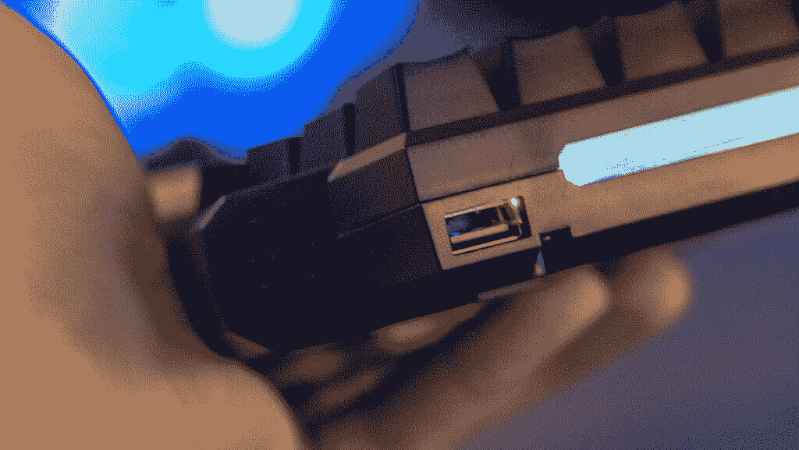
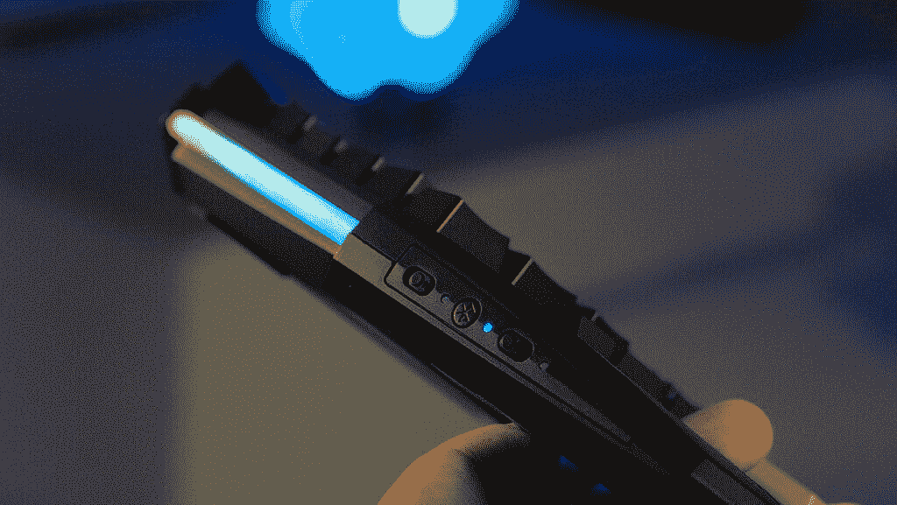
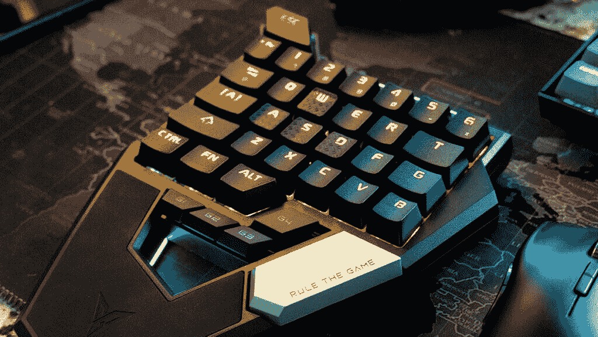
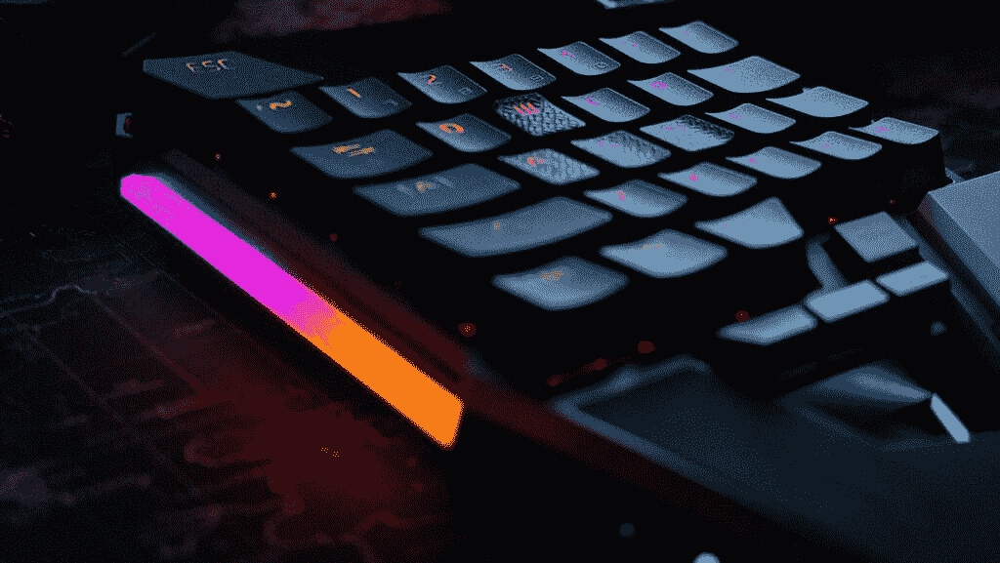

# 借助这款蓝牙控制器，使用键盘和鼠标在 Android 上玩游戏

> 原文：<https://www.xda-developers.com/flydigi-scorpion/>

谈到蓝牙控制器，Android 能够从标准的双操纵杆配置中读取输入。一些游戏需要按钮映射应用程序，而其他游戏无需额外配置即可运行。在大多数情况下，你的标准 Xbox 风格的控制器可以很好地与 Android 兼容。Android 与 PC 的不同之处在于它读取鼠标输入的方式。如果你曾经尝试过在 Android 上用鼠标玩游戏，你就会知道在屏幕上点击和拖动鼠标来复制一个基于触摸的瞄准系统是多么困难。这个问题导致键盘和鼠标游戏输入在很长一段时间内无法使用。Flydigi 已经创建了一个名为 Scorpion 的解决方案，这使它成为我们最喜欢的蓝牙游戏控制器。

Flydigi Scorpion 是一款 WASD 游戏键盘。该键盘由标准键盘的左半部分组成，包括空格键和四个可自定义的键。键盘配有 RGB LEDs 背光，可以根据您的喜好改变颜色和照明模式。键盘配有蓝色机械开关，可以更换键帽。

## 建造和设计

显然，在 Flydigi 控制器上花了很多心思。机械键盘没有很多你想要的缺失功能。从表面上看，它可能看起来像另一个基本的移动游戏配件，但实际上，它拥有高端机械键盘的一切。

 <picture></picture> 

USB-C charging port and USB mouse input.

 <picture></picture> 

Bluetooth and lighting controls.

**免费安装 Raid 暗影传说✅[IOs](https://clcr.me/xdadevelopers_iOS)✅[Android](https://clcr.me/xdadevelopers_Android)✅[PC](https://clcr.me/xdadevelopers_PC)并获得一个特殊的启动包💥仅在有限的时间内可用。**

Flydigi Scorpion 电池续航时间长，使用蓝牙信号连接到你的手机。一个 USB-C 端口可用于为控制器充电，另一个全尺寸 USB 端口用于有线鼠标输入。橡胶掌托延伸到键盘底部，为游戏创造了令人惊讶的舒适环境。在键盘的左侧，你会发现蓝牙开关、照明开关和有线/蓝牙输入开关。

我发现键盘缺少的一个功能是供 PC 使用的蓝牙输入。为了在您的电脑上使用它，您只能通过 USB-C 端口进行有线连接。如果能使用蓝牙连接与 PC 配合使用就好了。然而，蝎子只在使用 USB 连接时充当键盘输入。

## 功能

那么 Flydigi 是如何解决鼠标输入问题的呢？键盘将键盘和鼠标活动转换为控制器输入。这意味着 WASD 被转换成左操纵杆，鼠标运动被转换成右操纵杆。由于 Android 能够读取游戏控制器输入，这意味着 Flydigi Scorpion 可以作为一个自然的键盘/鼠标设置，具有 PC 风格的行为。在第一人称射击游戏中，不再需要在屏幕上点击和拖动来瞄准。现在你只需移动你的鼠标，点击就可以开火，就像你在电脑上操作一样。

 <picture></picture> 

The Flydigi Scorpion can be used with a USB mouse input.

 <picture></picture> 

The Flydigi Scorpion keys are backlit with RGB LEDs, with additional lighting bars on the side and top.

结果是一个完全自然的键盘和鼠标游戏设置。鼠标的移动和加速完全符合您的预期，而键盘则充当舒适的 WASD 输入。对于没有通用控制器支持的游戏，您可以使用 Flydigi Game Center 应用程序来映射您的控件。该应用程序还提供固件更新。自从我开始使用 Flydigi Scorpion 以来，我的键盘已经收到了两次更新。这总是一个有希望的迹象，因为它表明背后的公司正在积极支持它的产品。

在亚马逊上售价 58.99 美元的 Flydigi Scorpion 是你可以为你的手机买到的最昂贵的游戏配件之一。然而，这是你能找到的最好的键盘和鼠标解决方案。所以，如果你今天想买一个，请使用下面的链接。

[**在亚马逊**上获得 Flydigi 蝎子](https://www.amazon.com/Flydigi-Scorpion-Mechanical-One-Handed-Bluetooth/dp/B07PMCLVHR/?tag=xda-2jd5mpj-20&ascsubtag=UUxdaUeUpU29186&asc_refurl=https%3A%2F%2Fwww.xda-developers.com%2Fflydigi-scorpion%2F&asc_campaign=Short-Term)

###### *我们感谢暗影突袭传奇赞助了这篇文章。我们的赞助商帮助我们支付与运行 XDA 相关的许多费用，包括服务器成本、全职开发人员、新闻撰稿人等等。虽然您可能会在门户内容旁边看到赞助内容(这些内容将始终被标记为赞助内容),但门户团队对这些帖子不承担任何责任。赞助内容、广告和 XDA 仓库完全由一个独立的团队管理。XDA 绝不会通过接受金钱来赞扬一家公司，或以任何方式改变我们的观点或看法，从而损害其新闻诚信。我们的意见不能被收买。*