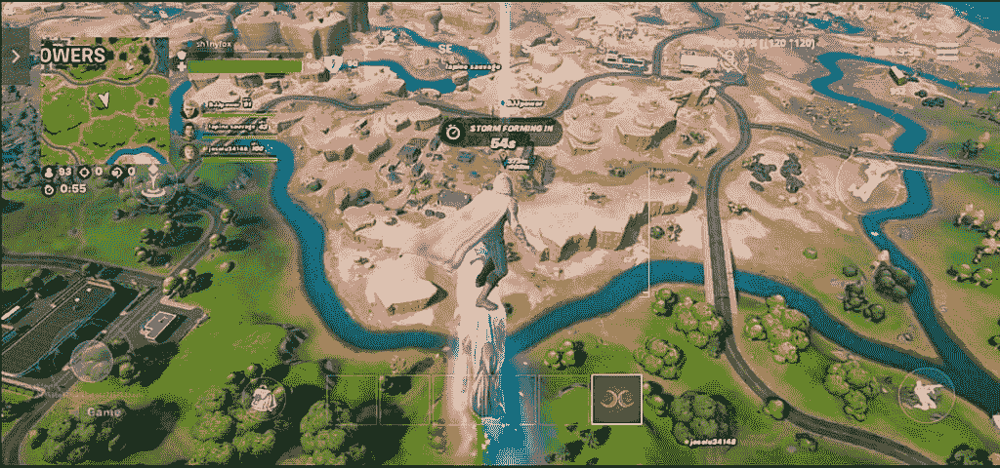
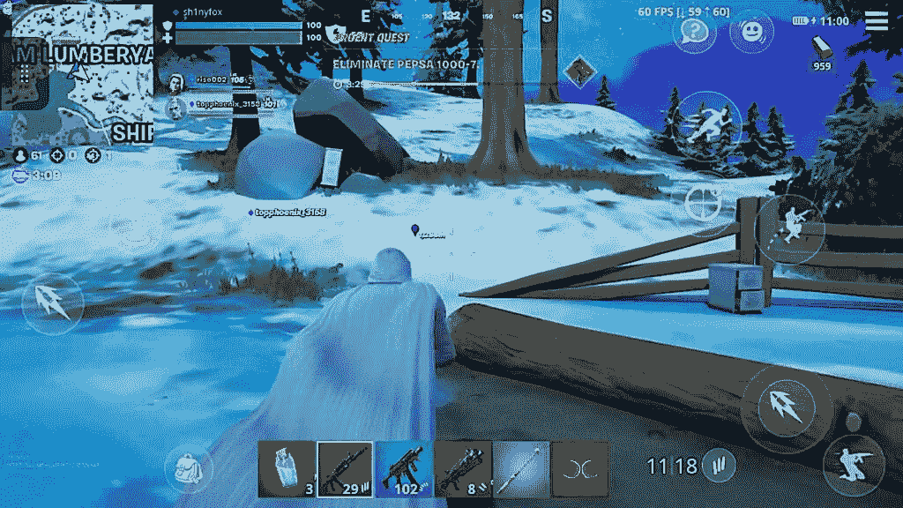

# 云是现在在安卓(和 iPhone)上玩堡垒之夜的最佳方式

> 原文：<https://www.xda-developers.com/fortnite-cloud-vs-android-native/>

多亏了英伟达和微软，移动堡垒之夜的粉丝们现在有了原生客户端的替代品。众所周知，在一场关于谁获得了切断所有 V 雄鹿销售的东西的争吵中，堡垒之夜被从苹果应用商店和谷歌 Play 商店移除。在 Android 上，因为它不是你从苹果那里得到的封闭花园，你仍然可以通过 Epic 自己的启动器在移动设备上玩[堡垒之夜。堡垒之夜玩家可以在旅途中玩游戏，Epic Games 可以将所有的 V Bucks 现金据为己有。但它永远不会像通过 Play Store 下载和支付东西那样无缝和方便。](https://www.epicgames.com/fortnite/en-US/mobile/android/get-started)

因此，当 Android 版本继续存在时，iPhone 用户却被冷落了。Nvidia 迅速采取补救措施，通过云推出了一款触屏堡垒之夜的封闭测试版，该版本现已在[正式推出](https://www.xda-developers.com/fortnite-touch-controls-geforce-now/)。微软最近还将[堡垒之夜添加到其 Xbox 云流媒体](https://www.xda-developers.com/xbox-cloud-gaming-adds-fortnite/)中，面向所有玩家，不需要游戏通行证订阅。除了明显的警告之外，这两款游戏都是比安卓版本更好的手机游戏。

## 明显的警告

从云端玩堡垒之夜需要良好的数据连接。在 Android 上玩堡垒之夜仍然需要稳定的数据连接，但由于它只用于连接服务器，你可以用相对较慢的连接来凑合。重要的是，如果你在玩手机游戏，你不会用掉太多的数据流量。

相比之下，来自云端的流媒体会占用相当大的一部分空间。即使调低到移动友好的设置，你也可能每小时消耗 2-3 GB 的数据。如果你有大量的数据流量，你可能不会太在意，但这对很多堡垒之夜玩家来说是个问题。

远离家庭，数据使用是云游戏的一个问题。

还有一个简单的事实，手机数据没有你家的宽带好。即使速度相当，也有可能会有更高的 ping。我和 EE 在英国的 5G 计划已经足够快了。但是，虽然我现在可以在家里享受 GeForce 上低至 15 毫秒的 ping，但在蜂窝网络上，它是两倍或更差。

如果你的游戏时间涉及大量的手机使用，重度堡垒之夜手机玩家总体上仍然会更好地使用原生安卓版本。但是其他人都应该上云。

## 云中的堡垒之夜是熟悉而辉煌的

 <picture></picture> 

Fortnite on Nvidia GeForce Now with touch controls

当我在云端加载堡垒之夜时，第一件让我震惊的事情是这些控件给我的感觉是如此的熟悉。它们在 GeForce Now 和 Xbox Cloud Streaming 上基本相同，在这两种情况下都与移动控件相当。如果它没坏，为什么要修理它？

但这对于任何过渡到云计算或在被迫中断后回到 iPhone 上玩的人来说也很重要。我很惭愧地承认，我曾经在我的 iPhone 上玩了太多的堡垒之夜，加载这两个云选项中的任何一个都好像从未停止过。

 <picture></picture> 

Fortnite for Android played on a Huawei Mate 30 Pro

基本就是个手游。有那么好。甚至还有同样的定制和自动射击模式，供我们当中更休闲的玩家使用。

不过，表演才是真正的赢家。使用英伟达的服务器或微软的 X 系列流媒体刀片的能力，堡垒之夜通过云远远超过其 Android 对手。它看起来更好，整体更稳定，基本上可以在任何东西上玩，这是你不能对移动版本说的。对于原生客户端，我不得不找出一部旧手机，因为尽管符合(显然)Epic 的规格要求，但在我目前使用的小米手机上安装堡垒之夜时，它是“计算机说不”的情况。即使在那时，我也只能在我的设备上以 30 FPS 的速度播放看起来相当恐怖的图形。

 <picture></picture> 

Fortnite on Xbox Cloud Streaming with touch controls

这些都不是云中的烦恼。一旦你将你的 Epic 帐户链接到 GeForce Now，当你加载它时，你会立即进入游戏。在 Xbox 上也是如此，就像你会在主机上加载一样。

《来自云端的堡垒之夜》太棒了，就像是一款本土手机游戏。

不过，就纯粹的结果而言，英伟达是赢家。如果你和我一样在顶层，你会得到一个 RTX 3080，这是周围最好的显卡之一，来支持你的堡垒之夜会话，并以高达 120 FPS 的速度传输到你的设备。如果您的兼容移动设备具有 120Hz 显示屏，您也会看到所有这些帧。这是堡垒之夜最大限度的，你不需要牺牲视觉效果来获得这些高帧率。

Xbox 被限制在 60 FPS，但它也给人留下了深刻的视觉印象。在这两种情况下，控制都很灵敏，几乎没有延迟问题的迹象，而且在稳定的无线连接下，缓冲也很少。考虑到这是一个竞争性的多人游戏，从云端传输并使用触摸控制，它非常出色。

* * *

对于真正的手机游戏，原生客户端仍然会更好，但至少在 iPhone 上，这不会很快发生。数十亿美元的公司太专注于谁得到你更多的钱，而不是真正关心你的体验，但至少有一个可行的选择。然而，云计算带来的性能差异是惊人的，图形保真度和帧速率是智能手机用户梦寐以求的。

云游戏仍处于起步阶段，但随着 Nvidia、微软甚至谷歌 Stadia 等公司的发展，我可以预见云将接管顶级移动游戏的未来。