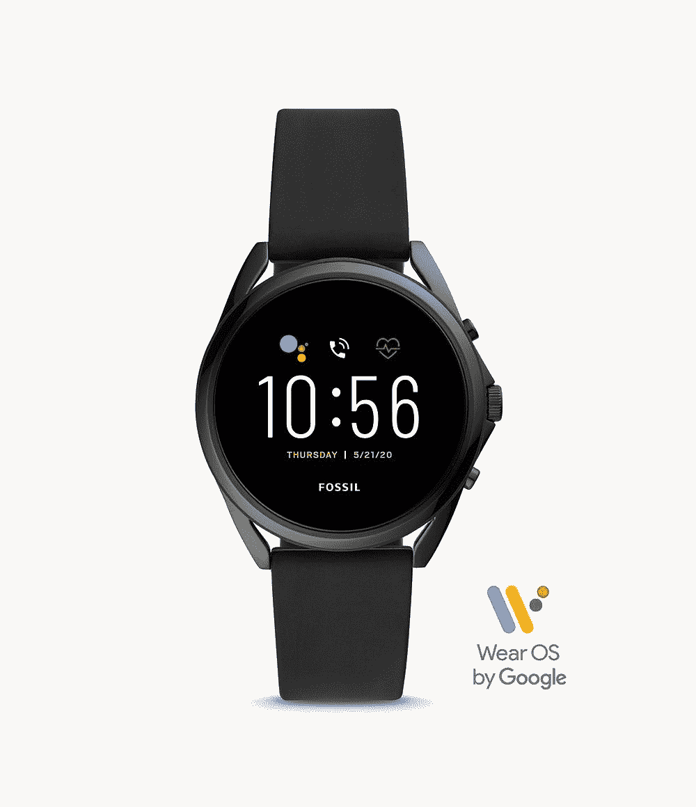

# 功能强大的新 Fossil 5 LTE 现已在威瑞森上市，售价 349 美元

> 原文：<https://www.xda-developers.com/fossil-5-lte-verizon/>

上周在 CES 2021 期间， [Fossil 5 LTE 被正式宣布](https://www.xda-developers.com/fossil-gen-5-wear-os-smartwatch-lte/)，为那些希望少受手机束缚的人提供了一个智能手表选择。这款智能手表的零售价为 349 美元，目前在威瑞森有黑色和粉色两种颜色，该公司也是这款智能手表的独家经销商。

Fossil 5 LTE 已经可以在 [Fossil 的网站](https://www.fossil.com/en-us/smartwatches/generations/gen-5-lte/)上购买，但为了使用你付费的功能，你必须获得威瑞森计划，因为它只能与威瑞森号码共享的手机配对。所以从威瑞森抢这块智能手表绝对是个好主意！毕竟，不管怎样，你都需要它们。

Fossil 5 LTE 比最初的 Fossil 5 智能手表贵 50 美元，实际上它内部也有同样的技术。您在这里支付的费用是为了让手表完全正常工作，而无需将手机放在身边。因此，如果你可能想在徒步旅行时离开手机，那么你的 Fossil 5 LTE 将不会有问题保持信号并通过 GPS 跟踪你的徒步旅行。想在手表上使用 Google Pay 而不用担心智能手机在哪里？这就对了。

在威瑞森，你可以直接花 350 美元购买 Fossil Gen 5 LTE，或者在 24 个月内每月支付 14.53 美元。此外，如果你将新化石与智能手机捆绑在一起，你将节省 150 美元。我敢肯定有一些[三星 Galaxy S21 交易](https://www.xda-developers.com/best-galaxy-s21-ultra-deals/)你也可以用这个在威瑞森叠加！

 <picture></picture> 

Fossil 5 LTE at Verizon

##### 化石第 5 代 LTE

化石 5 的 LTE 版本不在威瑞森！花 349 美元或 14.53 美元/月，24 个月，买一部没有智能手机也能工作的智能手机。

如果你对威瑞森计划中的智能手表不感兴趣，你可以选择标准的 Fossil 5。由于两款智能手表的技术本质上是一样的，所以同样的体验你可以省下整整 50 美元...而且那只是在它不打折的情况下。现在在亚马逊，Fossil 5 Carlyte 的售价为 240 美元，所以你比 LTE 版本节省了 110 美元！

 <picture></picture> 

Fossil 5 Carlyte

##### 化石第五代卡莱特

不需要将智能手机连接到手机数据，或者没有威瑞森？标准 Fossil 5s 拥有相同的技术，但价格更低！