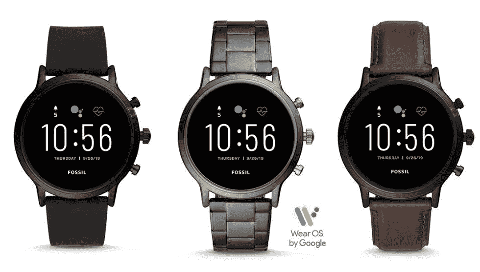
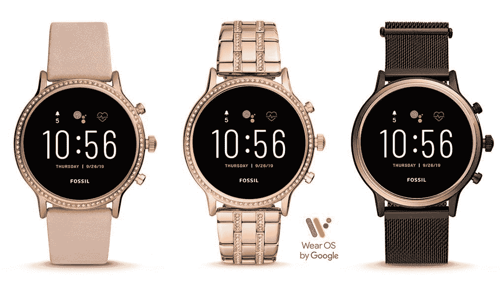

# Fossil 的第五代智能手表拥有骁龙 Wear 3100、1GB 内存、扬声器等等

> 原文：<https://www.xda-developers.com/fossil-gen-5-wear-3100-battery-modes/>

继三星 Galaxy Watch 2 之后，Fossil 宣布了他们最新的 Wear OS 系列。Fossil Gen 5 智能手表采用了[高通最新的可穿戴芯片组](https://www.xda-developers.com/qualcomm-snapdragon-wear-3100-sports-mode-still-coming/)，1GB 内存，扬声器，以及更长的电池寿命。Gen 5 有两种相同尺寸的机身款式，有多种表带选择，售价 295 美元。

像去年年底推出的 Fossil Sport 一样，Gen 5 系列是少数几个采用高通骁龙 3100 SoC 的系列之一。甚至新推出的 TicWatch Pro 4G/LTE [也没有高通最新的芯片](https://www.xda-developers.com/ticwatch-pro-4g-lte-first-impressions-two-displays-are-twice-as-nice/)。3100 的性能改进没有许多人希望的那么令人印象深刻，但 Fossil 已经包括 1GB 的 RAM 和新的电池模式来帮助解决这一问题。

 <picture></picture> 

Carlyle

Fossil 自主研发的电池节能方法被称为“智能电池模式”有四种不同的模式可供选择:每日模式、扩展模式、自定义模式和限时模式。日常模式是默认设置，这只是典型的体验。扩展模式将关闭某些功能，以将电池寿命延长至“数天”这包括永远在线的显示屏、位置、NFC、Wi-Fi 等。自定义模式本质上是一样的，但是用户可以决定禁用哪些功能。最后，纯时间模式将智能手表变成只有一个时钟的“哑”手表。当电池电量低时，此模式会自动启用。

 <picture></picture> 

Julianna

大多数 Wear OS 设备都有 512MB 的内存，但最近，我们已经看到 1GB 的内存。这在性能上也有很大的不同，这应该会进一步帮助 Gen 5 系列。Wear OS 的性能问题由来已久，感觉 Fossil 已经厌倦了等待谷歌来解决它。

第五代智能手表有六种可能的变体。“卡莱尔”风格是一种极简风格，有“烟色”、“黑色”和黑/棕色。“朱莉安娜”在表圈周围有更多的宝石点缀。它有玫瑰金、玫瑰金/黑色和玫瑰金腮红三种颜色可供选择。两种风格有相同的规格，身体尺寸，他们采取 22 毫米波段。它们现在可以从[化石](https://www.fossil.com/us/en/products/gen-5-smartwatch-the-carlyle-hr-smoke-stainless-steel-sku-FTW4024P.html)和[亚马逊](https://www.amazon.com/Fossil-FTW4026-Touchscreen-Model/dp/B07SRVV8V4/ref=as_li_ss_tl?ie=UTF8&linkCode=sl1&linkId=5e913a609900d639de4c7dd43c90a063&language=en_US&tag=xda-5bj3aea-20&ascsubtag=UUxdaUeUpU25542&asc_refurl=https%3A%2F%2Fwww.xda-developers.com%2Ffossil-gen-5-wear-3100-battery-modes%2F&asc_campaign=Short-Term) ( [2](https://www.amazon.com/Fossil-FTW6036-Touchscreen-Model/dp/B07SW1KK31/ref=as_li_ss_tl?keywords=fossil+gen+5+julianna&qid=1564986774&s=gateway&sr=8-1&linkCode=sl1&linkId=3525993fe0393419d7aee951f904e64b&language=en_US&tag=xda-5bj3aea-20&ascsubtag=UUxdaUeUpU25542&asc_refurl=https%3A%2F%2Fwww.xda-developers.com%2Ffossil-gen-5-wear-3100-battery-modes%2F&asc_campaign=Short-Term) )以 295 美元的价格买到。

| 

规范

 | 

化石第五代

 |
| 大小 | 44 毫米，12 毫米厚，2.8 盎司 |
| 波段大小 | 22 毫米 |
| 显示 | 1.28 英寸，AMOLED |
| 社会学 | 骁龙穿 3100 |
| 电池 | “36 小时/ 1 周时钟模式” |
| 连通性 | Wi-Fi、NFC、蓝牙 4.2 LE |
| 健康特征 | 加速度计、GPS、心率传感器 |
| 抗水性 | “防游泳” |
| 存储容量 | 8GB |
| RAM 容量 | 1GB |
| 软件 | 佩戴操作系统 |

* * *

**来源:[化石](https://www.fossil.com/us/en/products/gen-5-smartwatch-the-carlyle-hr-smoke-stainless-steel-sku-FTW4024P.html)**