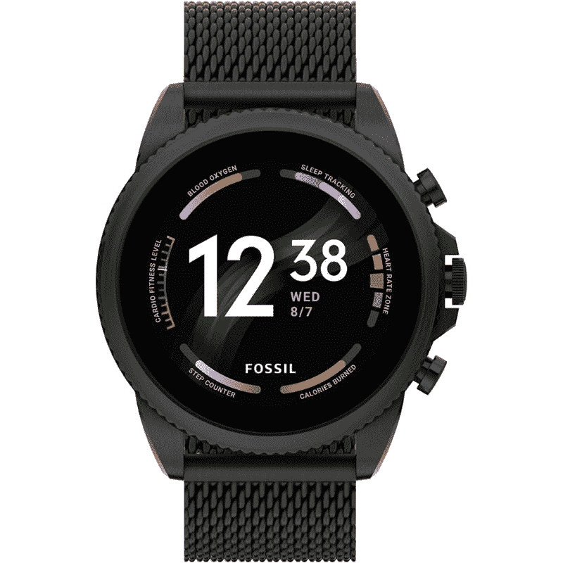

# 在亚马逊优惠日，Fossil Gen 6 智能手表优惠 110 美元

> 原文：<https://www.xda-developers.com/fossil-gen-6-smartwatch-prime-day-deal/>

# 在亚马逊优惠日，Fossil Gen 6 智能手表优惠 110 美元

作为亚马逊黄金日销售的一部分，Fossil Gen 6 智能手表目前以大幅折扣的价格出售。

许多现有的 Wear OS 智能手表将很快更新到该软件的最新版本，这是抢到你最喜欢的智能手表的最佳时机之一。亚马逊目前正在为各种智能手表提供巨大折扣，作为其黄金日销售的一部分。Fossil Gen 6 智能手表就是其中之一，目前仅售 209 美元。这比它通常的 299 美元的价格低，为你节省了大约 90 美元。

Fossil Gen 6 是目前最好看的智能手表之一，可以购买大量不同的表带选择。从简单的棕色皮革表带到花哨的黑色网眼表带，有十多种表带可供选择。这项特别交易的最大好处之一是，无论你选择哪种表带，你都可以得到相同的价格。

Fossil Gen 6 智能手表以其时尚而简单的设计肯定会吸引一些人的眼球。它还包含一套体面的内部零件，以保持手表长时间运行。我们正在研究配有 1GB 内存的高通骁龙 Wear 4100+芯片组。它还配备了 8GB 的板载内部存储，用于应用程序或离线音乐。这款特殊的智能手表还可以让你跟踪各种锻炼，甚至可以监控一些健康指标，包括心率和血氧水平。它还内置了 Alexa 支持，这意味着你可以快速访问亚马逊的数字语音助手。

Fossil Gen 6 智能手表目前运行 Wear 2 版本，但它很快将与其他智能手表一起接收 Wear OS 3。新的 Wear OS 更新预计会带来很多变化，所以这款手表只会随着时间的推移变得越来越好。

 <picture></picture> 

Fossil Gen 6 smartwatch

##### 化石第六代

Fossil Gen 6 是一款令人印象深刻的 Wear OS 智能手表，拥有时尚的设计和体面的内部组件。它还将在今年晚些时候收到 Wear OS 3 更新。

如果你不太确定 Wear OS 软件能做什么，那么看看我们收集的[最佳 Wear OS 应用](https://www.xda-developers.com/best-wear-os-apps/)，它们将帮助你充分利用你的智能手表。化石 Gen 6 的 209 美元的价格是很长一段时间以来的最低价格，所以一定要去看看。