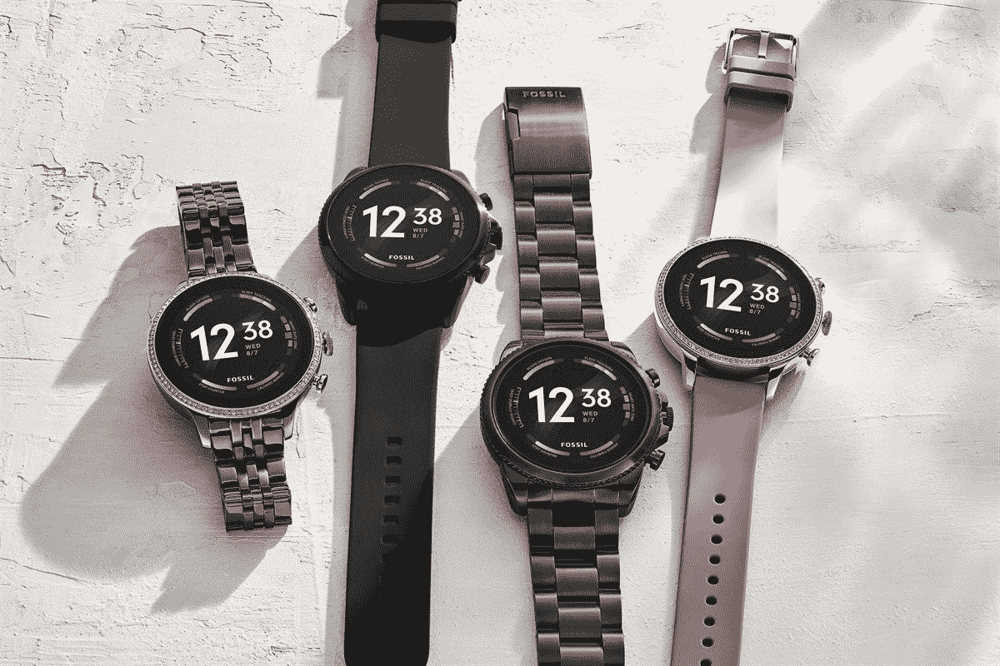
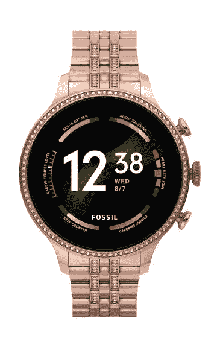

# 化石 Gen 6 系列搭配骁龙 Wear 4100+全球发售

> 原文：<https://www.xda-developers.com/fossil-gen-6-smartwatches-with-snapdragon-wear-4100-go-on-sale-in-u-s-india-and-other-regions/>

# 骁龙 Wear 4100+fossil Gen 6 智能手表在美国、印度和其他地区上市

Fossil Gen 6 系列现已在美国、印度、英国和多个欧洲市场销售。请继续阅读，了解更多信息。

 <picture></picture> 

FSL4013827

上个月 Fossil [发布了 Fossil Gen 6 系列](https://www.xda-developers.com/fossil-gen-6-launch/)，这是该公司最新的 [Wear OS 驱动的](https://www.xda-developers.com/best-wear-os-apps/)智能手表系列。虽然这款智能手表已经在多个市场接受了几周的预购，但它们最终将从今天开始在全球销售。

化石 Gen 6 有两种尺寸:42 毫米和 44 米。42 毫米型号的起价为 299 美元，而 44 毫米型号在美国的售价为 319 美元。在印度，该系列产品的价格在₹23,995 和₹24,995.与此同时，在欧洲和英国，智能手表在€的价格分别在 299-329 英镑和 279-299 英镑之间。Fossil Gen 6 系列现在可以从 Fossil 的网站和[亚马逊](https://www.amazon.com/Fossil-Gen-Smartwatch-Model-FTW4062V/dp/B09B2XG2RT/?tag=xda-2a8ivl9-20&ascsubtag=UUxdaUeUpU5485&asc_refurl=https%3A%2F%2Fwww.xda-developers.com%2Ffossil-gen-6-smartwatches-with-snapdragon-wear-4100-go-on-sale-in-u-s-india-and-other-regions%2F&asc_campaign=Short-Term)购买。

 <picture></picture> 

Fossil Gen 6

##### 化石第六代

Fossil Gen 6 系列采用高端设计，1.28 英寸 AMOLED 显示屏，骁龙 4100+ SoC，快速充电支持和 Wear OS。

Fossil 的新第 6 代智能手表代表了 Fossil 第 5 代的重大飞跃，承诺性能提高 30%，充电速度提高 80%，并提供新的健康跟踪功能。这款手表采用 1.28 英寸 AMOLED 显示屏，封装在不锈钢机身中。为智能手表提供动力的是高通的[骁龙 4100+](https://www.xda-developers.com/qualcomm-snapdragon-4100-announcement-wear-os-smartwatches/) SoC，配有 1GB RAM 和 8GB 板载存储。新型号还配备了一个 SpO2 传感器，用于监测血氧水平，以及一个改进的心率传感器，用于持续跟踪心率。另一个值得注意的升级是快速充电支持，Fossil 声称可以在短短 30 分钟内将手表从 0%充电到 80%。

在软件方面，Fossil Gen 6 仍然运行旧版本的 Wear OS。然而，Fossil 承诺这款手表将在“2022 年的某个时候”收到对 [Wear OS 3](https://www.xda-developers.com/wear-os-3-galaxy-watch-4-oneui-watch-review/) *的更新。*

## Fossil Gen 6 智能手表:规格

| 

规格

 | 

化石第六代

 |
| --- | --- |
| **构建** | 

*   不锈钢表壳、表圈和按钮

 |
| **尺寸&重量** |  |
| **显示** |  |
| **SoC** | 高通骁龙 Wear 4100+ |
| **公羊** |  |
| **电池&充电** | 

*   带磁性圆盘的 4 针 USB 快速充电器
*   快速充电支持(30 分钟内充电 80%)

 |
| **连通性** | 

*   蓝牙 5.0 LE
*   无线保真
*   全球（卫星）定位系统
*   国家足球联盟

 |
| **传感器** | 

*   加速计
*   陀螺仪
*   指南针
*   高度计
*   PPG 心率传感器
*   SpO2
*   体外红外
*   背景光

 |
| 声音的 | 用于通话的内置扬声器和麦克风 |
| 软件 | 佩戴谷歌操作系统 |