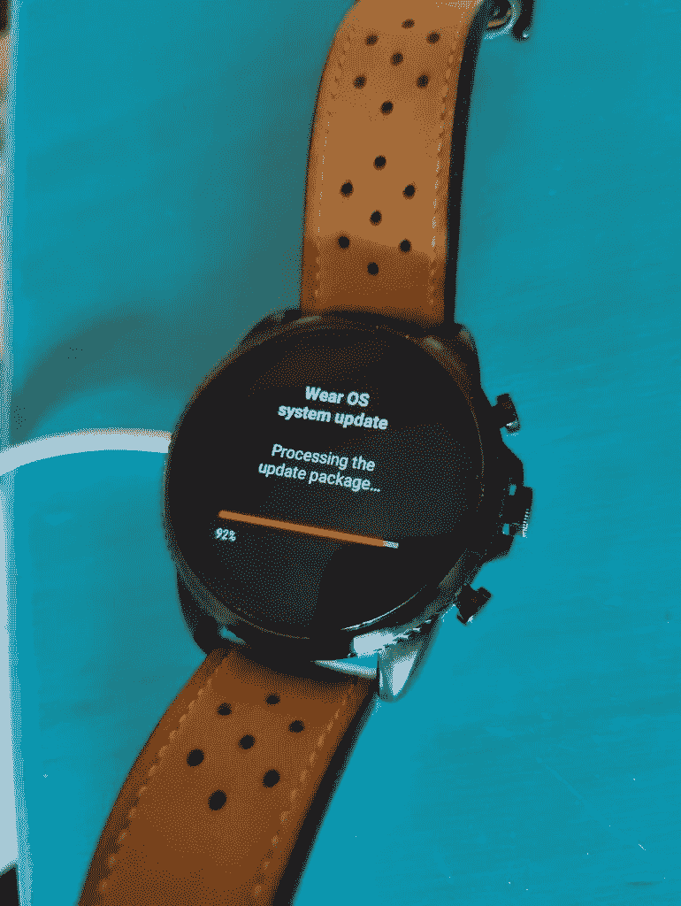

# Fossil 开始推出佩戴 OS 3 至 Gen 6 智能手表

> 原文：<https://www.xda-developers.com/fossil-gen-6-wear-os-3-rollout/>

Fossil 推出了期待已久的第六代智能手表 Wear OS 3 更新，上周推出了新的健康版型号。该公司现在已经开始将其推广到旧的 Gen 6 型号，并分享了更新中所有新内容的详细概述。

根据 *Reddit 上最近的报道，老款 Fossil Gen 6 智能手表的 Wear OS 3 更新已经开始向用户推出。*得益于新的 Wear Health Services 系统层，它包含了升级的健康和健康跟踪功能，*“以更节能的方式收集数据并提供给应用程序。”*此次更新还带来了更新的界面、性能和稳定性改进、新的手机配套应用以及改进的第三方应用。然而，它并不提供你在其他 Wear OS 3 智能手表上获得的所有功能，如 [Galaxy Watch 5](https://www.xda-developers.com/samsung-galaxy-watch-5-review/) 和最近发布的 [Pixel Watch](https://www.xda-developers.com/google-pixel-watch-hands-on/) 。

 <picture></picture> 

Credit: u/fonktastico

在 Reddit 上的一篇帖子中，Fossil 表示，Gen 6 系列的 Wear OS 3 更新不提供谷歌助手支持。据报道，谷歌正致力于将这款助手引入采用骁龙 Wear 4100 芯片组的智能手表，但该公司尚未提供发布时间表。为了弥补谷歌助手的不足，Fossil 与亚马逊合作，将 Alexa 引入其智能手表。

除了缺乏谷歌助手支持，Fossil Gen 6 系列的 Wear OS 3 更新在发布时不提供谷歌钱包支持。谷歌地图也不适用于 iOS 用户，谷歌 Fit 也没有预装在该版本中，因为它*“尚未更新以支持最新的穿戴健康服务。”*另外值得一提的是，化石 Gen 6 阵容上的 Wear OS 3 是基于 Wear OS 3.2.x，而不是 Wear OS 3.5。

Fossil 指出，第六代智能手表的 Wear OS 3 更新不会自动安装，用户必须点击 Wear OS 3 更新通知才能启动它。如果您错过了通知，您可以前往设置中的软件更新部分开始更新。该公司还表示，更新将对智能手表进行出厂重置，擦除所有数据，并防止回滚到 Wear OS 2 版本。

安装更新后，你必须将手表与手机上更新的 Fossil companion 应用程序配对。它不能与 Google Wear OS 应用程序配合使用，你必须从 Google Wear OS 应用程序和蓝牙设置中重置/忘记你的手表，才能与 Fossil 的配套应用程序配对。Fossil 警告说，整个更新过程需要一段时间，并建议用户在此期间将手表放在充电器上。要了解更多细节，请点击下面的链接查看 Fossil 的 Reddit 帖子。

* * *

**来源:** Reddit ( [1](https://www.reddit.com/r/WearOS/comments/y4372f/fossil_here_with_info_on_the_wear_os_3_update_and/) 、 [2](https://www.reddit.com/r/WearOS/comments/y61pim/fossil_gen_6_system_update/) 、 [3](https://www.reddit.com/r/fossil/comments/y65fo9/wearos_3_finally/) 、 [4](https://www.reddit.com/r/WearOS/comments/y63k4c/wearos_3_on_gen_6_smooth/) )