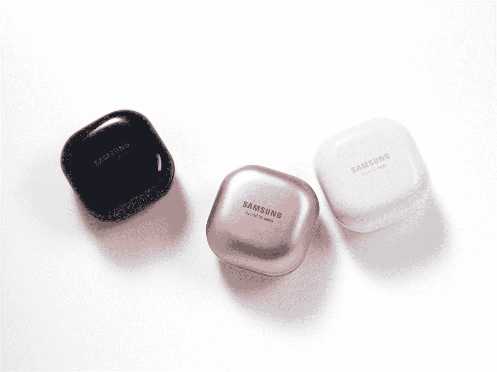

# 获得新的神秘蓝色银河芽生活和保存与以旧换新

> 原文：<https://www.xda-developers.com/galaxy-buds-live-mystic-blue/>

你知道全新的三星 Galaxy S21 发布时会有什么好消息吗？一对新的银河蓓蕾直播！三星刚刚为小豆形耳塞发布了一种新颜色，神秘的蓝色看起来棒极了。如果你还没有拿起花蕾现场直播，这是你的幸运日。

但是为什么是豆子，而不是其他耳塞呢？我们的[银河芽直播评论](https://www.xda-developers.com/samsung-galaxy-buds-live-review/)应该有助于回答这个问题。评论者 Aamir Siddiqui 喜欢 Buds Live 的声音和通话质量，尽管它似乎有点缺乏主动噪音消除。但是，如果你用它们来锻炼或在户外听音乐，完美的 ANC 也不总是最好的！至少对我来说，我想对我的周围有一些意识。

更好的是，您甚至可以通过符合条件的以旧换新来节省神秘蓝色银河 Buds Live 的费用！什么符合条件？明显地...一切！以旧换新任何有线或无线耳机，你可以在 Mystic Blue Buds Live 上节省 20 美元，只需 150 美元。一如既往，如果您是三星折扣计划的一部分，您可以节省更多。

 <picture></picture> 

Galaxy Buds Live (Mystic Blue)

##### 三星 Galaxy Buds 直播

立即从三星商店获得新的神秘蓝色银河芽直播！以任何音频设备折价可以节省 20 美元。

不喜欢神秘蓝吗？你仍然可以节省一对新的芽生活！事实上，你可以节省更多。其他 Buds Live colors 也有 20 美元的折价优惠，但也打折 30 美元。所以你花 120 美元就能买到！如果你更爱另一种颜色就完美了。

 <picture></picture> 

Galaxy Buds Live

##### 三星 Galaxy Buds 直播

如果蓝色不适合你，你可以在 Galaxy Buds Live 上节省高达 50 美元！以旧换新任何音频耳机，并降低 50 美元的建议零售价。

您是否在寻找更多三星交易？他们目前正在出售各种各样的配件！浏览一下[的交易页面](https://shop-links.co/1728494465901983509?u1=13ffad66-c61b-4fe0-b540-6de40758a072)，看看所有的商品。

最后，如果你是一个三星迷，你会想为下一个三星拆封标记你的日历！今年的第一次发布会将于 1 月 14 日举行，包括三星 S21 的发布以及更多。