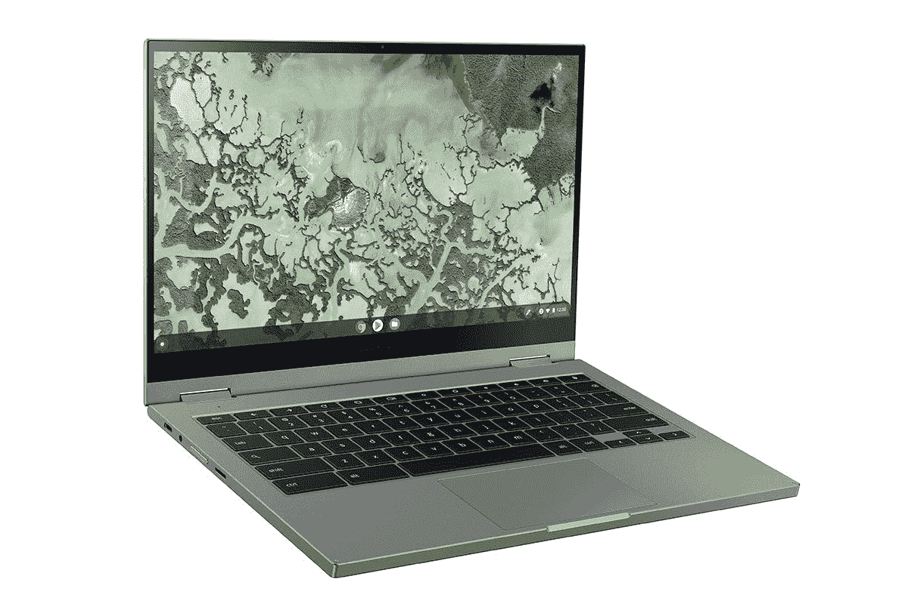

# Galaxy Chromebook 2 在三星网站和百思买上开始预售

> 原文：<https://www.xda-developers.com/galaxy-chromebook-2-available-pre-order/>

三星[在今年早些时候的](https://www.xda-developers.com/samsung-galaxy-chromebook-2-launch-specs-features-pricing-availability/) [CES](https://www.xda-developers.com/tag/ces-2021/) 上正式发布了Galaxy chrome book 2，就在我们第一次看到[泄露的新闻图片](https://www.xda-developers.com/samsung-galaxy-chromebook-2-press-image-leak/)、[定价细节以及该设备的规格](https://www.xda-developers.com/samsung-galaxy-chromebook-2-leaked-price-specs/)后不久。从泄露的信息中可以看出，Galaxy Chromebook 2 采用了 2 合 1 外形和一些硬件变化的高级设计。Chromebook 现在终于可以预购了，你可以以 549.99 美元的起价买到一台。

## 三星 Galaxy Chromebook 2:规格

| 

规格

 | 

三星 Galaxy Chromebook 2

 |
| --- | --- |
| **尺寸&重量** | 

*   304.8 x 203.2 x 13.97 毫米
*   1.22 千克

 |
| **显示** | 13.3 英寸全高清(1920x1080) QLED 触摸屏 |
| **处理器** | 

*   英特尔酷睿 i3-10110U，或
*   英特尔赛扬 5205U

 |
| **图形处理器** | 英特尔 UHD 公司 |
| **闸板&存放** |  |
| **电池&充电器** | 45.5 瓦时 |
| **输入/输出** | 

*   2 个 USB 型
*   MicroSD 读卡器
*   3.5 毫米耳机/麦克风组合插孔

 |
| **连通性** |  |
| **操作系统** | Chrome OS |
| **其他特征** |  |

* * *

如果你错过了我们对 Galaxy Chromebook 2 的发布报道，这里有一个快速复习。新款 Chromebook 的设计与最初的 Galaxy Chromebook 相似，采用铝制机箱和 2 合 1 外形。它有两种型号:一种采用第十代英特尔赛扬 5205 U 处理器，另一种采用第十代英特尔酷睿 i3-10110U 芯片。Galaxy Chromebook 2 的赛扬型号配有 4GB 内存和 64GB 内部存储，而 Core i3 型号配有 8GB 内存和 128GB 存储。相比之下，最初的 Galaxy Chromebook 配备了第十代英特尔酷睿 i5 处理器，高达 16GB 的内存和高达 1TB 的存储。

除了功耗较低的内部部件，Galaxy Chromebook 2 还采用了劣质的 13.3 英寸 FHD ( 1920 x 1080) QLED 显示屏，这是对其前身 4K AMOLED 面板的重大降级。除了上述硬件，Galaxy Chromebook 2 还配备了 Wi-Fi 6 支持、720p 网络摄像头、立体声扬声器(1.5W x 2)和有源手写笔支持。遗憾的是，触控笔没有像最初的型号那样内置在机箱中，你必须单独购买。Chromebook 有一个背光键盘，采用宽敞的 TKL 布局，两个 USB Type-C 端口用于充电和数据传输，一个 3.5 毫米耳机/麦克风组合插孔，以及一个用于扩展的 microSD 卡插槽。

## 定价和可用性

三星 Galaxy Chromebook 2 的赛扬型号售价为 549.99 美元，酷睿 i3 型号为 699.99 美元。它有两种配色——嘉年华红和水星灰——并将从今天开始在三星网站和百思买上预订。如果您预购该设备，您将有资格获得高达 50 美元的奖励，您可以在下次购买时使用。Galaxy Chromebook 2 将于 3 月 1 日开始购买，在 3 月 15 日之前购买的人将有资格在下次购买时再享受 30 美元的优惠。你可以通过下面的链接获得 Galaxy Chromebook 2，但我们建议你选择旧版本而不是新的 Core-i3 型号，因为它现在在 Best Buy 上以 699 美元的折扣价出售。

 <picture></picture> 

Samsung Galaxy Chromebook 2

##### 三星 Galaxy Chromebook 2

三星 Galaxy Chromebook 2 可能比旧款略有下降，但它绝对是一个仅售 549.99 美元的便宜货。