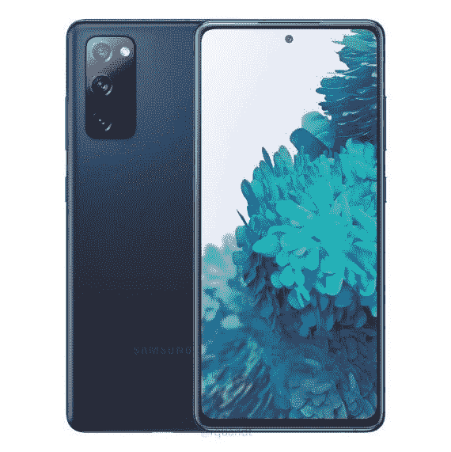

# 现在只需 525 美元(优惠 175 美元)即可获得三星 Galaxy S20 FE

> 原文：<https://www.xda-developers.com/galaxy-s20-fe-deal-december-2021/>

Galaxy S20 FE(粉丝版的简称)是三星去年出人意料的预算之作，它将 Galaxy S20 系列中的大多数高端硬件与更便宜的材料和低得多的价格结合在一起。Galaxy S21 FE 可能会很快发布，但与此同时，你现在可以在多家零售商那里以 524.99 美元的价格买到 S20 FE。这比原价低了 175 美元，比黑色星期五的价格便宜了 25 美元[。](https://www.xda-developers.com/galaxy-s20-fe-black-friday-2021-deal/)

Galaxy S20 FE 配备了骁龙 865 5G 芯片组，6.5 英寸 AMOLED 1080 x 2400 显示屏，128GB 的内部存储空间(也有 256GB 的型号，但不是以 525 美元的价格出售)，6GB 的内存，以及用于增加更多存储空间的 microSD 卡插槽。有三个后置摄像头(12MP 宽，8MP 长焦和 12MP 超宽)，它与三星的所有旗舰手机具有相同的 IP68 防水/防尘等级。

 <picture></picture> 

Samsung Galaxy S20 FE

##### 三星 Galaxy S20 FE

Galaxy S21 FE 就要上市了，但去年的型号现在已经上市。

这款手机出厂时搭载的是 Android 10，但在 2020 年 12 月发布后不久就更新到了 Android 11(以及三星的 One UI 3.0 皮肤)[。三星本周也刚刚开始向 Galaxy S20 FE](https://www.xda-developers.com/one-ui-3-0-rolling-out-samsung-galaxy-s20-fe/) [推出 Android 12 和 One UI 4](https://www.xda-developers.com/samsung-galaxy-s10-s20-fe-one-ui-4-stable-android-12/)，因此它应该很快就会出现在所有型号上。[三星承诺为 Galaxy S20 FE(及其其他旗舰产品)提供“三代”Android 操作系统更新](https://www.xda-developers.com/samsung-3-years-android-os-updates-galaxy-note-20/)，因此 Android 13 很可能是这款手机的最后一次重大软件升级。

在售的型号是美国解锁版，采用骁龙 865 5G 芯片组(与在其他国家销售的 Exynos 版本相反)，没有载波锁定。你可以在任何你喜欢的网络上使用它，而不用担心解锁代码、运营商膨胀软件或任何其他废话。

如果 Galaxy S20 FE 不适合你，请查看我们的[最佳安卓手机](https://www.xda-developers.com/best-android-phones/)综述，其中我们比较了每个价位的安卓智能手机的所有顶级选项。