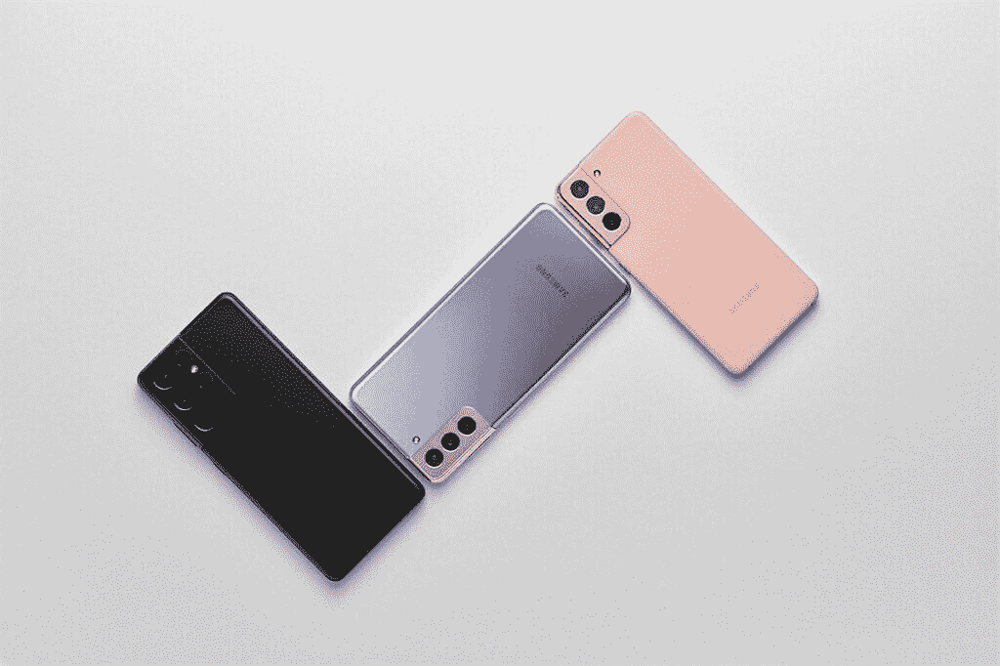

# 解释:Galaxy S21 相机的所有新功能！

> 原文：<https://www.xda-developers.com/galaxy-s21-cameras/>

三星 Galaxy S21 智能手机终于到来，它们为 T2 Galaxy S 系列的创新遗产增添了新的一笔。通过最新的 Galaxy S21 设备，我们看到了几个方面的重大改进，包括性能——这要归功于[骁龙 888](https://www.xda-developers.com/qualcomm-snapdragon-888-explained-specs-features/) 或新的 [Exynos 2100](https://www.xda-developers.com/samsung-exynos-2100-specs-features/) 芯片组，更高效的超声波指纹扫描仪的安全性，One UI 3.1 的改进的软件体验，UWB 等等。新的 Galaxy 设备还拥有许多新的相机功能——尽管三星使用的相机硬件几乎与上一代产品相同。

在本文中，我们将讨论 Galaxy S21、Galaxy S21 Plus 和 Galaxy S21 Ultra 的大量新软件和硬件。在我们开始之前，他概述了最新 Galaxy 系列的相机规格:

## 三星 Galaxy S21 系列:相机规格

| 

摄像机规格

 | 

三星 Galaxy S21

 | 

三星 Galaxy S21+

 | 

三星 Galaxy S21 Ultra

 |
| --- | --- | --- | --- |
| **后置摄像头** | 

*   **主:** 12MP，广角镜头，f/1.8，1/1.76”，1.8 m，OIS，双像素自动对焦
*   **次要:** 12MP，超广角镜头，f/2.2，120 FoV，1/2.55”，1.4 m，定焦
*   **第三:**6400 万像素，长焦镜头，f/2.0，1/1.76”，0.8 米，OIS PDAF

 | 

*   **主:** 12MP，广角镜头，f/1.8，1/1.76”，1.8 米，OIS，双像素自动对焦
*   **次要:** 12MP，超广角镜头，f/2.2，120 FoV，1/2.55”，1.4 m，定焦
*   **第三:** 64MP，长焦镜头，f/2.0，1/1.76”，0.8 m，OIS PDAF

 | 

*   **初级:** 108 MP，广角镜头，f/1.8，79，24mm，1/1.33 "，0.8 m(诺娜-宁滨前)，OIS，PDAF，激光自动对焦
*   **次要:** 12 MP，超广角镜头，f/2.2，120 FoV，13mm，1/2.55”，1.4 m，双像素 AF
*   **第三:** 10 MP，长焦镜头，f/2.4，35，72mm，1/3.24”，1.22 m，OIS，3 倍光学变焦，双像素自动对焦
*   **四元:** 10 MP，长焦镜头，f/4.9，10，240mm，1/3.24 "，1.22 m，OIS，10x 光学变焦，双像素自动对焦

视频:

*   所有前置和后置摄像头的 4K 为 60fps

 |
| **前置摄像头** | 10MP，f/2.2，1.22 m，80 FoV，双像素自动对焦 | 10MP，f/2.2，1.22 m，80 FoV，双像素自动对焦 | 40MP，f/2.2，0.7 米，80 FoV，PDAF |

* * *

## 

## 三星 Galaxy S21、S21 Plus 和 S21 Ultra 摄影功能

### 单次拍摄 2.0

三星去年在 Galaxy Note 20 Ultra 上推出了单次拍摄功能。它允许用户通过录制长达 10 秒的短视频剪辑而不是一张照片来捕捉快速变化的场景，然后让他们根据自己的需求选择最适合的。

在 Galaxy S21 系列中，三星宣布了 Single Take 2.0，现在每秒可以捕捉更多帧。现在，该功能还可以将该部分记录为慢动作视频剪辑，这样您就可以分享最精彩的动作事件，并获得更多细节和慢动作的戏剧效果。

### 8K 视频快照

就像单次拍摄 2.0 模式一样，Galaxy S21 设备也可以捕捉一个简短的 8K 视频剪辑，以确保您不会错过任何关键时刻。这个视频剪辑最终可以呈现 8K 分辨率(或大约 32MP)的图像。

### 增强的人像模式和类似 DSLR 的散景

三星声称已经大大改进了 Galaxy S21 设备的人像模式。这些图像现在使用人工智能来模拟专业相机。这些手机使用人工智能来实现三维深度，通过感应来实现更自然的背景模糊。此外，人工智能还可以增强人像，使其看起来像是在摄影棚的灯光下拍摄的。

此外，Galaxy S21 智能手机还可以在人像模式下接收各种面部照明效果，类似于 iPhones 已经普及的舞台照明效果。智能手机主要有三种照明模式，如高调单声道、低调单声道和工作室般效果的背景。

### Galaxy S21 Ultra 上的三星 ISOCELL HM3 108MP 传感器

在 Galaxy S21 系列中，三星宣布了其最新的 [ISOCELL HM3](https://news.samsung.com/global/samsungs-newest-108mp-mobile-image-sensor-with-advanced-features-captures-more-details-and-produces-sharper-results) 传感器，该传感器接替了最近宣布的 [ISOCELL HM2](https://www.xda-developers.com/samsung-isocell-lineup-promises-smaller-camera-bumps-future-smartphones/) 。ISOCELL HM3 传感器的尺寸为 1/1.33 英寸，像素为 0.8μm，就像 [ISOCELL HMX](https://www.xda-developers.com/samsung-isocell-bright-hmx-108mp-camera-sensor-xiaomi/) 和 [HM1](https://www.xda-developers.com/samsung-galaxy-s20-ultra-108mp-nona-binning-camera/) 传感器一样。在 9 合 1 像素宁滨的帮助下，该传感器默认捕捉 12MP 图像，产生的大像素为 2.4μm

虽然 ISOCELL HM3 在规格方面类似于 HMX 和 HM1 传感器，但它具有更好的颜色和曝光感知。除了提高传感器效率的 ISOCELL Plus 技术，它还支持 12 位彩色记录，并允许它捕捉比前几代产品多 64 倍的颜色。此外，智能 ISO Pro 扩大了 HDR 摄影的范围，而 Super PD Plus 功能允许自动对焦精度提高 50%。

### 12 位 HDR 和 12 位原始摄影

三星 Galaxy S21 Ultra 还能够捕捉 HDR 照片和 12 位原始照片。这意味着这种模式下的图像将有大约 6800 万种颜色，或者是 10 位图像颜色的 64 倍。正如你所料，这使得照片上的一种颜色到另一种颜色之间的过渡更加精细，从本质上很大程度上消除了色彩噪声。普通用户可能察觉不到 10 位和 12 位颜色的区别，但升级对专业摄影师来说至关重要。

### 双长焦相机和 100 倍空间变焦

三星在 Galaxy S21 Ultra 中重新引入了 100 倍空间变焦。但与仅配备 4 倍长焦设置的 [Galaxy S20 Ultra](https://www.xda-developers.com/samsung-galaxy-s20-ultra-review/) 不同，Galaxy S21 Ultra 配备了更先进的 10 倍[潜望镜相机](https://www.xda-developers.com/periscope-camera-vs-telephoto-camera/)，用于拍摄更清晰的远距离图像。毫无疑问，这是任何手持设备上最先进的长焦相机之一。

更重要的是，三星还提供了一个 3 倍光学变焦的辅助长焦相机。该公司声称，根据你试图拍摄的变焦水平或焦距范围，两个长焦相机之间会有无缝和自动的转换。

### 缩放锁定

为了确保长焦距范围不会妨碍用户平移和聚焦的能力，Galaxy S21 Ultra 配备了人工智能支持的稳定功能，以改善 OIS。这款智能手机还具有“缩放锁定”功能，它使用人工智能在移动智能手机时添加轻微的延迟，以确保平移平滑而不抖动。三星还声称变焦锁定功能将提供类似三脚架的稳定功能，这可能是事实。在我们的[三星 Galaxy S21 Ultra 实践文章](https://www.xda-developers.com/samsung-galaxy-s21-preview/)或下面的视频中查看该功能的演示:

* * *

## 三星 Galaxy S21、S21 Plus 和 S21 Ultra 视频功能

### 无限制视频录制

正如三星在 [Galaxy Unpacked 事件](https://shop-links.co/1729402802832179778?u1=03c743c9-1fc8-40db-8bc5-55105b45b66c)中非常明显的那样，Galaxy S21 智能手机不打算以任何方式限制用户，尤其是在视频录制方面。没有自动关闭定时器，您可以随时录制视频。

### 导演的观点

Galaxy S21 系列在性能方面是一款不折不扣的设备。这使得智能手机具有一些真正令人惊叹的功能，例如导演的视角。该功能允许用户使用多个摄像机从不同的视角录制视频。同时，该功能还让用户可以在任何摄像机之间自由切换，而不必停止或暂停视频。

### Vlogger 视图

Galaxy S21 智能手机上的 Vlogger 视图允许用户在使用后置摄像头的同时使用前置摄像头。这使得视频内容制作者，特别是 vloggers——这种模式以其命名——能够捕捉他们的反应，同时也从后置摄像头记录一些东西。

### 多麦克风录音

随着 Galaxy Note 20 系列的推出，三星推出了视频专业模式。在这种模式下，用户可以在录制视频时切换不同的麦克风模式。Galaxy S21 系列更进一步，允许用户使用多个麦克风作为同步音频源。使用该功能，您将能够同时使用智能手机和 Buds Pro 上的麦克风录制音频。

### 4K 在所有 5 台摄像机上以 60fps 的速度录制

三星 Galaxy S21 Ultra 上的所有五个摄像头都可以录制 4K 分辨率的超平滑 60fps 视频。除了上述功能，如无限制的视频录制和导演视角，4K@60fps 视频录制使 Galaxy S21 Ultra 成为视频录制的最高设备。

* * *

## Galaxy S20 系列何时会获得这些相机功能？

在为老款智能手机带来新功能时，三星有一颗善良的心，其中一些功能也是如此——至少那些可以在老款硬件上轻松运行的功能。虽然三星没有明确说明这些功能在旧旗舰上的可用性，但请确保查看 XDA 新闻门户网站的任何更新。

 <picture></picture> 

Galaxy S21 Ultra

三星 Galaxy S21 Ultra 是 2021 年新旗舰系列中的终极杀手锏，集旗舰 SoC、高级构建、出色的显示屏和令人惊叹的相机设置于一身，以及高级旗舰上预期的所有额外功能。