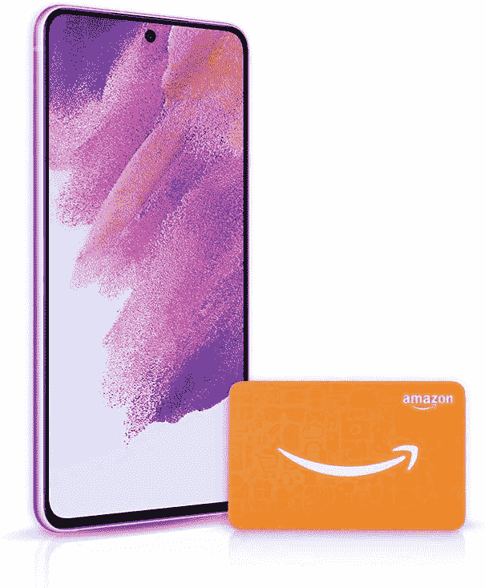

# 如果你购买 Galaxy S21 FE，亚马逊会给你一张价值 100 美元的礼品卡

> 原文：<https://www.xda-developers.com/galaxy-s21-fe-deal-amazon-jan-2022/>

三星终于发布了 [Galaxy S21 FE](https://www.xda-developers.com/samsung-galaxy-s21-fe/) ，它可能会成为即将推出的 [Galaxy S22](https://www.xda-developers.com/samsung-galaxy-s22/) 系列的廉价替代品。尽管 699 美元的初始零售价似乎是一个相对不错的交易，但销售和促销活动立即开始，就像他们对 S20 FE 所做的那样。例证:如果你从亚马逊购买 Galaxy S21 FE，商店将赠送一张价值 100 美元的亚马逊礼品卡。

[百思买有一个独家的蓝色选项](https://www.xda-developers.com/you-can-also-buy-the-galaxy-s21-fe-in-this-exclusive-blue-color/)来帮助它销售 Galaxy S21 FE(尽管蓝色相当低调)，但亚马逊的解决方案是简单地提供商店积分。在零售商的 Galaxy S21 FE 产品页面上有一个“S21 FE +亚马逊礼品卡”选项可供选择，但所有相同的颜色选项和存储容量似乎都可用。亚马逊表示，礼品卡“贴在包裹的迷你信封内”，因此它不仅仅是发送到您电子邮件的代码。

 <picture></picture> 

Galaxy S21 FE + $100 Amazon card

##### 三星 Galaxy S21 FE

当你购买 Galaxy S21 FE 时，亚马逊会给你 100 美元的商店积分。

Galaxy S21 FE 拥有 6.4 英寸 120Hz AMOLED 屏幕，高通骁龙 888 芯片组，6GB 内存，4,500mAh 电池，25W 有线快速充电，三个后置摄像头(12MP 主摄像头，12MP 超宽摄像头和 8MP 长焦摄像头)，32MP 前置摄像头，IP68 防水/防尘，以及一个基于 Android 12 的 UI 4.0。有两种硬件配置可供选择:128GB 存储，售价 699 美元，或 256GB 存储，售价 769 美元。与 Galaxy S20 FE 不同，它没有用于添加额外存储空间的 microSD 卡插槽。

如果你对我们在电话中的想法感到好奇，请查看我们的 [Galaxy S21 FE 实践文章](https://www.xda-developers.com/samsung-galaxy-s21-fe-hands-on-preview/)。我们必须等待，看看 Galaxy S22 系列的结果如何，但如果你现在需要一部手机*，这绝对不是一个糟糕的交易。你可以把礼品卡留给自己，在以后亚马逊购物时使用，或者送给别人。*