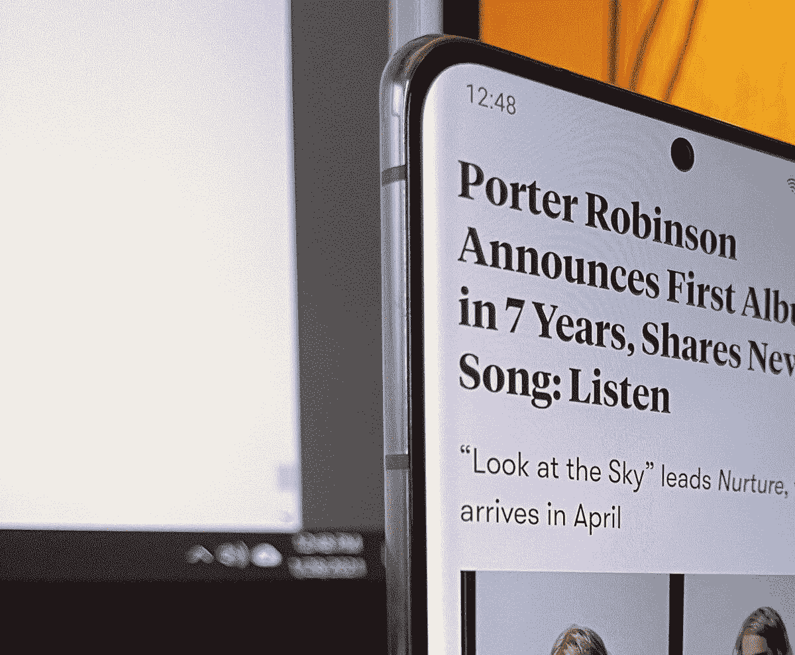
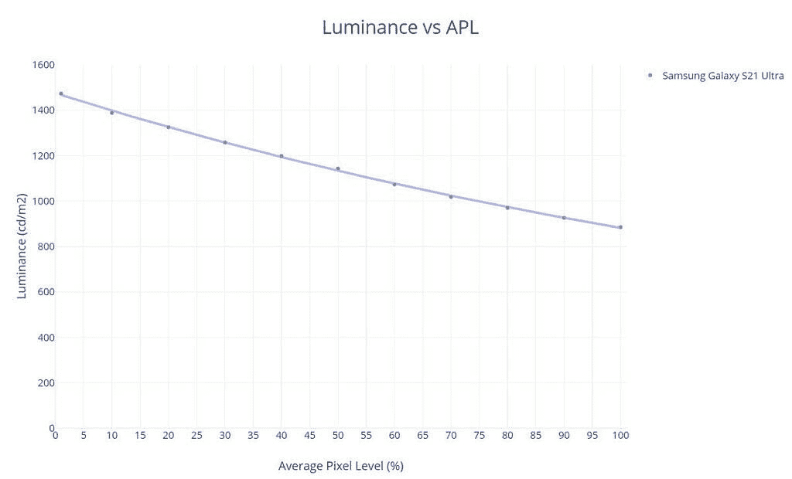

# 三星 Galaxy S21 Ultra Display 评论:技术进步

> 原文：<https://www.xda-developers.com/galaxy-s21-ultra-display-review/>

对于显示技术爱好者来说，新 Galaxy 设备的发布总是一个激动人心的时刻。由于三星显示仍然引领着移动屏幕行业的进步，新的三星 Galaxy S21 Ultra 展示了移动显示技术的前沿，并为我们提供了一些关于在不久的将来发布的手机显示屏的提示。

然而，最新的面板并不总是最好的面板。虽然技术可能在进步，但公司需要确保他们的校准质量处于受控状态。有时技术进步会带来新的问题:例如，当手机切换刷新率时，高刷新率面板会产生颜色偏移，因此必须创建软件解决方案来解决这个问题。新的发射器材料和驱动器调整也可能会影响图像质量。Galaxy S21 Ultra 展示了三星较新的有机发光二极管技术，让我们看看它是否也能提高图像质量。

*本次评测中的骁龙三星 Galaxy S21 Ultra 是个人购买的。三星没有以任何方式补偿这一审查。*

 <picture></picture> 

*Now with less glare!*

## **三星 Galaxy S21 Ultra Display 优点&缺点**

*   出色的峰值亮度
*   良好的 sRGB 和 P3 色彩准确度
*   良好的对比度和色调映射
*   会比其他 OLEDs 更暗
*   灰度颜色精度的改进
*   自适应刷新率解决方案不会产生颜色偏移

*   在低亮度级别缺少阴影细节
*   条带是可见的(即使对于 10 位内容)
*   HDR10 含量过饱和且太亮

#### **有什么变化？**

与 Galaxy Note20 Ultra 相比，三星没有提到任何巨大的变化。理论上，这两种面板似乎极其相似:两者都是支持高达 120 Hz 刷新率的大型 QHD 面板，两者都宣传支持 VRR(可变刷新率)的下一代 LTPO 面板。在亮度方面，两者都拥有 1500 尼特的峰值。然而，新 Galaxy S21 Ultra 的一个主要区别是，它最终允许显示器的原生 QHD 分辨率达到 120 Hz 刷新率——以前的 Galaxy 旗舰产品如果想使用 120 Hz 高刷新率模式，就只能使用 FHD (1080p)渲染分辨率。不幸的是，我没有 Galaxy Note20 Ultra 来研究其他潜在的差异，但来自 *Anandtech* 的 Andrei 发现 Galaxy S21 Ultra 中的面板比 Note20 Ultra 中的面板更加节能。

#### **“可变”刷新率**

虽然三星 Galaxy S21 Ultra 被宣传为具有“真正的”可变刷新率解决方案，但它实际上仍然可以在离散刷新率模式之间切换。然而，由于 Galaxy S21 Ultra 和 Note20 Ultra 的 LTPO“VRR”面板，显示器驱动程序中的刷新率模式比 Android 操作系统中的刷新率模式更多。来自 *Anandtech* 的 Andrei 也[负责负责面板微调刷新率切换的显示驱动机制](https://www.anandtech.com/show/16069/samsung-variable-refresh-rate-display-explained-vrr-note20-ultra)。

**采集数据的方法论**

为了从显示器中获得定量的颜色数据，我将特定于设备的输入测试模式转移到三星 Galaxy S21 Ultra，并使用 X-Rite i1Display Pro 测量显示器产生的发射，该发射由 X-Rite i1Pro 2 分光光度计在其高分辨率 3.3 纳米模式下测量。我使用的测试模式和设备设置针对各种显示特性和可能改变我所需测量的潜在软件实现进行了修正。除非另有说明，我的测量通常是在禁用显示相关选项的情况下进行的。我使用

*constant power*

模式(有时称为

*equal energy*

图案)，与大约 42%的平均像素水平相关，以测量传递函数和灰度精度。测量发射型显示器时，不仅要测量恒定的平均像素水平，还要测量恒定的功率模式，这一点很重要，因为它们的输出取决于平均显示器亮度。此外，恒定的平均像素水平并不固有地意味着恒定的功率；我使用的模式满足这两者。我使用更高的平均像素水平(接近 50%)来捕捉较低像素水平和许多白色背景的应用程序和网页(像素水平较高)之间的中点。我使用最新的色差度量δ

*E[TP]* [(ITU-R BT.2124)](https://www.itu.int/dms_pubrec/itu-r/rec/bt/R-REC-BT.2124-0-201901-I!!PDF-E.pdf)

，这是一个

[overall better measure for color differences](https://www.ibc.org/publish/specifying-colour-tolerances-for-hdr-and-wcg-displays-/2449.article)

比δ

*E* [00]

这在我早期的评论中使用过，目前仍在许多其他网站的展示评论中使用。那些还在用δ的

*E* [00]

对于颜色误差报告，鼓励使用δ

*E[ITP.]*

Δ

*E[ITP]*

通常在计算中考虑亮度(强度)误差，因为亮度是完整描述颜色的必要组成部分。然而，由于人类视觉系统分别解释色度和亮度，我将我们的测试模式保持在恒定亮度，并且在我们的δ中不包括亮度(I/强度)误差

*E[ITP]*

价值观。此外，在评估显示器的性能时，将这两种错误分开是有帮助的，因为就像我们的视觉系统一样，它们属于显示器的不同问题。这样，我们可以更彻底地分析和理解显示器的性能。我们的颜色目标是基于 ITP 颜色空间，它比 CIE 1976 UCS 具有更好的色调线性，在感知上更均匀。我们的目标以 100 cd/m 的基准在整个 ITP 色彩空间中大致均匀地间隔开

²

白色级别，以及 100%、75%、50%和 25%饱和度的颜色。颜色是在 73%的刺激下测量的，假设伽马功率为 2.20，这相当于约 50%的亮度。对比度、灰度和颜色精度在显示器的整个亮度范围内进行测试。在 PQ 空间中，亮度增量均匀分布在最大和最小显示亮度之间。图表和图形也绘制在 PQ 空间中(如果适用),用于正确表示对亮度的实际感知。δ

*E[TP]*

值大约是 3

× the magnitude of Δ*E*[00] values for the same color difference. A measured color error Δ*E[TP]* of 1.0 denotes the smallest value for a just-noticeable-difference for the measured color, while the metric assumes the most critically-adapted state for the observer so as not to under-predict color errors. A color error Δ*E[TP]* less than 3.0 is an acceptable level of accuracy for a reference display (suggested from ITU-R BT.2124 Annex 4.2), and a Δ*E[TP]* value greater than 8.0 can be noticeable at a glance, which I've tested empirically.

HDR 测试模式是针对

[ITU-R BT.2100](https://www.itu.int/dms_pubrec/itu-r/rec/bt/R-REC-BT.2100-2-201807-I!!PDF-E.pdf)

使用感知量化器(ST 2084)。HDR sRGB 和 P3 图案与 sRGB/P3 原色均匀间隔，HDR 参考白色水平为 203 cd/m

² [(ITU-R BT.2408)](https://www.itu.int/dms_pub/itu-r/opb/rep/R-REP-BT.2408-2017-PDF-E.pdf)

，并且对于其所有模式，PQ 信号电平为 58%。所有 HDR 模式都是在 HDR 平均 20% APL 下用恒定功率测试模式测试的。

### **颜色配置文件**

三星 Galaxy S21 Ultra(以及大多数其他 Android 设备)保持了与过去两代产品相同的屏幕颜色模式配置，具有生动自然的轮廓。生动模式被设置为我的骁龙单位的默认设置。

**自然**配置文件是手机的色彩精确配置文件，它针对 sRGB 色彩空间进行色彩管理，直到显示 P3 色彩空间。配置文件的白点目标为 D65/6500 K(我的测量读数约为 6300 K)，其色调映射目标为 2.20 的标准伽玛。

**生动**配置文件是一种颜色增强的配置文件，它增加了屏幕上颜色的饱和度。该配置文件的目标色彩空间比 sRGB 大约大 36%,与显示 P3 相似，但蓝色有所改变。红色被提升了大约 24%，并偏向橙色；绿色被增强了大约 35%并且偏向青色；蓝色被增强了大约 18%,并向青色严重着色。产生的颜色过饱和，色调稍微有点倾斜，但许多用户可能更喜欢这种强烈的色彩。白点稍微冷一点，默认设置目标约为 6700 K。对于此配置文件，提供了一个选项来调整配置文件的色温。高级设置下还提供了单独的 RGB 通道调整(多项式颜色校正)。该简档的色调映射也以 2.20 的标准灰度系数为目标，但是它在较高的亮度下发散到较高的值，因为该简档没有响应于内容 APL 而标准化显示亮度。

### **亮度**

 <picture></picture> 

Peak luminance vs content APL

新的三星 Galaxy 旗舰产品通常会为移动 OLEDs 带来新的峰值亮度记录。然而，对于三星 Galaxy S21 Ultra，我们看到的亮度数据与 Note20 Ultra 相似。也就是说，在全屏白色(100% APL)下，我们看到的是大约 900 尼特，在 1% APL 下，我们看到的是 1，500 尼特。大多数光主题应用程序的 APL 约为 75-85%，Galaxy S21 Ultra 可以输出约 1000 尼特。不用说，这些仍然是非常令人印象深刻的亮度数字。请注意，三星 Galaxy S21 Ultra(以及大多数其他 Android 设备)只能在高环境照明下，如阳光下，才能达到这一峰值亮度。否则，手动亮度范围的峰值亮度仅为全屏白色的 400 尼特左右。

如果没有软件覆盖的某种黑暗滤镜的帮助，大多数其他显示器都无法达到这种亮度。

在其峰值时，显示器亮度的一个警告是，它牺牲了图像对比度，以获得最大的白色亮度。Galaxy S21 Ultra 的峰值亮度随内容 APL 变化显著；当显示屏的其余部分不发光时，手机可以向显示屏的明亮区域输送更多的电流。虽然这有利于让小的明亮区域更加突出，但它会完全扰乱色调的渲染，使图像中的细节更难看到。出于这个原因，一些 OLEDs 通过限制面板的电流和将亮度标准化为全屏白色(最大功率消耗)的亮度，禁用了这种亮度提升(或亮度降低，无论你想怎么看)机制，而不管内容 APL。这种行为现在被实现到大多数手机的自然(或类似)配置文件中，以提高色调的准确性。然而，一些手机，如三星 Galaxy S21 Ultra，继续允许亮度在峰值亮度下变化，可能是为了规格表——我发现控制峰值亮度下 APL 亮度响应的显示器在阳光下总体上更清晰。一加 8 Pro 将峰值亮度正常化(只有大约 720 尼特)，然后*提升*中间色调，仍然是我见过的日光下观看的最好的手机显示器之一；谷歌像素 5 [表现类似](https://www.xda-developers.com/google-pixel-5-display-review/#:~:text=Matter%20of%20fact%2C%20the%20Google,the%20HDR10%20tone%20mapping%20issue).)。

在最低的亮度设置下，我注意到我得到了两个不同的读数。如果自适应亮度被禁用，显示屏的全屏白色亮度可能会低至 1.6 尼特，这是非常好的——大多数其他 OLEDs 只能低至约 1.8-2.0 尼特。然而，当启用自适应亮度并将亮度滑块设置为最小值时，Galaxy S21 Ultra 的显示屏可以达到 1.2 尼特的全屏白色，这令人印象深刻。如果没有软件覆盖的某种黑暗滤镜的帮助，大多数其他显示器都无法达到这种亮度。三星 Galaxy S21 Ultra 也可以做到这一点，而不会对图像质量产生明显影响。在此向三星致敬。

#### **功耗**

与两年前的 Galaxy S10 相比，我们看到 Galaxy S21 Ultra 在发光效率方面明显更节能。在 Galaxy S10 的最高全屏亮度约为 750 尼特时，Galaxy S21 Ultra 的功耗几乎比 S10 低整整一瓦，约低 25%，即使 Galaxy S21 Ultra 的屏幕面积增加了约 20%。当 Galaxy S10 的功率数字按比例放大到与 Galaxy S21 Ultra 的屏幕面积相匹配时，差异就更加惊人了；在这种情况下，Galaxy S21 Ultra 的功耗减少了约 37%，可以输出约 1，000 尼特的功率，与 S10 的峰值 750 尼特亮度相同。

### **对比度和色调映射**

*在 40% APL 时测量(~27%目标 ADL)*

如前所述，三星 Galaxy S21 Ultra 的自然轮廓使显示器亮度对内容 APL 的响应标准化。这是产生紧密传递函数(色调图)校准的关键步骤；如果没有它，图像对比度将根据内容的平均亮度而变化，这可以在下面生动的配置文件的对比度和色调图中观察到。由于亮度正常化，自然配置文件在手动亮度范围内产生了接近标准 2.20 power gamma 的出色色调准确度。但在其峰值亮度下，当高亮度模式被激活时，三星会禁用亮度正常化，以便面板可以输出最亮的白色。这有影响色调准确性的缺点，我们的测量显示，在峰值亮度下，Galaxy S21 Ultra 呈现的色调比预期的暗得多，图像中的细节可能会丢失。

在低亮度下，自然轮廓保持其对 2.20 伽马能量的跟踪。虽然这在理论上看起来很准确，但在低亮度水平下通常并不理想。在这些亮度水平下，最暗色调之间的差异变得非常小，导致细节损失和“黑色挤压”，即使对于完美跟踪 2.20 伽马功率的显示器也是如此。因此，显示器校准器应该在最初的几个色调步骤中使用更低、更亮的伽马功率，以提高低亮度下的显示器清晰度。谷歌 Pixel 5 和苹果 iPhones 等手机是显示器的好例子，由于其色调映射行为，它们在低亮度下具有出色的阴影清晰度。

*在 40% APL (~27%目标 ADL)时测量*

生动简档不采用亮度归一化，因此其图像对比度随着显示器亮度和内容 APL 而变化。对于低到中等亮度水平，它正确地跟踪 2.20 伽马功率，但在大约 400 尼特以上开始明显地跟踪更高的亮度水平。这只会在峰值亮度(高亮度模式)时成为一个问题，但我希望三星能够保持静态，以保持其亮度范围内的图像对比度。对于生动模式，三星可以改为跟踪静态的 2.40 伽马功率，以便全面提高对比度，而不仅仅是在高亮度水平。

**渐变条带为自然轮廓**

梯度条带一直是我对三星设备的抱怨。即使有了全新的 Galaxy S21 Ultra，位深度量化在自然轮廓中的显示仍然非常微妙。即使对于 10 位内容，其在显示世界中的唯一存在是为了解决量化伪像，Galaxy S21 Ultra 仍然表现出一些条带。罪魁祸首似乎是中间色调中的一条带，它在中到高亮度级别被染成红色。这不像 S10 展示中那样是一个大问题，但它仍然存在，因为我最近没有对任何其他主要 OEM 提出过投诉。

### **白平衡和灰度色彩精度**

**自然轮廓的灰度曲线，120 Hz**

三星 Galaxy S21 Ultra 上的灰度色彩分布非常紧密，在自然轮廓中控制得很好。我的图中有一个缺口，这可以从上一节中我的渐变条带照片的红色条带中看出，但总的来说，显示器上没有不和谐的色调。我很高兴看到三星在这方面有所改善:我评测的最后一款 Galaxy 显示器 Note10，[在灰度色彩精度方面表现不太好](https://www.xda-developers.com/samsung-galaxy-note-10-display-analysis-the-most-vibrant-and-brightest-but-not-the-most-accurate/)。然而，正如我评测的所有三星 Galaxy 显示器一样，它们在自然模式下的校准略显过热，我们的 Galaxy S21 Ultra 的灰度和白点测量值约为 6300 K。

**灰度曲线为生动的轮廓，120 Hz**

生动配置文件的灰度颜色扩散稍紧，这可以从色域压缩较少的颜色配置文件中预料到。该配置文件中的色带也较少，默认情况下，白点和灰度测量值约为 6700 K。

#### **刷新率色差**

根据我对显示器的观察，在使用*时，当显示器改变刷新率模式时，我没有注意到图像质量的变化。*这并不是说*和*刷新率模式之间没有任何差异。60 Hz 和 120 Hz 显示模式之间存在细微的颜色校准差异，但似乎操作系统足够智能，不会在差异明显时进行切换。通过跟踪 Android OS 当前的刷新率，我发现 Galaxy S21 Ultra 在一定的系统亮度和环境亮度下是不会切换模式的。这只是针对安卓暴露出来的刷新率模式；在我看来，驱动程序级别的刷新率模式没有显示出明显的颜色变化，但是，在不知道显示器何时*实际上*改变其驱动程序刷新率的情况下，很难正确评估这一点，因为这对操作系统来说并不明显。

### **色彩准确度**

**sRGB 色彩准确度图用于自然轮廓**

三星的 Galaxy S21 Ultra 在其手动亮度范围(δ*E[TP]*= 2.7)的自然轮廓中，一般表现出出色的 sRGB 色彩准确度。根据经验，δ*E[TP]*值低于 3.0 可视为参考质量。然而，虽然配置文件的平均颜色误差非常低，但在中高显示亮度时有几个高颜色误差值得注意。在 60%-80% PQ 亮度之间，sRGB 的高饱和度红色呈现出轻微的橙色色调(δ*E[TP]*≈10)，色域在该区域向橙色扩展，而红色向粉红色有所限制。在相同的亮度范围内，中高蓝色区域的色调向紫色倾斜，这很奇怪，因为其余的蓝色看起来很好。

低亮度色彩校准非常出色，比我见过的大多数其他移动显示器都要好。

在最大亮度下，我们看到整个色域有过饱和的趋势。这实际上是理想的行为，因为当显示器处于其峰值亮度时，它抵消了高环境照明的一些屏幕色域压缩。大部分颜色保留了相同的色调，非常优秀。但就像它的手动亮度范围一样，红色严重偏向橙色(尽管既然橙色似乎没问题，这意味着肤色不太可能明显扭曲)。

低亮度色彩校准非常出色，比我见过的大多数其他移动显示器都要好。大多数手机在低亮度下显示出压缩的色域，而 Galaxy S21 Ultra 并非如此。然而，Galaxy S21 Ultra 在低亮度下仍然存在阴影清晰度的问题。

**显示自然轮廓的 P3 色彩准确度图**

自然配置文件的显示 P3 颜色校准似乎比其 sRGB 颜色校准稍微更准确。在 Galaxy S21 Ultra 的手动亮度范围内，该配置文件为显示器 P3 产生了 2.4 的平均颜色误差δ*E[TP]*，这是非常出色的。显示器 P3 校准没有 sRGB 校准中存在的红色问题，但是中到高饱和度蓝色的误差仍然存在。当显示 P3 内容在 Android 生态系统中不可避免地变得更加普遍时，这应该会提供良好的未来保障。

### **HDR 回放**

*在 20% APL 时测量*

*~400 nit 帧-平均光线级别(HDR10 1000) / ~900 nit 帧-平均光线级别(HDR10 4000))*

HDR 内容(以 HDR10 和杜比视界的形式)每天都在变得越来越丰富。现在每个流媒体平台上都有大量的 HDR 作品，我们现在才看到冰山一角。三星的相机还允许 HDR10+视频录制，可以在 Galaxy S21 Ultra 上播放，因此，内容创作者应该期待他们的播放设备具有一定的准确性。在我们当前的标准中仍有大量未开发的潜力，我期待未来的许多改进和修订，如标准化形式的[杜比视觉智商](https://www.avforums.com/articles/what-is-dolby-vision-iq.17050)。对于我们的 HDR 审查，我们将着眼于当前事实上的 HDR10 标准回放使用 ST. 2084(又名感知量化器，或 PQ)绝对传递函数。HDR 在 Galaxy S21 Ultra 上播放的自然生动的个人资料完全相同。

三星 Galaxy S21 Ultra 是我测试的第一款根据 HDR 内容的元数据改变色调映射的安卓手机

在峰值亮度方面，三星 Galaxy S21 Ultra 宣传的峰值为 1500 尼特，这对于 HDR10-1000 (HDR10 在 1000 尼特峰值)的内容来说已经足够了。从我的测量中，我发现 Galaxy S21 Ultra 在 20%的窗口尺寸下可以达到 1480 尼特(这也是 HDR 的典型 APL)，因此三星声称的 HDR 1500 尼特是真实的。它实际上也相当适中:在 10% APL 的情况下，Galaxy S21 Ultra 可以达到 1580 尼特，在 1% APL 的情况下，它可以输出 1680 尼特。这些数字对于 4000 尼特的 HDR 内容来说还不太可行，但这仍然是一个值得尊敬的进步，并且在更高的 APL 下允许适当的 1000 尼特高光。

我们的对比图显示了 Galaxy S21 Ultra 在播放 HDR10 内容时如何再现标准 PQ 曲线。我们可以看到，当显示器处于最大亮度(这是 HDR10 内容应该播放的亮度设置)时，Galaxy S21 Ultra 呈现的 HDR10 内容比标准亮度要亮得多。然而，我怀疑三星可能只是没有遵循惯例，或许手动将显示器亮度调整到 1000 尼特峰值会导致准确的 HDR10-1000 PQ 曲线。注意，显示器对 PQ 曲线的渲染取决于 HDR10 内容的峰值亮度元数据(1000 尼特或 4000 尼特峰值)；消费类显示器目前不能达到 4000 尼特(有些不能达到 1000 尼特)，因此显示器会逐渐下降到峰值亮度。三星 Galaxy S21 Ultra 是我测试的第一款实际上根据 HDR 内容的元数据改变色调映射的 Android 手机，这很好看(前几代可能也有，但我没有测试这一点)——只是遗憾地看到它似乎没有正确遵循 PQ 曲线。此外，我发现 Galaxy S21 Ultra 显示 HDR 内容的时间越长，曲线的前 10%逐渐变得越亮；图表底部的尖峰显示了一个实例中的这种行为，当时显示器渲染的色调比预期的亮 0.3 尼特，这是阴影中的一个巨大差异。

在灰度色彩精度方面，三星 Galaxy S21 Ultra 在 HDR 播放方面表现平平。它的阴影偏向洋红色，其余灰度点的色温比标准的要温暖得多，高光偏向黄色。4.7 的标准距离σ非常高，超过了灰度点集合的非临界显著差异值(δ*E[TP]*>3.0)。

Galaxy S21 Ultra 也发现了 HDR 内容的颜色准确性问题。我们的色彩准确度图表显示，Galaxy S21 Ultra 使 P3-BT.2100 色域内的所有色彩过饱和，并且还可以看到黄色的白点色调。这种过饱和与 PQ 曲线过度明亮的渲染密切相关。

总的来说，三星 Galaxy S21 Ultra 提供了极其生动的 HDR 观看体验，比标准版更明亮、更丰富。它可能不会提供最真实的影院体验，但亮度和色彩盈余的一个好处是，它可以在更亮的条件下改善您的 HDR 观看体验，而不仅限于黑暗的房间。

三星 Galaxy S21 Ultra 是真正的一流面板，解决了智能手机高刷新率 OLEDs 的许多缺点。在校准方面，Galaxy S21 Ultra 保持了同口径手机应有的色彩准确度。然而，我希望在低亮度设置下看到更好的阴影细节调整，我看到其他机器人现在更加关注这一点。另一方面，我也希望看到三星改善其在最大亮度下的色调调整，而不是试图竞争尽可能高的尼特数。我的骁龙 Galaxy S21 Ultra 设备在低亮度和非常少的灰度色彩下也表现出了出色的面板均匀性，这与我之前的 Note10 的体验相反，这两方面都很糟糕。最后，我现在实际上发现曲线的状态是可以忍受的:即使有明亮的内容，当正面看显示器时，曲线在边缘处产生很少或没有明显的失真——我不介意在日常驾驶中出现这种曲线。

| **规格** | 三星 Galaxy S21 Ultra |
| --- | --- |
| **型** | 灵活的有机发光二极管五边形菱形像素 |
| **制造商** | 三星显示公司。 |
| **尺寸** | 6.2 英寸乘 2.8 英寸6.0 英寸对角线17.3 平方英寸 |
| **分辨率** | 3200×144020:9 像素宽高比 |
| **像素密度** | 每英寸 364 个红色子像素每英寸 515 个绿色子像素每英寸 364 个蓝色子像素 |
| **像素锐度距离** *视力为 20/20 的可分辨像素距离。典型的智能手机观看距离约为 12 英寸* | < 6.7 英寸为全彩图像< 9.4 英寸为消色差图像 |
| **黑色削波阈值** *要削波的黑色信号电平* | <最大亮度 0.8%<1.2% @ min brightness |

| **规格** | **自然** | **生动的** |
| --- | --- | --- |
| **亮度** | **最小值:**1.6 尼特**峰值 100% APL:**885 尼特**峰值 50% APL:**1143 尼特**峰值 HDR 20%杀伤人员地雷:**1484 尼特 |
| **伽玛** *标准是 2.20 的直线伽玛* | 平均 2.252.23–2.31 | 平均 2.282.23–2.33 |
| **白点** *标准是 6504 K* | 6270 Kδ*E[TP]*= 2.4 | 6668 Kδ*E[TP]*= 1.7 |
| **色差***δ*E[TP]*值在 10 以上就显得δ*E[TP]*值在 3.0 以下就显得准确δ*E[TP]*值在 1.0 以下就显得与完美* | sRGB:平均δ*E[TP]*= 3.9**P3:**平均δ*E[TP]*= 4.3 | 

**比 sRGB**

色域大 36%+24%红色饱和度，茶色橙色

+35%绿色饱和度，茶色青色

+18%蓝色饱和度，茶色青色

 |