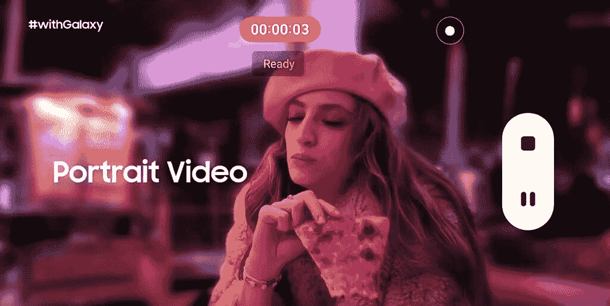

# 三星为 Snapchat、Instagram 和抖音带来了 Galaxy S22 相机功能

> 原文：<https://www.xda-developers.com/galaxy-s22-camera-features-snapchat-instagram-tiktok/>

三星的 [Galaxy S22 系列](https://www.xda-developers.com/samsung-galaxy-s22-series-launch/)手机配备了大量可以在相机应用程序中使用的相机功能，但你也可以在社交媒体应用程序中使用它们。三星宣布，它正在与 Snapchat、抖音和 Instagram 合作，使 Galaxy S22 的高级相机功能可以直接在这些应用程序中使用。

其中支持的功能是夜间模式摄影，这是一个很大的交易。夜间模式涉及大量处理，以在弱光环境下获得良好的照片，因此在社交媒体应用程序中获得这些功能将非常有帮助。它们还将支持平滑变焦，你甚至可以直接在应用程序中使用长焦镜头拍照。这些都是通常只有三星自己的相机应用程序才能提供的功能，所以这是一件大事。

 <picture></picture> 

Galaxy S22 portrait video on social apps

在视频方面，你也可以在这些社交媒体应用程序中直接捕捉人像视频。这项功能使用对象识别来模糊背景，并帮助视频主题突出，你可以在不打开相机应用程序本身的情况下做到这一点。视频录制时的自动对焦、数字图像稳定和超级 HDR 视频也都可以在社交媒体应用程序中使用。超级 HDR 是 Galaxy S22 相机的另一大新功能，允许您在背光强烈的情况下捕捉更多人和物体的细节。

三星只提到了抖音、Snapchat 和 Instagram，所以如果你希望在另一个社交媒体应用程序中使用这些 Galaxy S22 相机功能，你可能会运气不佳。三星尚未宣布任何允许其他应用程序也拥有这些功能的 API，但这在未来总是可能发生的。

如果你有兴趣购买新的 Galaxy S22 手机，你可以使用下面的链接或查看 Galaxy S22 系列的[最佳交易。](https://www.xda-developers.com/best-samsung-galaxy-s22-deals/)

 <picture></picture> 

Samsung Galaxy S22

三星 Galaxy S22 有三个摄像头，主 50MP 摄像头支持 tetra-宁滨技术。

 <picture></picture> 

Samsung Galaxy S22 Plus

##### 三星 Galaxy S22 Plus

Galaxy S22 Plus 具有相同的相机设置，支持 tetra-宁滨。

 <picture></picture> 

Samsung Galaxy S22  Ultra

Galaxy S22 Ultra 拥有最好的摄像头设置，有四个摄像头，主 108MP 传感器中有一个宁滨。