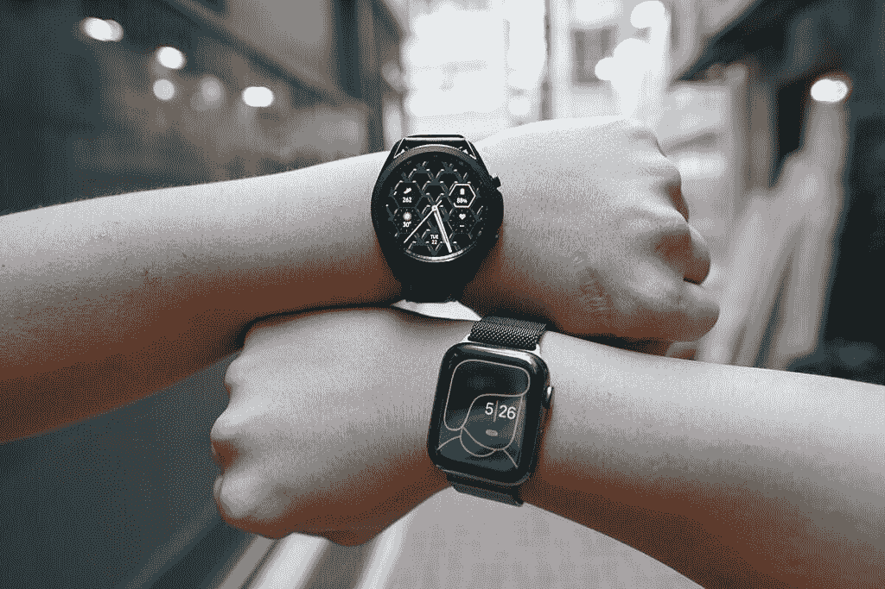
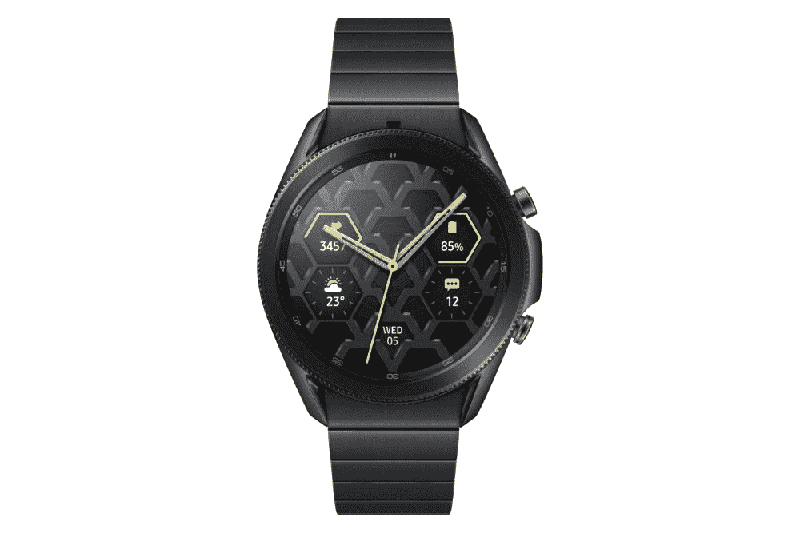

# Apple Watch 6 仍然是最好的智能手表，但 Galaxy Watch 3 已经接近了

> 原文：<https://www.xda-developers.com/galaxy-watch-3-vs-apple-watch-6/>

苹果手表比任何安卓智能手表都要好。我不得不痛苦地说，我的主 SIM 卡在安卓手机里的次数比在 iPhone 里多得多，但这是真的。

对我们来说，好消息是，Android 智能手表在过去一年中有了显著改善。Oppo 手表拥有华丽的曲面屏；华为手表 GT 2 Pro 拥有疯狂的 14 天电池寿命和优质的制造质量，Fitbit Versa 2 在 2020 年在我的手腕上呆了几个月。但在我测试过的所有非苹果产品中，[三星的 Galaxy Watch 3](https://www.xda-developers.com/samsung-galaxy-watch-3/) 可能是在性能、软件和硬件方面整体最好的——尽管我必须提到，我还没有测试过我们给予高度评价的 [TicWatch Pro 3](https://www.xda-developers.com/mobvoi-ticwatch-pro-3-review/) 。

虽然 Galaxy Watch 3 非常好，但它仍然低于 Apple Watch Series 6——我不是在谈论设计、适合度和舒适度等主观的东西，而是不那么主观的关键性能领域。

在我深入探讨为什么 Apple Watch 6 更好之前，我想声明，我明白这不是一个真空中的公平比较，因为 Apple Watch 将你锁定在苹果的生态系统中。相比之下，Galaxy Watch 3 在技术上可以与任何手机配合使用(尽管它与三星配合使用效果最佳)。如果你是 XDA 的常客，你可能已经决定加入 Android 团队。然而，我认为值得强调一下 Android 智能手表的不足之处和可以做得更好的地方。

 <picture></picture> 

Galaxy Watch 3 (left) and Apple Watch Series 6 (right).

## 回复通知

我们都有戴智能手表的理由。有些人喜欢这种外观；有些人希望跟踪身体活动；还有人用它来看时间(疯狂的想法，我知道)。但对我来说，戴智能手表的最大原因是让我不必每次收到来电通知时都掏出手机。

这意味着我不仅仅希望能够阅读我收到的短信；我也喜欢回应他们的能力。不幸的是，这立即取消了一大块 Android 智能手表的资格。华为最近的可穿戴设备上运行的专有操作系统根本不能让我回复通知。Fitbit 的操作系统只允许我回复固定信息。运行 WearOS 的 Oppo 手表允许我进行响应，但这样做的方法并不实用。三星的 TizenOS 几乎没有竞争，在 Android 领域做得最好——但 Apple Watch 处理得更好。

我回复短信的首选方法是对着我的手表说话，苹果手表的语音听写技术很神奇；它能以 99%的准确率实时拾取我的话。我说话，手表会拾取，即使是跨越多个句子的几十个单词。

Galaxy Watch 3 上的语音听写明显变慢；它几乎从一开始就远远落后于我的声音，虽然它最终会赶上来，但通常会听错几个词。如果要我猜的话，我会说准确率在 75%左右。

不相信我？我在视频上做了并排测试。作为测试，我把标志性的*新鲜的贝莱尔王子*介绍主题的第一节全部说了一遍，你可以看到 Apple Watch Series 6 几乎一字不差地跟上了我的节奏，只出现了几个错误。与此同时，Galaxy Watch 3 提前落后，完成的文本至少听错/曲解了六个字。

Galaxy Watch 3 的错误也是无意义的:什么是“德尔菲亚”？至少 Apple Watch 听错的时候，还是推出来一个语法上说得通的词。

现在事情是这样的:这对三星来说已经是一个*巨大的* *改进*！我记得在 2018 年左右使用了一款较旧的 Galaxy Gear 手表，对它甚至无法跟上五六个单词的句子感到沮丧。

当然，语音听写只是一种回应方式。另一种方法是通过屏幕键盘输入单词。WearOS 展示了一个完整的 QWERTY 键盘，这在理论上是有意义的，但一旦你开始敲击微小的按键，你就会意识到智能手表的屏幕对于一个完整的键盘来说太窄了。

三星和苹果明白这一点，有替代方案。两者都提供了“涂鸦”模式，让我们用手指在屏幕上写出单个字母。但就像语音听写一样，Apple Watch 6 处理涂鸦的速度比 Galaxy Watch 3 更快，也更智能。与 TizenOS 相比，WatchOS 似乎有更好的自动更正和响应时间。考虑到处理能力的巨大差异，这并不奇怪，我将在下一节介绍这一点。

## 社会学

Apple Watch Series 6 运行在全新的 s 6 芯片上，该芯片基于 iPhone 11 中使用的 A13 仿生芯片。想想这有多疯狂:这就像今天在骁龙 855 上运行的安卓智能手表。

与此同时，Galaxy Watch 3 的硅是两年前的 Exynos 9110。没有真正的方法来测试这两个芯片，但正如我提到的，Apple Watch 在处理人类语音方面似乎更有能力，应用程序在 Apple Watch 6 上的启动速度也明显快于 Galaxy Watch 3。

## 应用程序

语音听写之外的其他软件也是苹果 WatchOS 的一个重大胜利。iOS 上的 Watch 应用程序提供了比 Galaxy 可穿戴应用程序更无缝的体验。这两款应用都会将你重定向到它们的原生应用商店来下载应用。尽管如此，尽管 iOS 的手表应用和应用商店共享相同的设计语言，并能立即切换，但三星的 Galaxy 可穿戴应用看起来一点也不像其 Galaxy 应用商店，切换通常需要几秒钟的加载时间。这在我的 Fold 2 上尤其不和谐，因为 Galaxy 可穿戴应用程序的界面是深色的，而 Galaxy App store 的界面是白色的，所以从漆黑的用户界面到亮白色的用户界面是一个急剧的跳跃。

苹果手表的软件更新总是一个单一的更新。在 Galaxy 可穿戴应用程序上，手表内的不同应用程序和服务都需要单独下载。因此，你可能一天要轻敲八九次，而不是轻敲一次“安装”。

Galaxy 应用商店中第三方应用的选择也很缺乏。并不是说名字识别就是一切，但在苹果的手表应用商店中，每隔一次就有一个熟悉的品牌——耐克、星巴克、NBA、纽约时报、SoundHound、ESPN、CNN 等等——而在 Galaxy Watch 上，唯一一个熟悉的第三方应用大多数人都会听说过 Flipboard。

这个问题也适用于 WearOS 手表或华为的智能手表，它可能永远不会得到解决，因为应用程序开发人员有更多的动力为 Apple Watch 平台开发应用程序，因为 iOS 用户在应用程序上的支出远远超过 Android 用户，并且 Apple Watch 的数量(以及潜在的市场规模)远远超过其他品牌。

Apple Watch 对 Spotify 的处理也更好，设计更好的界面显示了更多信息，包括我所有的播放列表和专辑封面。在 Galaxy Watch 3 上，这是一个基本的用户界面。

## 观察面孔和并发症

像第三方应用程序选择一样，手表表面和复杂功能的选择也是一件片面的事情。Apple Watch 不仅有几十种手表表面可供选择，而且在我看来，它们也更好看，有更全面的风格，有些支持可定制的多种复杂功能。而三星的 watch face gallery，看起来都差不多，只有主要的五六个让你自定义复杂功能，然后只针对三星的第一方应用程序像三星日历，三星电子邮件等。苹果可穿戴设备上的 Watch faces 可以支持第三方应用程序——例如，我在其中一款设备上安装了 Spotify 和谷歌地图。

## 语音助手

苹果的 Siri 绝不是最好的数字语音助手——谷歌的助手在理解上下文和找到相关信息方面几乎客观上更好——但 Siri 仍然远远好于三星的 Bixby。

Siri 还可以自动检测我何时对它说话:每当我把 Apple Watch 拿到手腕上开始说话，Siri 就会开始拾取我的话语。即使在嘈杂的环境中，如繁忙的街道中间，它也能很好地工作。要在 Galaxy Watch 3 上激活 Bixby，你首先必须说出触发短语“嘿 Bixby”，但这并不总是有效。

## 健身和健康跟踪

这一部分，感谢三星(和美国安卓用户)，更接近了。Apple Watch Series 6 今年最重要的新增功能是一个血氧传感器，用于跟踪氧饱和度水平——这是三星的 Galaxy Watch 3 甚至更老的 Galaxy Watch Active 2 已经提供的功能。同样，对于苹果手表进行心电图(ECG)的能力——三星的 Galaxy Watch 3 也可以做到这一点，最近[获得了 FDA](https://www.xda-developers.com/samsung-galaxy-watch-3-watch-active-2-ecg-monitoring-app-us/) 的许可，可以在美国上市。血氧跟踪和心电图都很容易在 Apple Watch 和 Galaxy Watch 3 上激活，但苹果的可穿戴设备 one-up 能够在没有提示的情况下被动跟踪血氧水平。这意味着 Apple Watch 更有可能注意到不规则的心律或血氧水平。

然而，这些腕戴式可穿戴设备能否提供血氧饱和度或心律的准确数据仍有待观察，证据似乎也不确定。我不仅发现结果不一致，而且其他评论者，包括我们以前的同事马克斯·温巴赫，也注意到了同样的情况。

对于更简单的健康跟踪，如基本心率和步数，两者都做得很好，似乎足够准确。两者都足够智能，可以自动开始跟踪远足(或长时间快速行走)和骑自行车锻炼。

更复杂的锻炼，如健身房，将需要手动启动跟踪。这就是三星和苹果采取不同方法的地方。苹果把举重归为一项运动；三星将举重分为近十几种特定的活动，比如“卧推”、“深蹲”、“硬拉”，甚至“弯曲”。认真的举重运动员或健美运动员花整个健身房锻炼一次，可能会欣赏三星的做法。尽管如此，对于大多数普通用户来说，一个小时的举重训练会让我们做五到六种不同的活动，所以三星希望我们每次都手动切换。

然而，三星更擅长睡眠追踪。作为测试，我戴着这两款手表睡了几个晚上，Galaxy Watch 3 始终给我一个更准确的时间，代表我睡觉的实际时间。

## Galaxy Watch 3 胜出的地方

虽然 Apple Watch Series 6 在软件、手表外观、第三方应用和通知管理等所有关键领域几乎肯定都优于三星 Galaxy Watch 3(和大多数其他 Android 手表)，但 Galaxy Watch 3 也有一些优势。

例如，Galaxy Watch 3 的电池寿命更长。三星宣传电池续航时间为两天，我一直在实现这个目标，甚至更多。在离开充电器整整 24 小时后，我的 Galaxy Watch 3 现在仍有 65%的电池。与此同时，苹果手表每天至少需要充电一次。

我也喜欢 Galaxy Watch 3 的可旋转表圈——触觉反馈使通过旋转表圈导航 UI 感觉非常满意。你还可以在所有 Galaxy Watch 3 型号上获得不锈钢，而 Apple Watch 6 从铝开始，不锈钢需要额外付费。

还有生态系统和手机品牌锁定的问题。如果你买的是苹果手表，你只能和 iPhone 配合使用。与此同时，Galaxy Watch 3 将适用于任何手机，无论是三星、苹果、华为还是一加。然而，它仍然最好与三星手机配合使用，因为如果你使用另一款安卓系统，你必须下载 Galaxy Wearable 应用程序，以及所有其他三星应用程序，如三星健康、三星电子邮件等，才能充分利用手表的功能。

我知道这篇文章可能会惹恼一些读者，他们认为我在用这篇文章来支撑苹果。但正如我在开始时已经解释过的:相比 iOS，我更喜欢 Android，我的主要手机通常是 Android。我希望有一个像 Apple Watch 一样无缝运行的 Android 选项。两年前，这一差距如此之大，似乎只是一场白日梦。但是现在呢？Galaxy Watch 3 已经足够缩小差距，我很满意，但它仍然可以变得更好。

 <picture></picture> 

Apple Watch

##### Apple Watch 系列 6

如果你还没有投资 Android 生态系统，Apple Watch Series 6 是你应该购买的最佳智能手表。它在许多方面都超过了 Galaxy Watch 3，但关键是，它不能与 Android 设备兼容，你需要一部 iPhone 才能使用它。

 <picture></picture> 

Samsung Galaxy Watch 3 - From $369

##### 三星 Galaxy 手表 3

Galaxy Watch 3 提供了很多不错的功能，虽然它在某些领域不会与 Apple Watch Series 6 竞争，但如果你有一部 Android 手机，它是最好的选择。