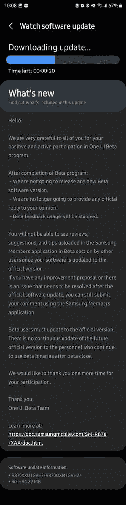

# Galaxy Watch 4 系列终于收到稳定的 One UI Watch 4.5

> 原文：<https://www.xda-developers.com/galaxy-watch-4-one-ui-4-5-stable/>

三星推出了其最新的 Wear OS 智能手表， [Galaxy Watch 5](https://www.xda-developers.com/samsung-galaxy-watch-5-review/) 和 [Galaxy Watch 5 Pro](https://www.xda-developers.com/samsung-galaxy-watch-5-pro-launch/) ，其中一款 UI Watch 4.5 基于 Wear OS 3.5。发布后不久，该公司开始测试 Galaxy Watch 4 系列的更新，为老款智能手表带来了几个新功能。在为 Galaxy Watch 4 系列推出 [six One UI Watch 4.5 测试版更新](https://www.xda-developers.com/galaxy-watch-4-one-ui-watch-4-5-beta-6/)之后，三星现在终于在稳定频道上推出了它。

三星昨天正式宣布 One UI Watch 测试版计划结束，并确认不会发布任何进一步的测试版更新。虽然强调这一变化的三星社区论坛帖子没有提到稳定的首次推出，但 Galaxy Watch 4 用户已经开始接收稳定的更新(固件版本 GVH2)。

 <picture></picture> 

Credit: u/JeffTechnically

三星可能会逐步推出它，所以你应该会在未来几天内在你的 Galaxy Watch 4 或 Galaxy Watch 4 Classic 上收到它。如果您错过了我们之前的 One UI Watch 4.5 报道，这里有一个该版本中所有新功能的快速复习。

## Galaxy Watch 4 系列的 One UI Watch 4.5 中的新功能

One UI Watch 4.5 包括一个新的 QWERTY 键盘，支持滑动输入，这是三星最初随手表附带的 T-9 键盘的一大进步。这意味着你不再需要在智能手表上安装 Gboard 应用程序来获得更好的打字体验。新的 QWERTY 键盘还提供听写和手写输入支持，当你不想在手表屏幕上滑动以发送快速回复时，这应该会派上用场。

除了新的 QWERTY 键盘，One UI Watch 4.5 还为旧款 Wear OS 智能手表带来了双 SIM 卡支持。有了双 SIM 卡支持，你可以在你的 Galaxy 智能手机上设置一个首选 SIM 卡，它会自动与你的 Galaxy Watch 4 同步。您还可以选择在手表上查看当前的 SIM 卡，并在手表上拨打电话时进行选择。

此外，One UI Watch 4.5 还为 Galaxy Watch 4 系列带来了更好的手表表面可定制性。由于这一点，您可以将您最喜爱的表盘以不同的颜色组合和不同的复杂功能添加到收藏夹列表中，以便于访问。

最后，更新包括一些辅助功能，可以让你调整色调和对比度，减少透明度和模糊效果，并关闭所有动画。此外，新的辅助功能将使您能够访问新的声音平衡设置和触摸交互设置。

*你的 Galaxy Watch 4 或 Galaxy Watch 4 Classic 收到 One UI Watch 4.5 更新了吗？你最喜欢哪些新功能？请在下面的评论区告诉我们。*

* * *

**来源:** [三星社区](https://us.community.samsung.com/t5/Tips/Information-about-the-closing-of-the-Beta-program-Sep-1st/m-p/2367048)， [Reddit](https://www.reddit.com/r/GalaxyWatch/comments/x3pebj/new_gvh2_beta_for_the_gw4/)