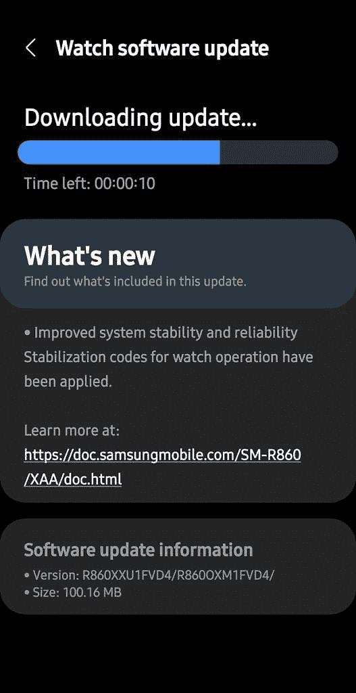

# Galaxy Watch 4 获得了稳定性改进，并于 2022 年 5 月发布了最新更新补丁

> 原文：<https://www.xda-developers.com/galaxy-watch-4-update-stability-improvements-may-2022-patches/>

三星已经开始为 Galaxy Watch 4 推出新的软件更新。虽然你预计更新最终会为 Wear OS 智能手表带来谷歌助手支持，但遗憾的是，事实并非如此。相反，此次更新只打包了一些系统稳定性改进和最新的安全补丁。

根据 *Reddit* 上的用户报告，Galaxy Watch 4 的最新软件更新(固件版本 r 8 x 0x u 1 fvd 4)已经开始到达用户手中。它的大小约为 100MB，提高了系统的稳定性和可靠性。如所附截图所示，changelog 还声明更新为手表操作应用了稳定代码。但我们不确定这是什么意思。

 <picture></picture> 

Credit: [u/Enjinr](https://www.reddit.com/user/Enjinr/)

此外，三星的网站指出，软件更新将 Galaxy Watch 4 提升到 2022 年 5 月的安全补丁级别。不幸的是，changelog 没有提到 Google Assistant 支持，安装了更新的用户确认该功能无处可寻。因此，我们可能需要再等几周，三星才能最终为其 Wear OS 智能手表推出谷歌助手支持。

如果你不了解情况，Galaxy Watch 4 [威瑞森版本之前的软件更新变更日志中提到了谷歌助手支持](https://www.xda-developers.com/google-assistant-support-coming-soon-galaxy-watch-4/)。然而，更新并没有启用该功能时，它达到了用户。在谷歌助手首次被发现后不久，威瑞森立即从更新日志中删除了所有提及谷歌助手的内容。几天后，三星[发布了一则新广告，强调了其 Wear OS 智能手表](https://www.xda-developers.com/samsung-ad-google-assistant-galaxy-watch-4/)上的谷歌助手，这让许多人相信谷歌助手支持将最终随着以下更新而上线。但是，它仍然没有在最新的软件版本中出现。

目前，最新的 Galaxy Watch 4 更新似乎正在向美国用户推出。但是在接下来的几天里，其他地区的用户应该也能接触到。

*您收到 Galaxy Watch 4 的更新了吗？请在下面的评论区告诉我们。*

* * *

**来源:** [Reddit](https://www.reddit.com/r/GalaxyWatch/comments/uhzmf6/just_got_fvd4_update_for_watch_4_bluetooth_in_the/) ，[三星](https://doc.samsungmobile.com/SM-R860/XAA/doc.html)