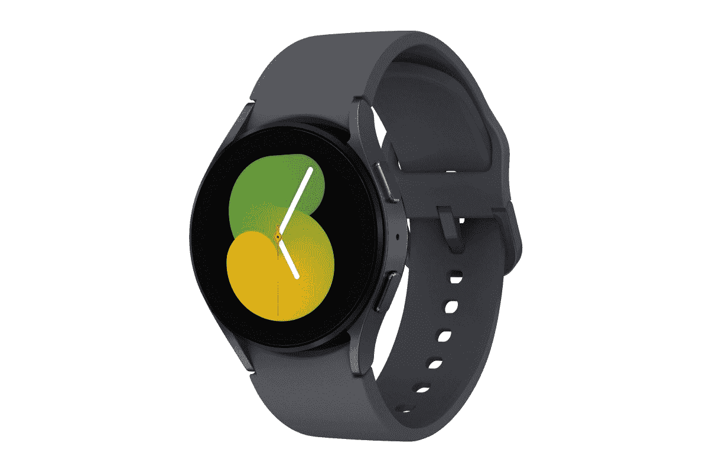
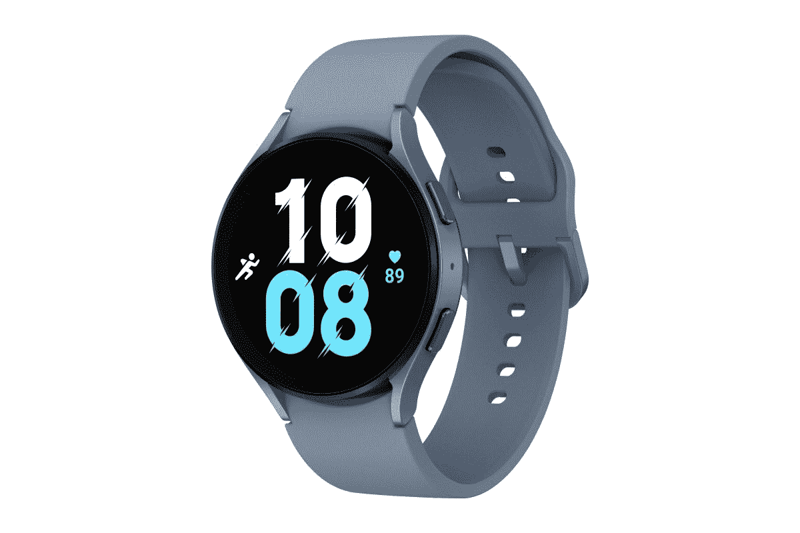

# Woot 已经在 Galaxy Watch 5 上提供“清仓”交易

> 原文：<https://www.xda-developers.com/galaxy-watch-5-clearance-deal-woot/>

虽然距离三星正式宣布 [Galaxy Watch 5](https://www.xda-developers.com/samsung-galaxy-watch-5-review/) 才一个多月，但 Woot 已经在清仓甩卖 Wear OS 智能手表。这家亚马逊旗下的零售商目前正在打折出售仅支持蓝牙的 Galaxy Watch 5 的 40 毫米和 44 毫米版本。如果你到目前为止还没有购买，现在是时候给自己买一块闪亮的新智能手表了。

你可以买到 40 毫米的 Galaxy Watch 5，通常零售价为 280 美元，现在只需 250 美元。这款手表有三种颜色可供选择——石墨表壳搭配石墨表带，玫瑰金表壳搭配玫瑰金表带，银色表壳搭配宝来紫色表带。另一方面，44 毫米的 Galaxy Watch 5 仅售 290 美元(比零售价低 20 美元)，有三种颜色组合——石墨表壳搭配石墨表带，蓝宝石表壳搭配蓝宝石表带，银色表壳搭配白色表带。

 <picture></picture> 

Samsung Galaxy Watch 5 (40mm, Bluetooth-only)

现在就在 Woot 上以 250 美元的价格购买 40 毫米 Galaxy Watch 5 吧！

对于不知情的人来说，Galaxy Watch 5 装有 Exynos W920 双核芯片组，配有 1.5GB RAM 和 16GB 内部存储。40 毫米型号采用 1.2 英寸 AMOLED 显示屏，配有蓝宝石水晶玻璃和 284mAh 电池，而 44 毫米型号采用 1.4 英寸 AMOLED 显示屏，配有蓝宝石水晶玻璃和更大的 410mAh 电池。

 <picture></picture> 

Samsung Galaxy Watch 5 (44mm, Bluetooth-only)

Galaxy Watch 5 的 44 毫米版本现在只需 290 美元就可以成为你的了！

两种型号都配有耐用的装甲铝制外壳、20 毫米运动表带和 IP68 防尘防水等级。智能手表支持多种健身跟踪功能，包括心电图、血氧监测、温度监测、睡眠跟踪和身体成分分析。Galaxy Watch 5 运行一个基于 Wear OS 3.5 的 UI Watch 4.5，它带来了几个新的软件功能，如全尺寸 QWERTY 键盘和新的手表外观。

*你会以这个折扣价订购 Galaxy Watch 5 吗，还是会等到假期，希望以更低的价格购买？请在下面的评论区告诉我们。*