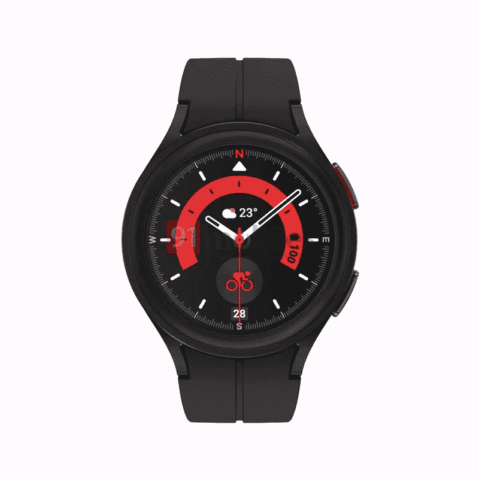
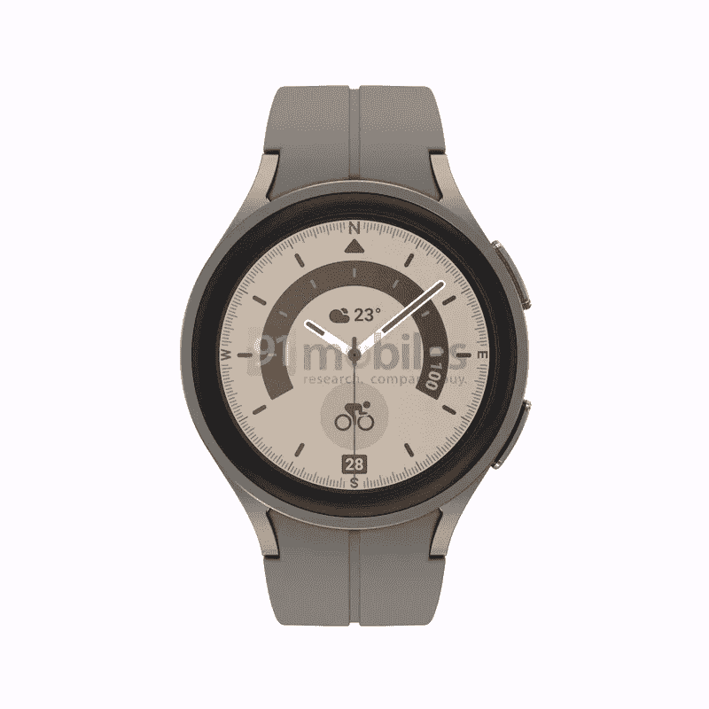
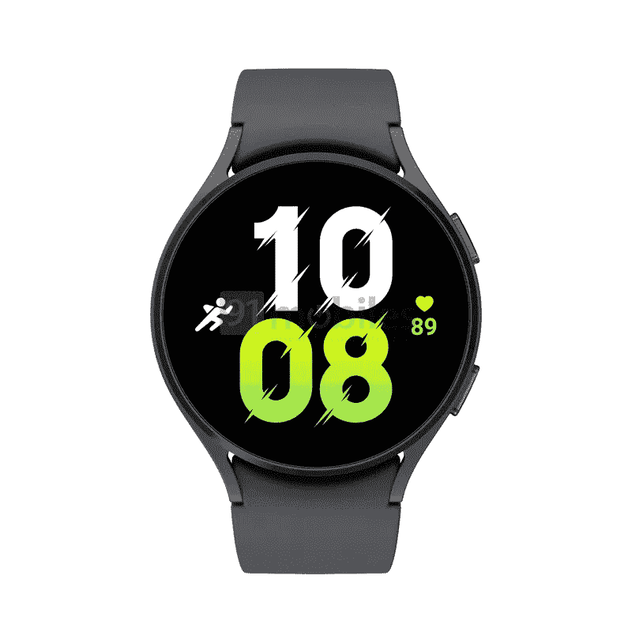
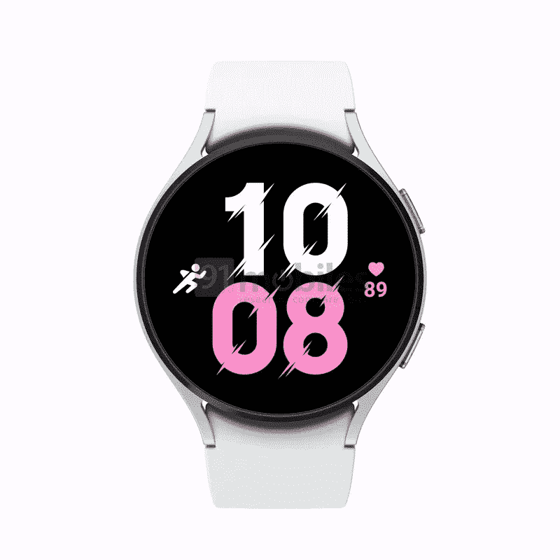

# 新泄露的 Galaxy Watch 5 和 Galaxy Watch 5 Pro

> 原文：<https://www.xda-developers.com/galaxy-watch-5-series-leaked-renders/>

在过去的几周里，我们已经看到了关于三星即将推出的 [Galaxy Watch 5 系列](https://www.xda-developers.com/samsung-galaxy-watch-5/)的多次泄露。到目前为止，我们已经了解到三星将在新的阵容中提供两款机型，Galaxy Watch 5 和 Galaxy Watch 5 Pro，这两款机型都将配备更大的电池和更快的充电能力。此外，我们已经发现了[关于两款车型的颜色变化](https://www.xda-developers.com/galaxy-watch-5-watch-5-pro-colors-leak/)和[传闻定价](https://www.xda-developers.com/galaxy-watch-5-series-pricing-leak/)的细节。然而，之前的泄露都没有让我们看到更新的设计。如今，这种情况发生了变化，因为知名泄密者埃文·布拉斯(Evan Blass)分享了 Galaxy Watch 5 和 Galaxy Watch 5 Pro 的渲染图(通过 *91mobiles* )，这让我们可以 360 度观看三星的下一代 Wear OS 智能手表。

下面的渲染图让我们第一次看到了优质的 Galaxy Watch 5 Pro，展示了一种更新的设计，带有新的磁性表带，显示屏周围没有旋转挡板。与 Galaxy Watch 4 一样，它的右边缘有两个按钮，其中一个按钮带有红色。

 <picture></picture> 

Samsung Galaxy Watch 5 Pro

这款手表看起来右边有一个麦克风，左边有一个扬声器格栅。正如之前发现的那样，Galaxy Watch 5 Pro 将有两种颜色可供选择——黑色和钛色。

 <picture></picture> 

Samsung Galaxy Watch 5 Pro

另一方面，普通的 Galaxy Watch 5 在设计上与 Galaxy Watch 4 并没有太大的不同。它采用了传统的手表风格的表带，没有旋转的表圈，右边缘有两个按钮，左边缘有一个扬声器格栅。

 <picture></picture> 

Samsung Galaxy Watch 5

非专业版将有几个额外的配色和两种外壳尺寸。这两种型号都可能只有蓝牙和 LTE 版本。

 <picture></picture> 

Samsung Galaxy Watch 5

并排看 Galaxy Watch 5 和 Galaxy Watch 5 Pro，你会注意到高级型号的显示屏略有凹陷。凸起的边框应该可以很好地保护显示器，防止日常使用中的划痕和碰撞。普通的 Galaxy Watch 5 没有提供同样的保护，它的显示屏与边框齐平。

 <picture></picture> 

Samsung Galaxy Watch 5

三星可能会在下个月的某个时候推出 Galaxy Watch 5 系列及其下一代可折叠产品。一旦我们有了更多关于即将推出的 Galaxy 设备的细节，我们会尽快通知您。

*如何看待更新后的 Galaxy Watch 5 系列设计？请在下面的评论区告诉我们。*

* * *

**途经:**[91 辆](https://www.91mobiles.com/hub/exclusive-samsung-galaxy-watch5-series-first-official-imagery/)