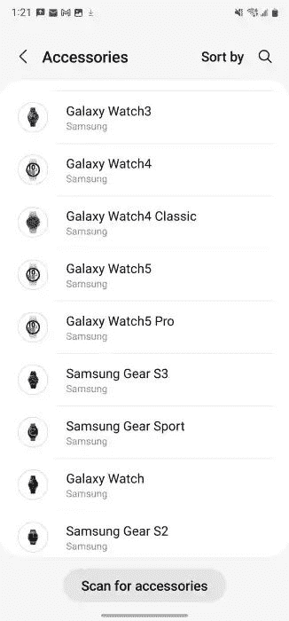

# Galaxy Watch 5 和 Watch 5 Pro 出现在最新的三星健康测试版中

> 原文：<https://www.xda-developers.com/galaxy-watch-5-watch-5-pro-spotted-latest-samsung-health-beta/>

# Galaxy Watch 5 和 Watch 5 Pro 出现在最新的三星健康测试版中

即将推出的三星 Galaxy Watch 5 和 Galaxy Watch 5 Pro 在最新的三星健康测试版更新中亮相。

在过去的几周里，我们已经看到了关于三星即将推出的 Wear OS 智能手表的多次泄露。消息透露，三星将从今年的高端 Galaxy Watch 中去掉“经典”品牌，取而代之的是被过度使用的“专业”品牌。我们还了解到，即将推出的 Galaxy Watch 5 Pro [将采用优质材料](https://www.xda-developers.com/galaxy-watch-5-pro-sapphire-glass-titanium-case/)，如蓝宝石玻璃和钛表壳。此外，泄露的消息表明，Galaxy Watch 5 和 Galaxy Watch 5 Pro [都将比他们的前辈配备更大的电池](https://www.xda-developers.com/galaxy-watch-5-battery-report/)。尽管三星尚未做出任何官方决定，但即将发布的 Galaxy Watch 5 和 Galaxy Watch 5 Pro 现在已经出现在三星健康应用的最新测试版中。

据 9to5Google 报道，三星健康应用(版本 6.22.0.069)的最新测试版在占位符图片旁边提到了三星即将推出的 Wear OS 智能手表。有趣的是，Galaxy Watch 4 和 Galaxy Watch 4 Classic 也在去年正式推出前约一个月出现在三星健康应用中。

 <picture></picture> 

Screenshot: 9to5Google

三星健康测试版没有透露更多关于 Galaxy Watch 5 和 Galaxy Watch 5 Pro 的信息，但 Galaxy Watch 5 Classic 的缺席证实了三星今年正在淘汰“经典”阵容。这符合最近从 *GalaxyClub* 泄露的[消息，该消息透露了即将推出的 Galaxy Watch 系列的三个代号。泄露的消息表明，三星可能会在 Galaxy Watch 5 系列中推出三款型号，代号为 *Heart-S、Heart-L 和 Heart-Pro。*根据最新泄露的消息，我们怀疑三星将推出两种尺寸的普通 Galaxy Watch 5(解释代号中的‘M’和‘L’)，以及单一尺寸选项的 Galaxy Watch 5 Pro。](https://www.xda-developers.com/samsung-galaxy-watch-codename-hints-upcoming-pro-model/)

目前，我们没有关于三星即将推出的 Wear OS 智能手表的任何进一步信息。一旦我们了解到更多情况，我们会尽快通知您。

* * *

**Via:**[9 to 5 Google](https://9to5google.com/2022/06/02/samsung-galaxy-watch-5-pro-branding-and-classic-removal/)